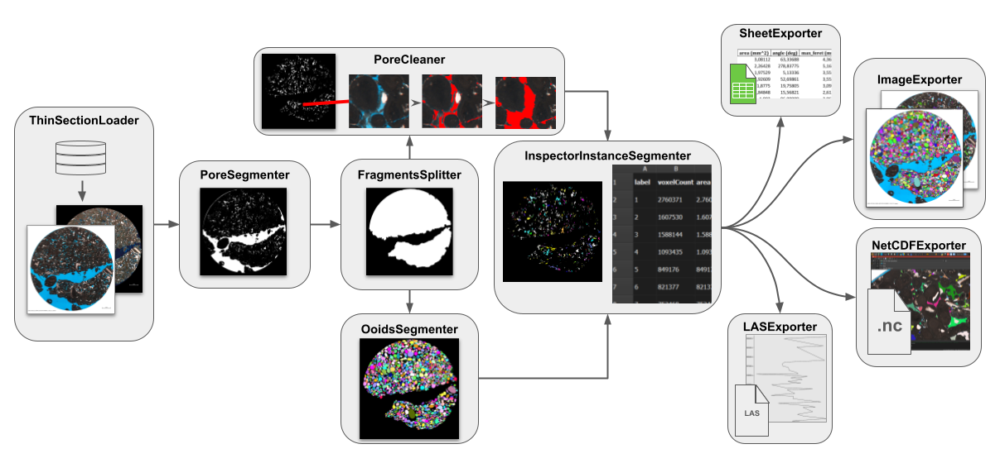

# Fluxo de operações

Uma vez iniciada a execução do *script* principal, o programa itera sobre as imagens do diretório de entrada e executa uma série de operações. No geral, as operações salvam arquivos temporários em formato NRRD e retornam o caminho onde foram armazenados, de modo que possam ser utilizados pelas aplicações CLI do GeoSlicer em etapas posteriores.

Caso o nome da imagem conste no arquivo `filter_images.csv` e o número de ilhas úteis conste como 0, a imagem é ignorada.

## [ThinSectionLoader](ThinSectionLoader.py): Carregamento das imagens

A imagem PP/c1 é carregada e salva em formato NRRD compatível com as aplicações em CLI executadas nas etapas posteriores. O cabeçalho do arquivo é diferente de acordo com o modelo de segmentação de poro escolhido (Bayesiano ou neural), visto que são administrados por diferentes CLI's. A menos que o nome da imagem conste no arquivo `not_use_px.csv`, a versão PX/c2 também é carregada para uso posterior, porém é mantida apenas em memória em vez de salva em disco.  

## [PoreSegmenter](PoreSegmenter.py): Segmentação binária de poros

O CLI de segmentação binária de poro é invocado para operar a partir do caminho para o NRRD da imagem original, salvo pelo [ThinSectionLoader](ThinSectionLoader.py). O resultado é salvo em um novo NRRD.

## [FragmentsSplitter](FragmentsSplitter.py): Isolamento dos fragmentos de interesse da rocha

Muitas imagens possuem grandes regiões "vazias", preenchidas por resina de poro, que são detectadas pelo [PoreSegmenter](PoreSegmenter.py) mas que não correspondem de fato à porosidade da rocha, mas apenas à região em volta de seu(s) fragmento(s). Em alguns casos específicos, não todos mas apenas os *N* maiores fragmentos da seção de rocha interessam. Os nomes das imagens que se encaixam nessa situação devem constar no arquivo `filter_images.csv`, juntamente ao valor de *N*. Para isolar os fragmentos úteis da rocha, a seguinte sequência de operações é aplicada:

* Primeiramente, o maior fragmento, correspondente à toda área da seção, é isolado das bordas da imagem;
* Então, toda porosidade detectada que toque a borda da imagem é também descartada, pois é interpretada como resina de poro visível ao redor da área útil da rocha;
* Por fim, caso a imagem conste entre as precisem considerar apenas os *N* maiores fragmentos, o tamanho (em pixeis) de cada fragmento da área útil restante é medido e apenas os *N* maiores são mantidos.

O NRRD dos poros detectados é atualizado descartando toda detecção não-contida na área  útil da rocha.

## [PoreCleaner](PoreCleaner.py): Remoção de poros espúrios e artefatos na resina

Este módulo é responsável por aplicar duas operações de "limpeza" na segmentação de poros convencional, que se não realizadas podem impactar negativamente nos resultados finais.

### Remoção de poros espúrios

Os segmentadores de poro atuais do GeoSlicer tendem a gerar detecções espúrias em pequenas regiões compreendidas por rocha mas que por efeitos de iluminação/resolução/afins têm coloração parecida com a da resina azul de poro. O módulo executa um modelo capaz de reconhecer essas detecções e diferencia-las das corretas, com base nos valores de pixel dentro de um intervalo em torno do centróide de cada segmento. Todos os poros espúrios detectados são descartados.

### Incorporação de bolhas e resíduos na resina de poro

É comum que se formem na resina de poro algumas bolhas de ar e resíduos relacionados. Os segmentadores não detectam esses artefatos, não interpretando-os como área de poro, o que influencia no tamanho e quantidade dos poros detectados. Este módulo visa "limpar" a resina, incluindo essas bolhas e resíduos ao corpo do poro correspondente. Basicamente, três critérios devem ser atendidos para que uma região da imagem seja interpretada como bolha/resíduo:

1. **Ter cor branca ou ter cor azul com pouca intensidade e saturação:** em geral, as bolhas são brancas ou, quando cobertas de material, têm um tom de azul quase negro. Os resíduos que eventualmente circundam as bolhas também tem um nível de azul pouco intenso;
2. **Tocar na resina de poro:** a transição entre a resina e os artefatos é normalmente direta e suave. Como o modelo de segmentação de poro detecta bem a região de resina, o artefato precisa tocar nessa região. Consequentemente, o algoritmo atual não consegue detectar casos menos comuns em que o artefato tome 100% da área do poro;
3. **Ser pouco visível na imagem PX/c2:** alguns elementos da rocha podem ser parecidos com os artefatos e também ter contato com a resina. Porém, no geral, os artefatos são pouco ou nada visíveis nas imagens PX/c2, enquanto os demais elementos são geralmente notáveis. Algumas imagens do poço RJS-702, porém, não têm um bom alinhamento natual ou facilmente corrigível entre as imagens PP e PX, dificultando essa correspondência de regiões. Esta etapa é então ignorada para essas imagens, listadas no arquivo `not_use_px.csv`, o que pode resultar em sobressegmentação dos poros por capturar falsos artefatos.

O NRRD de poros é novamente atualizado, desta vez com os poros "limpos".

## [OoidSegmenter](OoidSegmenter.py): Segmentação de oóides

Um modelo neural treinado para detecção de oóides também é aplicado e tem seu resultado salvo em NRRD. Diferentemente da natureza binária do segmentador de poros, este já separa as diferentes instâncias do elemento.

Na prática, este modelo é dividido em dois: uma parada detecção de instâncias grandes e outros para pequenas. As grandes são detectadas primeiro, então as pequenas são detectadas apenas na região não compreendida pelas grandes. Eles foram treinados e são aplicados em versões de escala reduzida das imagens.

## [InspectorInstanceSegmenter](InspectorInstanceSegmenter.py): Separação de instâncias e cálculo de propriedades geológicas

Este módulo aproveita uma aplicação CLI do GeoSlicer para separar as instâncias da segmentação de entrada em NRRD, calcular suas propriedades geológicas e gerar um relatório de saída. A primeira etapa é aplicada apenas aos poros, visto que os oóides já são naturalmente detectados de forma separada.

O algoritmo de separação das instâncias depende da especificação do usuário, podendo alternar entre *islands*, que os separa por conectividade simples de pixeis, ou *watershed*, que aplica o algoritmo de mesmo nome.

## [ImageExporter](ImageExporter.py): Geração de imagem destacando as instâncias segmentadas em cada imagem original

Módulo responsável por salvar uma imagem em formato trandicional (PNG) exibindo os resultados finais das segmentações para todos os tipos de instância (atualmente poros e oóides). A imagem final é uma cópia da imagem PP original, porém colorindo aleatoriamente cada instância detectada.

## [SheetExporter](SheetExporter.py): Geração de planilhas contendo propriedades e estatísticas calculadas

Salva em planilha as propriedades geológicas calculadas e estatísticas relacionadas para cada imagem. A versão *AllStats* reúne as propriedades de cada instância individualmente, enquanto a versão *GroupsStats* as agrupa por similaridade de tamanho e dedica diferentes páginas para diferentes estatísticas descritivas (média, mediana, desvio padrão, mínimo e máximo) para cada grupo.

No caso dos poros, os grupos são calculados de forma não-supervisionada, enquanto que para os oóides são pré-definidos com base na [escala granulométrica de Udden-Wentworth](https://mcas-proxyweb.mcas.ms/certificate-checker?login=false&originalUrl=https%3A%2F%2Fpost.geoxnet.com.mcas.ms%2Fescala-granulometrica-de-udden-wentworth%2F%3FMcasTsid%3D28375%23%3A~%3Atext%3DExisten%2520en%2520uso%2520muchas%2520escalas%2520granulom%25C3%25A9tricas%252C%2520pero%2520la%2Cinternacionalmente%2520para%2520la%2520clasificaci%25C3%25B3n%2520granulom%25C3%25A9trica%2520de%2520part%25C3%25ADculas%2520sedimentarias.&McasCSRF=e126bfb0a9bae24ec8c108b1dbb70e32d8beb726fac2630ce517d9f27c73648c).

## [NetCDFExporter](NetCDFExporter.py) (Opcional): Gerador de arquivo NetCDF das segmentações

Gera um arquivo NetCDF contendo a imagem PP original e um *labelmap* para cada tipo de instância (poros e oóides), em que cada instância é aleatoriamente colorida e pode ser visualizada sobre a região real em que aparece na imagem.

## [LASExporter](LASExporter.py): Geração de arquivos LAS descritores das propriedades do poço

Uma vez que todas as imagens do poço são processadas, arquivos LAS são criados separando suas propriedades geológicas por profundidade e as resumindo em estatísticas descritivas. Um arquivo é gerado para cada estatísica, dentre média, mediana, desvio padrão, mínimo e máximo. Tipos de instâncias diferentes têm seu próprio conjunto de arquivos LAS.

A título de exemplo, se um poço têm três imagens, correspondentes às profundidades 2000, 2500 e 3000 metros, e cada uma possui centenas de poros e oóides, será gerado um arquivo LAS contendo a média das propriedades dos poros em cada um dos níveis de profundidade e um análogo para os oóides. Isso será repetido para cada uma das estatísticas descritivas.