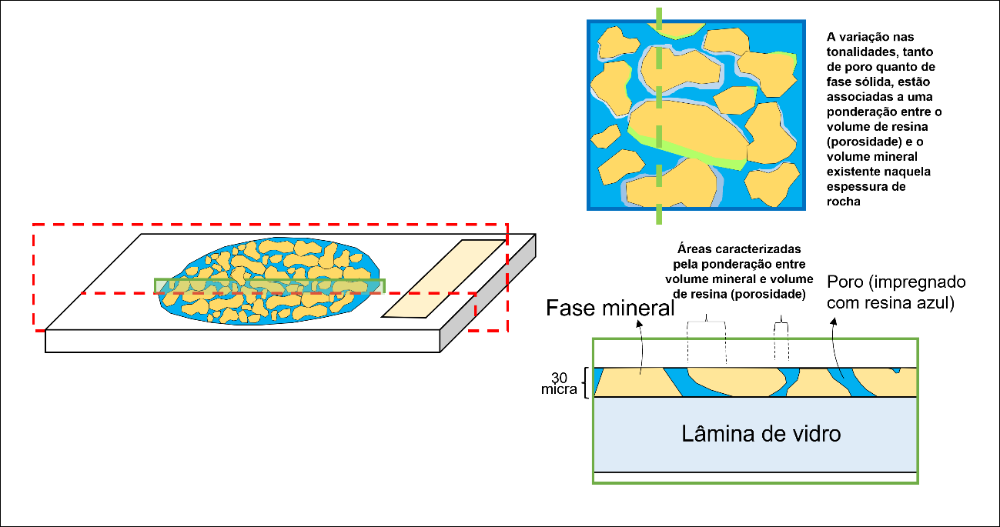
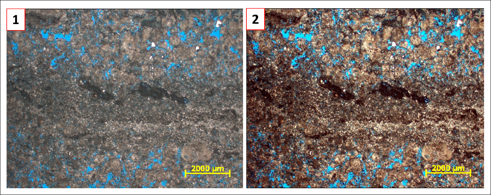
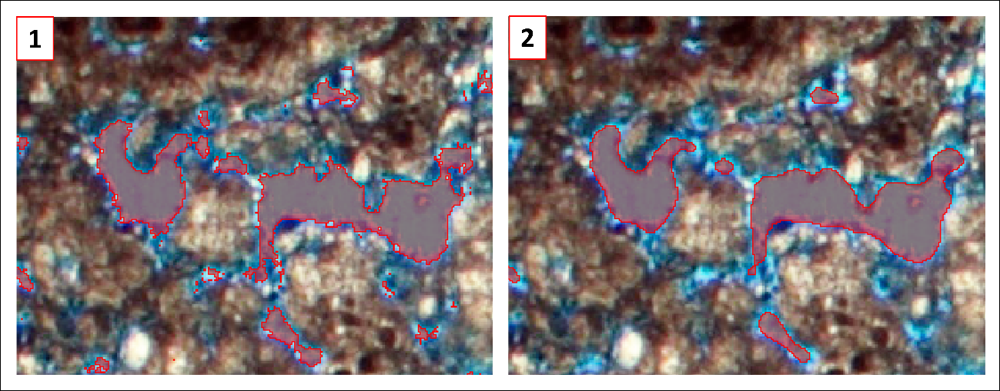
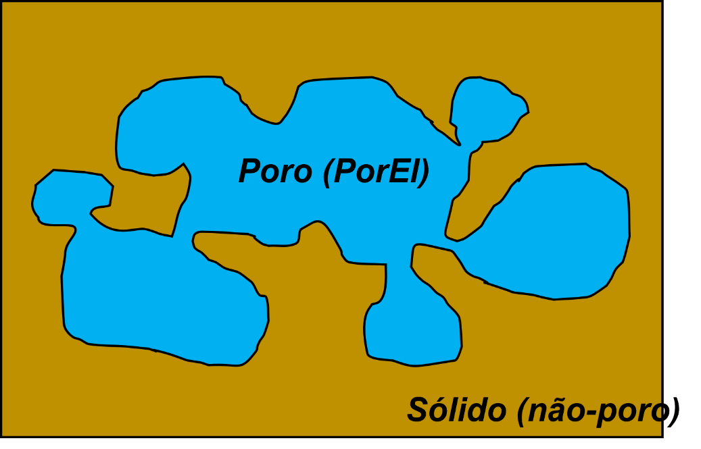
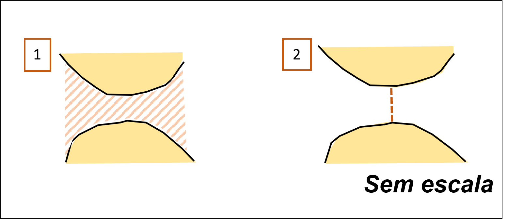
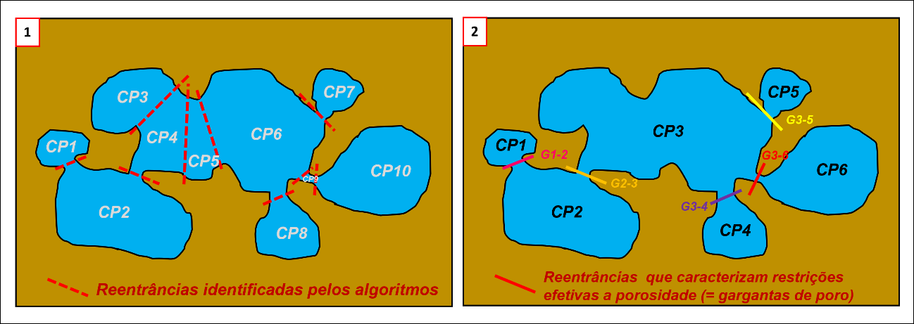

# Estudos de porosidade

## PNM, PIA e a importância de se obter parâmetros geométricos confiáveis para a porosidade

PNM (Pore Network Modelling, ou “Modelagem de Trama Porosa” em tradução livre) é uma
técnica muito disseminada no estudo de materiais que tem como objetivo a descrição de
propriedades de fluxos multifásicos em meio a uma trama de vazios tridimensionalmente
distribuídos. Iniciada com estudos a partir da década de 70, vem ganhando robustez com a
incorporação de novas técnicas e capacidade computacional, promovendo a criação de
estruturas de porosidade cada vez mais complexas e fiéis às amostras, em velocidades de
aquisição progressivamente maiores. De acordo com a bibliografia, são inúmeras as técnicas
utilizadas para a construção desses modelos: ensaios de porosimetria, MEV, Microtomografia,
e avaliação petrográfica são os mais consagrados.

Dentre as possibilidades petrográficas, o módulo Thin Section do Geoslicer possibilita o desenvolvimento de estudos avançados de fotomicrografias, que se enquadram-no conceito de PIA (Petrographic Image Analysis, ou “Análise de Imagem Petrográfica” em tradução livre),  com a obtenção de propriedades geométricas e quantificação do segmento identificado como porosidade. Cunhada por Ehrlich et al. (1984), e evoluída por diversos autores (Gostick, ....) a técnica aqui proposta visa a identificação, segmentação, fragmentação e análise dos elementos. Foram elaboradas diversas propostas que visam otimizar a operação e os resultados, e variam de acordo com a complexidade do dado ou necessidade de detalhamento dos outputs. Na versão atual do software, consideram-se as seguintes questões:

**Identificação**: refere-se a capacidade de reconhecer determinado objeto, ou característica (no caso, as áreas associadas a porosidade). Para os referidos estudos, é suficiente o reconhecimento do que é poro e o que não é (ou seja, é sólido). Como costume, a porosidade de rocha é impregnada por resina de coloração azul, que confere essa tonalidade característica às áreas de porosidade, porém há questões associadas às paredes dos poros, que, a depender de características como ângulo de contato e tamanho dos cristais, podem gerar uma variação de tonalidades (Figura 1 – esquema 3D em perspectiva de uma lâmina, e foto representativa dessa variação de cores).

|  |
|:-----------------------------------------------:|
| Figura 1: esquema de lâmina petrográfica. Notar, nos destaques a direita, as variações de tonalidade provocadas pela ponderação entre resina e fases minerais, conforme ângulo de contato e características dos cristais dos constituintes |

**Segmentação**: como definido por Ehlich et al (1984) é o ato de determinar quais pixels do arranjo pertencem a mesma categoria. Para a análise da área porosa, basta a discretização de dois segmentos (“poro” e “não poro”), processo comumente chamado de “binarização”. É possível de se realizar, no Geoslicer, a partir de abordagem manual, com adoção de filtros nos sistemas de cores (thresholds), ou através de semi-automatização, onde cabe ao usuário realizar as anotações dos segmentos (amostrar o que é “poro” e o que é “não-poro”) e definir o algoritmo de extrapolação dessas informações para uma área de interesse (ROI – Region of Interest). Sugere-se previamente realizar eventuais correções da imagem, através de ferramentas de brilho, contraste e/ou equalização do histograma de distribuição de cores (Figura 2).

|  |
|:-----------------------------------------------:|
| Figura 2: exemplo de aplicação de um dos filtros pré-segmenação, disponíveis na aba "Image Tools". No caso, foi aplicada a equalização de histograma de cores, e observa-se uma melhor definição e homogeneização das cores das diferentes fases |

Isso tem como vantagem a homogeneização das características dos pixels, e maior efetividade na construção de segmentos por thresholds ou anotações. Após a imagem ser binarizada, sugere-se a aplicação de filtros de suavização (smoothing) no segmento, evitando, assim, serrilhamento excessivo da superfície, e textura “salt and pepper” (zona de classificação de pixels altamente variável, comum nos halos limites entre o que é poro e o que não é) (Figura 3). Com esses dados já é possível de se obter uma estimativa de porosidade, que nada mais é do que a porcentagem de área ocupada por pixels identificados como poros. Diferente de Ehrlich et al (1984), considera-se, aqui, a porosidade total, cabendo ao usuário a determinação de filtros de tamanho para exclusão de determinada faixa de poros identificados.

|  |
|:-----------------------------------------------:|
| Figura 3: exemplo de suavização da superfície do segmento de porosidde (em vermelho). em 1), segmento sem qualquer suavização. Notar serrilhamento e identação evidenciando "confusão" na rotulação de pixels, principalmente associados às bordas dos elementos; em 2), após aplicada iteração de suavização (definida pelo usuário em “Segmentation > Manual – smoothing”). Notar superfícies mais regulares. Como desvantagem, atentar ao desaparecimento de alguns elementos, em virtude de serem menores que os limites do filtro aplicado. |

**Fragmentação**: a completa extração de informações sobre o sistema poroso, a nível bidimensional, carece de maior detalhamento do segmento de porosidade. O meio poroso é uma trama 3D composta por espaços de maiores dimensões (câmaras porosas) conectadas por espaços menores, que indicam restrições (gargantas de poro). Em uma seção bidimensional (como é o caso de lâminas petrográficas), esse sistema é representado por um conjunto de áreas discretas preenchidos por resina. Admite-se que, embora essas áreas não necessariamente estejam conectadas no plano da seção delgada, essa conexão é efetiva devido a impregnação por resina. Uma área discreta, contínua, preenchida por resina, é denominada PorEl (“elemento de porosidade”, por Ehrlich et al., 1991a), e pode ser composta por uma ou mais câmaras porosas e suas conexões (Figura 4). Grande esforço foi realizado, durante os anos, para a correta fragmentação desses PorEls em constituintes do sistema poroso, através de protocolos de erosão-dilatação (Ehrlich et al. 1991b, dentre outros), razão de eixos, algoritmo SNOW (Gostick, 2017) e Watershed. Atualmente, o Geoslicer contempla uma customização do protocolo de Watershed, através da personalização de filtros e outros parâmetros vinculados a geometria de gargantas.

|  |
|:-----------------------------------------------:|
| Figura 4: Esquema representando binarização (segmentação poro - não-poro) de fotomicrografia. Notar que a porosidade registrada é dividida no que é chamado, por Ehrlich et al. (1991a), de PorEl (ou "elemento de porosidade'). PorEls são áreas discretas, contínuas, de pixels classificados como “poro”. Apesar de não conectados, tendem a serem considerados partes da porosidade efetiva em virtude da impregnação por resina. Vale ressaltar que esses elementos podem ser compostos por diferentes componentes do sistema poroso (ilustrados nessa projeção bidimensional). |

A abordagem adotada aqui considera a garganta de poro como um plano, definido na seção de maior estrangulamento da área identificada como porosidade (nos dados bidimensionais) (Figura 5 – comparativo de garganta como linha e como área). As limitações de tamanho de gargantas estão vinculadas ao tamanho dos eixos dos poros que elas conectam. Admite-se que os valores absolutos obtidos provavelmente não coincidem com os resultados de outras análises (como a porosimetria), porém bibliografia sugere que os dados obtidos apresentam boas correlações com os ensaios realizados para as mesmas amostras.

|  |
|:-----------------------------------------------:|
| Figura 5: comparativo entre duas abordagens utilizadas em bibliografia para identificação de gargantas de poro. em 1) considera-se a garganta como uma área (em 2D), ou volume (em 3D), balizada por ângulos formados por linhas tangenciais às paredes dos poros; em 2) considera-se garganta uma área (em 3D), ou segmento de reta (em 2D) unindo os pontos mais próximos das paredes de poro. No Geoslicer, o conceito 2) é abordado pois, além da maior facilidade em se adquirir os dados de garganta, as informações obtidas (tamanho, orientação) são correlacionáveis aos dados adquiridos através de outras análises (porosimetria, por exemplo). |

Por fim, a fragmentação do segmento de poro nos prováveis constituintes do sistema poroso visa adquirir, de maneira mais fiel, as propriedades geométricas de (seção das) câmaras porosas e gargantas, estabelecendo valores razoáveis de perímetro, área, rugosidade, tamanho e orientação de eixos, etc... Nota-se que a não fragmentação, ou superfragmentação geram dados que não caracterizam a porosidade conforme suas propriedades (materializadas na seção 2D exposta)

P.S.: define-se como “garganta de poro” as restrições que promovem impacto na distribuição espacial de poros, e provável modificação do comportamento dinâmico de fluidos. Essas atribuições estão associadas a uma proporcionalidade entre o tamanho da restrição e o tamanho do maior eixo paralelo medido dentro da câmara porosa (Figura 6).

|  |
|:-----------------------------------------------:|
| Figura 6: PorEl fragmentado. Em 1) todas as reentrâncias de porosidade (feições que alteram a continuidade da função distância e transformada para construção do watershed) são identificadas e utilizadas para fragmentar a área discretizada. Isso gera maior quantidade de câmaras porosas (CP´s) e gargantas de poros de grandes dimensões; em 2), nem todas as reentrâncias são consideradas gargantas de poro (GP´s). Esse diagnóstico está associado a relação espacial e de tamanho entre a reentrância e as câmaras porosas conectadas por ela. Uma vez que essa fragmentação é executada de maneira coerente, as propriedades geométricas dos constituintes do sistema poroso (CP´s e GP´s) podem ser adquiridos de maneira mais confiável. Vale ressaltar que essas informações apresentam a limitação de serem dados bidimensionais, extraídos de seções aleatórias (não controladas) de sistemas espaciais geralmente heterogêneos. |

Embora, em bibliografia, muitas vezes as gargantas serem representadas como “pipes”, aqui a figura geométrica representativa é uma linha (perpendicular às paredes de poro), cujas propriedades medidas são o comprimento e orientação. Em se tratando de comprimento, o comparativo com os raios de garganta de poro, obtidos em porosimetria, é mais direto, pois se trata da mesma unidade de medida. Esse cuidado que deve ser tomado visa honrar possíveis irregularidades das paredes de poro, muito comuns em litotipos carbonáticos (alta reatividade mineralógica, que facilita a ocorrência de processos diagenéticos de modificação do espaço poroso). Em outras palavras, toda garganta é uma reentrância de parede de poro, mas nem toda reentrância pode ser considerada uma garganta de poro.

**Análise**: uma vez definidos os parâmetros e coletados os dados vinculados às câmaras porosas e gargantas de poro (propriedades geométricas como dimensões, orientação, distribuição, etc...), os outputs visam ilustrar, da melhor maneira possível, as características do sistema poroso, tanto na forma de mapas de distribuição (imagens do segmento fragmentado) quanto pela documentação das informações geométricas levantadas, na forma de tabelas (editáveis) e gráficos (plots binários, roseta e histogramas). A confecção de gráficos visa otimizar a visualização das distribuições e buscar correlações entre grandezas, com alto grau de customização por parte do usuário. Como exemplo de atividades, histogramas de distribuição de tamanhos de gargantas de poros podem ser associados aos resultados dos testes de porosimetria; parâmetros como TSD (Throat Size Distribution, ou “Distribuição de Tamanho de Gargantas’, em tradução livre) e MPS (Mean Pore Size, ou “Tamanho Médio de Poros”, em tradução livre) podem ser obtidos e correlacionados de acordo com a necessidade.
