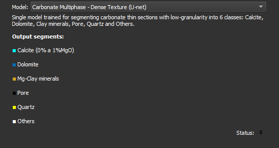

## Segmentação Inteligente

Segmente automaticamente a imagem usando um modelo de aprendizado de máquina. Se preferir segmentar a imagem manualmente, pule este passo com a opção `Skip`.

**Módulo correspondente**: [Segmentação Automática (Thin Section)](../../Segmenter/Automatic/automatic_thinSection.md) 

### Elementos da Interface

- **Model**: Selecione o modelo a ser usado para segmentar a imagem. Após selecionar, informações sobre o modelo aparecerão, incluindo descrição e segmentos de saída. Cada modelo segmenta a imagem em um conjunto específico de classes.
