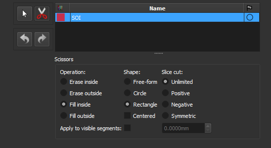
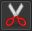
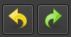

## Definir o Segmento de Interesse

Selecione o segmento de interesse (SOI) para as imagens PP/PX.

Algumas imagens podem incluir regiões que não fazem parte da rocha, em especial nas bordas. Esse passo permite definir a região relevante.

Os passos posteriores *Smart-seg* e *Auto-label* serão executados apenas nesta região.

Para definir o segmento, desenhe retângulos na imagem. Se preferir desenho livre, selecione a opção *Free-form*.

**Módulo correspondente**: *[Segment Editor](../Modulos/SegmentEditor.md)*

### Elementos da Interface

#### Ferramentas de Segmentação

-  **Sem edição**: Use este ícone para interagir com a visualização (zoom, mover etc) em vez de desenhar o segmento.
-  **Tesoura**: Use este ícone para ativar a ferramenta de tesoura, usada para editar o segmento de interesse.

#### Opções da Tesoura

- **Operações**:
    - **Erase inside**: Apagar parte do segmento que estiver dentro da região desenhada.
    - **Erase outside**: Apagar parte do segmento que estiver fora da região desenhada.
    - **Fill inside**: Preencher segmento dentro da região desenhada.
    - **Fill outside**: Preencher segmento fora da região desenhada.
- **Formas**:
    - **Free-form**: Desenhar desenhos livres.
    - **Circle**: Desenhar círculos.
    - **Rectangle**: Desenhar retângulos.
-  **Undo/Redo**: Desfazer ou refazer a última alteração.