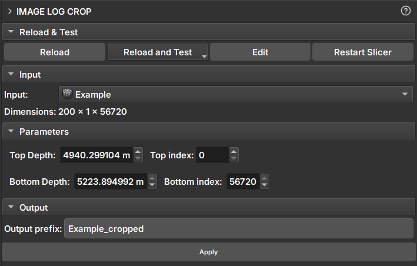

# Módulo Image Log Crop

O Módulo _Image Log Crop_ é uma ferramenta integrada ao GeoSlicer, projetada para permitir o recorte personalizado de imagens de poço, ajustado com base nas profundidades do topo ou fundo da imagem, ou pelo uso das linhas da matriz para delimitar a área de interesse.

## Painéis e sua utilização

|  |
|:-----------------------------------------------:|
| Figura 1: Apresentação do módulo Image Log Crop. |

### Principais opções:

 - _Input_: Escolha a imagem a ser recortada. 

 - _Top Depth_: Profundidade da parte superior da imagem do poço.

 - _Top Index_: Índice do pixel (Número da linha matriz) equivalente da profundidade de corte superior escolhida, em relação à profundidade da imagem selecionada.

 - _Bottom Depth_: Profundidade da parte inferior da imagem do poço.

 - _Bottom Index_: Índice do pixel (Número da linha matriz) equivalente da profundidade de corte inferior escolhida, em relação à profundidade da imagem selecionada.