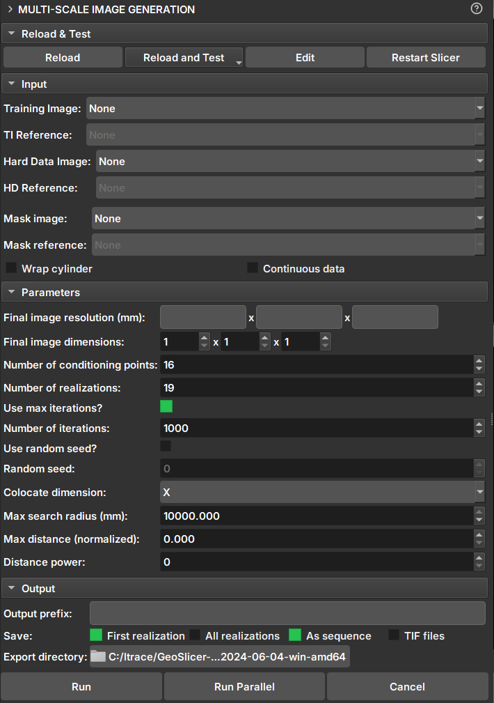

# Módulo Multiscale Image Generation

O módulo Multiscale Image Generation oferece uma interface com diversos parâmetros para a manipulação e configuração da biblioteca MPSlib. O MPSlib possui um conjunto de algoritmos baseados em modelos estatísticos de múltiplos pontos (MPS - Multiple point statistical) inferidos a partir de uma imagem de treinamento.
Atualmente, apenas o algoritmo Generalized ENESIM com modo de amostragem direta (DS - Direct Sampling) está disponível.

## Painéis e sua utilização

|  |
|:-----------------------------------------------:|
| Figura 1: Módulo Multiscale Image Generation. |

## Dados de entrada

 - _Training Image_: Volume que atua como imagem de treinamento.

 - _Hard Data Image_: Volume que atua como "Hard Data", onde os valores e pontos são fixos durante a simulação.

 - _Mask Image_: Volume que atua como máscara para seleção da área de simulação. Segmentos não selecionados não serão incluídos na simulação.

 - _Wrap cylinder_: Caso o "Hard Data" seja uma imagem de poço (2D), esta opção faz com que a imagem seja considerada como um cilindro e realize simulações como 3D.

 - _Continuous data_: Altera o tipo de dado de simulação para contínuo. Em simulação de dado contínuo as segmentações controlam quais regiões e valores do volume vão entrar como Hard Data ou dado de treinamento. Segmentos não selecionados serão desconsiderados. Dados de entrada escalares sempre são simulados como contínuos e em toda extensão do volume.

Segmentações e Labelmaps podem ser usadas para simulações discretas e contínuas, mas volumes escalares podem ser usadas apenas para contínua.

### Parâmetros

 - _Final Image Resolution_: Resolução do voxel da imagem resultante (mm).

 - _Final Image Dimensions_: Dimensões da imagem resultante.

 - _Number of Conditioning points_: Número de pontos condicionantes a ser utilizado em cada iteração.
 
 - _Number of realizations_: Número de simulações e imagens a serem geradas.

 - _Number of max iterations_: Número máximo de iterações na pesquisar na imagem de treinamento.

 - _Random seed_: Valor inicial usado para iniciar a simulação. Uma mesma seed com os mesmos parâmetros sempre geram o mesmo resultado.

 - _Colocate dimensions_: Para uma simulação 3D, garanta que a ordem nas últimas dimensões seja importante, permitindo uma co-simulação 2D com dados condicionais na terceira dimensão.

 - _Max search radius_: Somente dados condicionais dentro de um raio definido são usados como dados de condicionamento.

 - _Max distance_: A distância máxima que levará à aceitação de uma correspondência condicional de modelo. Se o valor for 0, será buscada uma correspondência perfeita.

 - _Distance power_: Pondera os dados de condicionamento com base na distância dos valores centrais. Valor 0 configura sem ponderação. 

