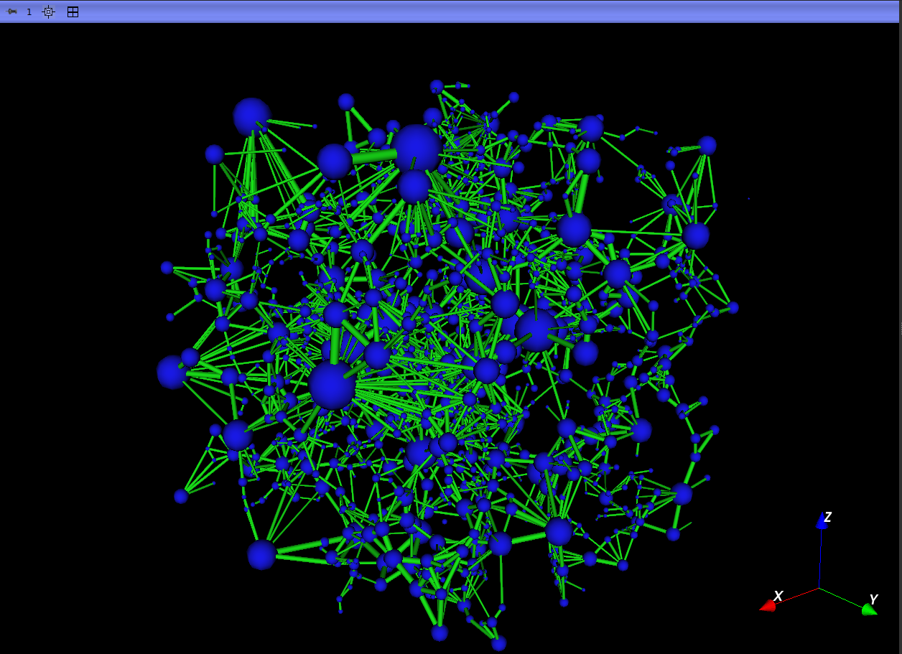

# Extração

Esse módulo é utilizado para extrair a rede de poros e ligações a partir de: uma segmentação individualizada dos poros (_Label Map Volume_) realizada por um algoritmo de [_watershed_](../Quantification/segment_inspector.html), gerando uma rede uniescalar; ou por um mapa de porosidades (_Scalar Volume_), que gerará um modelo multiescalar com poros resolvidos e não-resolvidos.

|  |
|:-----------------------------------------------------------------------:|
| Figura 1: Interface do módulo de Extração. |

Após a extração, ficará disponível na interface do GeoSlicer: as tabelas de poros e gargantas e também os modelos de visualização da rede. As tabelas geradas serão os dados usados na etapa seguinte de simulação.

|  |
|:-----------------------------------------------------------------------:|
| Figura 1: A esquerda Label Map utilizado como entrada na extração e a direita rede uniescalar extraída. |

|  |
|:-----------------------------------------------------------------------:|
| Figura 2: A esquerda Scalar Volume utilizado como entrada na extração e a direita rede multiescalar extraída, onde azul representa poros resolvidos, e rosa representa os poros não-resolvidos. |
