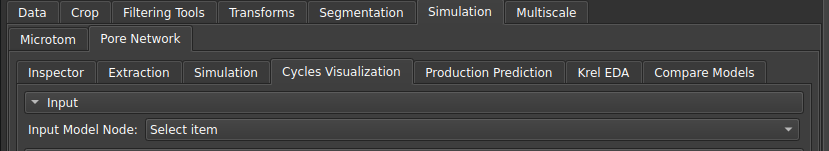
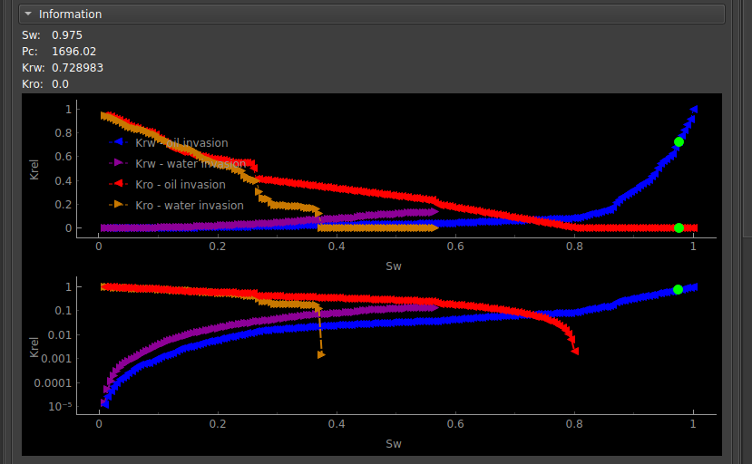

# Cycles Visualization

Esse módulo serve para controlar e visualizar as simulações de permeabilidade relativa criadas no módulo Pore Network Simulation com a opção "Create animation node" ativada.

|  |
|:-----------------------------------------------------------------------:|
| Figura 1: Entrada do nó de animação para visualização. |

Ao selecionar o nó de animação, aparecerá na visualização 3D um modelo dos poros e ligações com setas nas regiões de inlet/outlet, indicando o sentido das invasões. Além disso os gráficos na seção "Information" mostraram as curvas do Krel e algumas informações extras.

|  |
|:-----------------------------------------------------------------------:|
| Figura 3: Curvas de permeabilidade relativa para o ciclo. |

A partir da seção parâmetros na interface, o usuário pode então controlar a animação.

|  |
|:-----------------------------------------------------------------------:|
| Figura 3: Interface de seleção de parâmetros. |

- Show zero log Krel: Coloca um valor não-nulo para os pontos na escala logarítmica;
- Animations step: Seleciona um passo de tempo específico na animação;
- Run animation: Atualiza incrementalmente o passo da simulação de forma automática;
- Loop animation: Executa a atualização em loop, voltando ao início sempre que chegar ao fim;
- Animation speed: Escolhe a velocidade da atualização automática;
