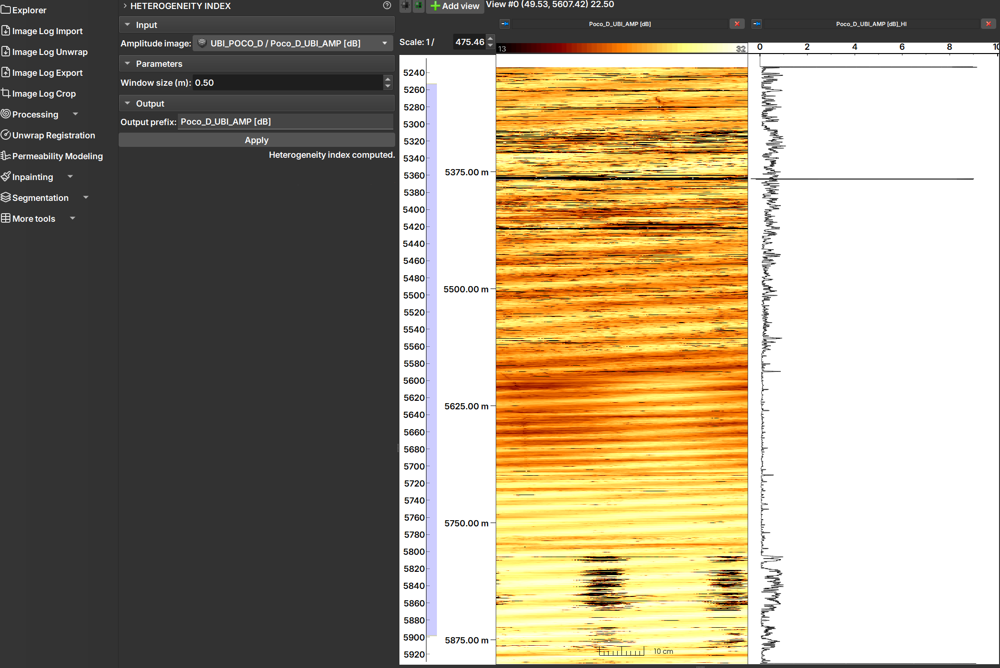

# Índice de Heterogeneidade

O módulo Índice de Heterogeneidade (_Heterogeneity Index_) calcula o índice de heterogeneidade de uma imagem de poço, como proposto por [Oliveira e Gonçalves (2023)](https://doi.org/10.30632/SPWLA-2023-0034).

## Interface

O módulo se encontra no ambiente _Well Logs_. Na barra esquerda, navegar por _Processing_ > _Heterogeneity Index_.

|  |
|:-----------------------------------------------:|
| Figura 1: Módulo Índice de Heterogeneidade (esquerda) e a visualização da imagem ao lado do índice (direita). |

### Parâmetros

 - **Input**:
    - _Amplitude image_: Selecione a imagem de amplitude a ser analisada.
 - **Parameters**:
    - _Window size (m)_: Tamanho em metros da maior janela de profundidade que será analisada. Aumentar este valor resultará em uma curva de HI mais suave.
 - **Output**:
    - _Output prefix_: O prefixo de saída. A curva de saída será nomeada como `<prefixo>_HI`.
 - _Apply_: Executa o algoritmo.

## Método

O método calcula o índice de heterogeneidade (HI) de uma imagem de amplitude, avaliando o desvio padrão em diferentes escalas (tamanhos de janela de convolução). Em seguida, o algoritmo ajusta uma regressão linear entre o logaritmo da escala e o desvio padrão. O coeficiente angular dessa regressão representa o índice de heterogeneidade para cada profundidade analisada. Assim, o índice quantifica a relação entre a variação local e a escala de observação.

## Referências

- OLIVEIRA, Lucas Abreu Blanes de; GONÇALVES, Leonardo. *Heterogeneity index from acoustic image logs and its application in core samples representativeness: a case study in the Brazilian pre-salt carbonates*. In: **SPWLA 64th Annual Logging Symposium**, 10–14 jun. 2023. Anais [...]. [S.l.]: Society of Petrophysicists and Well-Log Analysts, 2023. DOI: [10.30632/SPWLA-2023-0034](https://doi.org/10.30632/SPWLA-2023-0034).
