# Segmentação Automática (Micro CT)

Dois problemas merecem especial atenção quando o assunto é a microtomografia de rocha. Em primeiro lugar, a segmentação de poros em relação aos seus minerais. Este procedimento pode ser útil para a caracterização de poros, de propriedades geoestatísticas, hidráulicas e mecânicas das rochas, bem como para a execução de simulações posteriores. O segundo problema é o da identificação conjunta dos elementos gerais contidos na amostra. Nesta segunda segmentação, denominada *basins*, múltiplas classes de elementos são consideradas: não-material, poro, quartzo, porosidade em sub-resolução, calcita e alta atenuação. Para além do valor intrínseco à identificação de minerais, tal segmentação é utilizada na inferência da densidade da rocha, na caracterização de suas fraturas e no estudo detalhado do comportamento dos fluidos nas rochas de interesse.

## Arquitetura U-Net

O GeoSlicer implementa segmentadores para ambos os problemas acima por meio de redes neurais pré-treinadas do tipo U-Net, a qual foi introduzida na [segmentação multifásica de lâminas](./automatic_ThinSection) delgadas. As configurações de rede U-Net utilizadas nesta seção são mostradas na Tabela 1.

|Parâmetros da U-Net | Segmentação binária | Segmentação *basins*|
|:------------------:|:-------------------:|:--------------------:|
|Escalas | 5 | 5|
|Convoluções por escala | 2 | 2|
|Função de ativação | PReLU | PReLU|
|Canais de entrada | 1 | 1|
|Canais de saída | 1 | 6|

##### Tabela 1: Configuração de modelos utilizados na segmentação de poros e basins.

## Treinamento

Os dados utilizados no treinamento somam 68 volumes para o caso do modelo de segmentação binária (poro/não-poro), e 106 para os volumes de segmentação multi-classe, como detalhado na tabelas 2 e 3. A distribuição de intensidades varia bastante entre um produto de microtomografia e outro. De forma a facilitar a generalização da rede para dados futuros, uma transformação linear de histograma foi realizada, de tal modo que os percentis 5 e 50 tornassem as intensidades 0 e 0.5, respectivamente.

Os volumes de treinamento foram recortados em subvolumes menores, com dimensão de 128³ voxels. Uma porção aleatória de 75% deles sofreu transformações aleatórias de aumento de dados, incluindo rotações, reversões e adição de ruído branco antes de carregadas para treinamento, enquanto que os outros 25% foram carregados diretamente em cada etapa de validação.

|Conjunto (segmentação binária) | Volumes | Subvolumes recortados|
|:------------------:|:-------------------:|:--------------------:|
|Treinamento e validação | 64 | 26086|
|Teste | 4 | 806|
|Total | 68 | 26892|

##### Tabela 2: Configuração de dados utilizados no treinamento e teste do modelo de segmentação de poros.

|Conjunto (segmentação binária) | Volumes | Subvolumes recortados|
|:------------------:|:-------------------:|:--------------------:|
|Treinamento e validação | 100 | 44156|
|Teste | 6 | 2288|
|Total | 106 | 46444|

##### Tabela 3: Configuração de dados utilizados no treinamento e teste do modelo de segmentação *basins*.

O poro, que é a classe mais importante em ambas as segmentações, encontra-se em pequenas regiões, sendo menos comum do que as outras classes. Esta característica torna todo o conjunto de dados desbalanceado, pela própria natureza das rochas. Nestes casos, é indicado o uso da função custo de Tversky no treinamento, ao invés das mais tradicionais, como a entropia cruzada, e o custo de Dice. A função custo de Tversky, proposta por Salehi et al., 2017, foi projetada para abordar essa questão, incorporando dois parâmetros de compensação entre os falsos positivos ($\alpha$) e falsos negativos ($\beta$), definidos pelo usuário. No artigo em que é definida, os valores de 0.3 para $\alpha$ e 0.7 para $\beta$ se mostraram úteis para o treinamento de modelos em dados altamente desequilibrados, permitindo que o mesmo seja mais sensível às classes minoritárias. Considerando um modelo binário, tal função tem a seguinte forma:

$$TL(\alpha, \beta)=\frac{\sum_{i=1}^N p_{0 i} g_{0 i}}{\sum_{i=1}^N p_{0 i} g_{0 i}+\alpha \sum_{i=1}^N p_{0 i} g_{1 i}+\beta \sum_{i=1}^N p_{1 i} g_{0 i}},$$

onde TL é a função custo de Tversky, $\alpha$ e $\beta$ são seus parâmetros, $p_{0 i}$ é a probabilidade do voxel $i$ pertencer à classe segmentada, enquanto $p_{1 i}$, a de não pertencer a ela. De modo similar, $g_{0 i}$ vale 1 no voxel $i$ se ele pertence à classe segmentada e 0 caso contrário, enquanto $g_{1 i}$ é o oposto. Num cenário com mais de duas classes sendo segmentadas, o custo de Tversky é a média dos custos relacionados a cada classe.

## Resultados

Ambos os modelos foram treinados até que o custo calculado na validação passasse a divergir, com tamanho de lote igual a 32 exemplos para a rede binária e 10 exemplos para a rede *basins*. A evolução da função custo nos dois casos são mostradas nas Figuras 2 e 5. A Figura 3 apresenta a matriz de confusão normalizada em relação aos rótulos verdadeiros para o modelo de segmentação poro/não-poro numa das imagens de validação. De forma similar, a Figura 6 contém a matriz de confusão para a segmentação multi-classe. Este modelo não conseguiu generalizar as classes não-material e alta-atenuação (*non-material* e *high-attenuation*). Enquanto o primeiro caso é esperado, pois os dados utilizados no treinamento raramente continham exemplos da classe, o segundo representa um considerável potencial para melhorias, de forma que o modelo *basins* deixe de ignorar estes elementos durante a segmentação. As distribuições de tamanho de poro foram calculadas para os dois modelos usando recortes centrais de 400³ voxels, e podem ser vistos nas Figura 3 e 6. As curvas de distribuição de poros previstas se aproximaram mais das anotadas no caso do modelo binário, o que indica que ele deve ser utilizado quando uma boa segmentação de poros é mais valorizada em determinada tarefa.

### Segmentação Binária

| 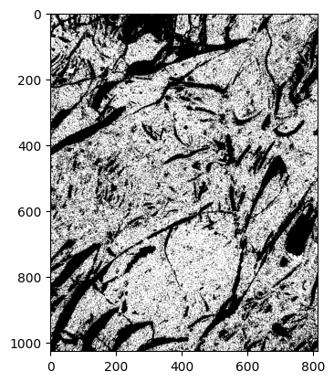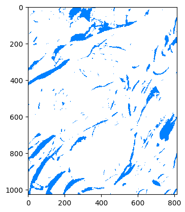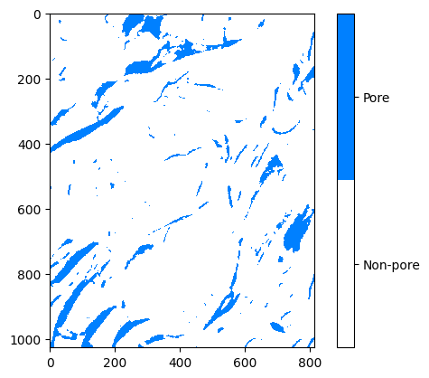 |
|:-----------------------------------------------:|
| Figura 1: Seção de imagem de micro-CT de um dos testes do modelo de segmentação binária junto com a respectiva anotação utilizada (ao centro) e resultado dos rótulos previstos pela rede de poros (a direita).

| 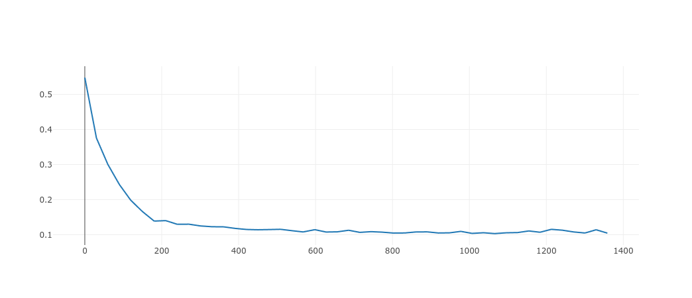 |
|:-----------------------------------------------:|
| Figura 2: Evolução da função custo em cada iteração de treinamento do modelo de poros no conjunto de validação.

| 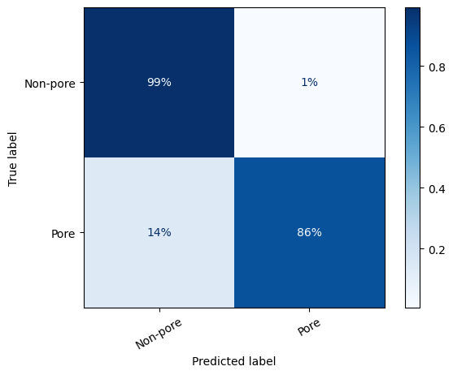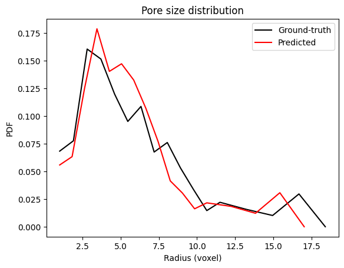 |
|:-----------------------------------------------:|
| Figura 3: Matriz de confusão do modelo de poros em dados de teste e distribuição de tamanho de poros prevista contra anotada em um dos volumes do conjunto de teste usando o modelo de segmentação binária.

### Segmentação *Basins*

| 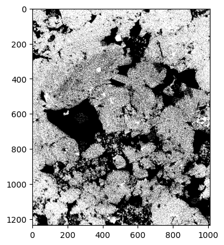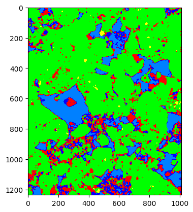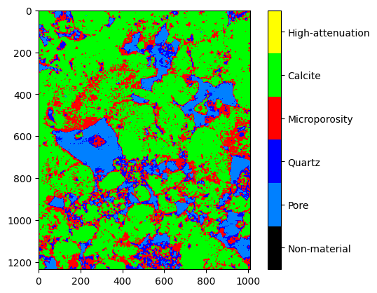 |
|:-----------------------------------------------:|
| Figura 4: Seção de imagem de micro-CT de uma das imagens de teste do modelo de segmentação basins (RJS688A_F6484H_LIMPA_T2_01983nm), com a respectiva anotação utilizada (ao centro) e resultado dos rótulos previstos pela rede de poros (à direita).

| 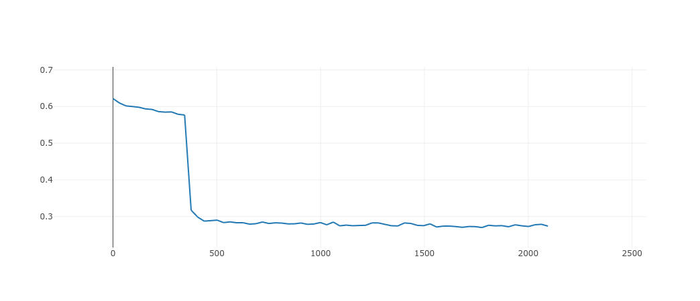 |
|:-----------------------------------------------:|
| Figura 5: Evolução da função custo em cada iteração de treinamento do modelo de poros no conjunto de validação.

| 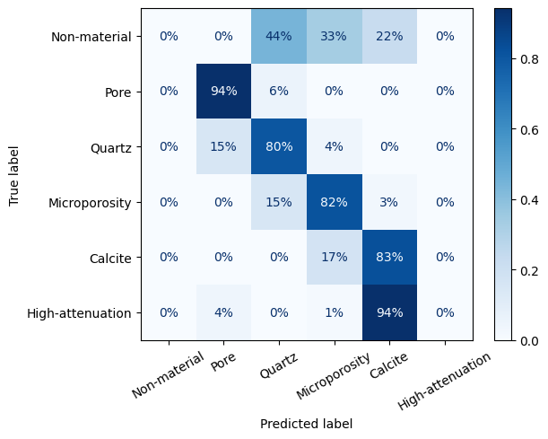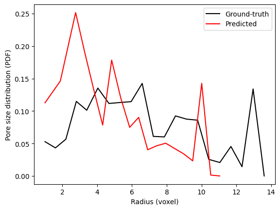 |
|:-----------------------------------------------:|
| Figura 6: Matriz de confusão do modelo de segmentação basins em dados de teste e distribuição de tamanho de poro predita contra anotada em um dos volumes do conjunto de teste usando o modelo de segmentação basins.

## Referências Bibliográficas

SCHMIDT, U., WEIGERT, M., BROADDUS, C., MYERS, G. Cell detection with star-convex polygons. In: Medical Image Computing and Computer Assisted Intervention–MICCAI 2018: 21st International Conference, Granada, Spain, September 16-20, 2018, Proceedings, Part II 11. Springer International Publishing, 2018. p. 265-273.

SALEHI, Seyed Sadegh Mohseni; ERDOGMUS, Deniz; GHOLIPOUR, Ali. Tversky loss function for image segmentation using 3D fully convolutional deep networks. In: Machine Learning in Medical Imaging: 8th International Workshop, MLMI 2017, Held in Conjunction with MICCAI 2017, Quebec City, QC, Canada, September 10, 2017, Proceedings 8. Springer International Publishing, 2017. p. 379-387.

WEIGERT, M., SCHMIDT, U., HAASE, R., SUGAWARA, K., MYERS, G. Star-convex polyhedra for 3D object detection and segmentation in microscopy. In: Proceedings of the IEEE/CVF winter conference on applications of computer vision. 2020. p. 3666-3673.

BAI, Min; URTASUN, Raquel. Deep watershed transform for instance segmentation. In: Proceedings of the IEEE conference on computer vision and pattern recognition. 2017. p. 5221-5229.

HE, K., GKIOXARI, G., DOLLÁR, P., GIRSHICK, R. Mask r-cnn. In: Proceedings of the IEEE international conference on computer vision. 2017. p. 2961-2969.

RONNEBERGER, Olaf; FISCHER, Philipp; BROX, Thomas. U-net: Convolutional networks for biomedical image segmentation. In: Medical Image Computing and Computer-Assisted Intervention–MICCAI 2015: 18th International Conference, Munich, Germany, October 5-9, 2015, Proceedings, Part III 18. Springer International Publishing, 2015. p. 234-241.
