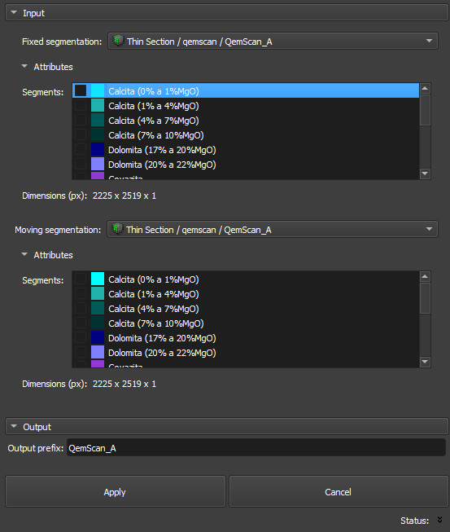

# Thin Section Automatic Registration

O módulo Thin Section Auto Registration faz parte da categoria Registration e tem como objetivo registrar automaticamente imagens de seções delgadas, usando segmentações de volumes fixos e móveis. Ele permite definir imagens de entrada, configurar prefixos de saída e aplicar transformações para alinhar as imagens.

## Painéis e sua utilização

|  |
|:-----------------------------------------------:|
| Figura 1: Apresentação do módulo Auto Registration. |

### Principais opções:
A interface do módulo Auto Registration é composta por vários painéis, cada um projetado para simplificar o carregamento e o processamento de imagens QEMSCAN/RGB:

 - _Fixed segmentation image_: Escolha a imagem de referência ou fixa.

 - _Moving segmentation image_: Escolha a imagem que será transformada para se alinhar à imagem fixa.

 - _Segments_: Escolha os segmentos da imagem a ser transformada para serem utilizados para otimização do registro.

 - _Output prefix_: Defina um prefixo que será aplicado aos resultados, facilitando a organização e identificação dos arquivos de saída

 - _Apply_:  Inicia o processo de registro, aplicando transformações que alinham a segmentação móvel à segmentação fixa.

 - _Cancel_:  Interrompe o processo em qualquer momento, caso seja necessário.