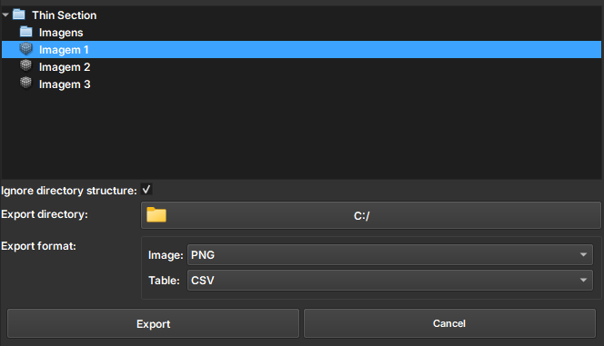

# Thin Section Export

O módulo Thin Section Export é usado para exportar diferentes tipos de dados, como imagens, mapas de rótulos e tabelas, em formatos como PNG, TIF, CSV e LAS. O módulo oferece uma interface gráfica onde o usuário pode escolher quais dados exportar, selecionar o formato desejado e definir a pasta de destino. Ele também mostra o progresso da exportação e permite cancelar o processo se necessário. O objetivo é facilitar a exportação de dados geológicos ou científicos de forma organizada.

## Painéis e sua utilização

|  |
|:-----------------------------------------------:|
| Figura 1: Apresentação do módulo Thin Section Export. |

### Principais opções:

 - _Explorer data_: Escolha a Imagem a ser Exportada. 

 - _Ignore directory structure_: Exporte todos os dados ignorando a estrutura de diretórios. Apenas um nó com o mesmo nome e tipo será exportado.

 - _Export directory_: Caminho para os arquivos exportados

 - _Export format_: Formatos como PNG, TIF, CSV e LAS são suportados
