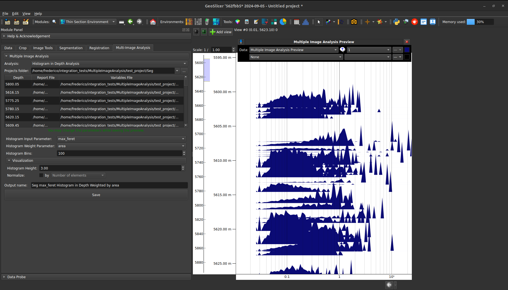
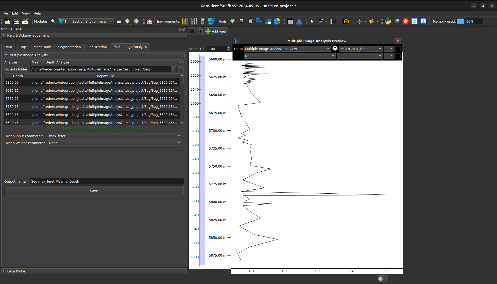
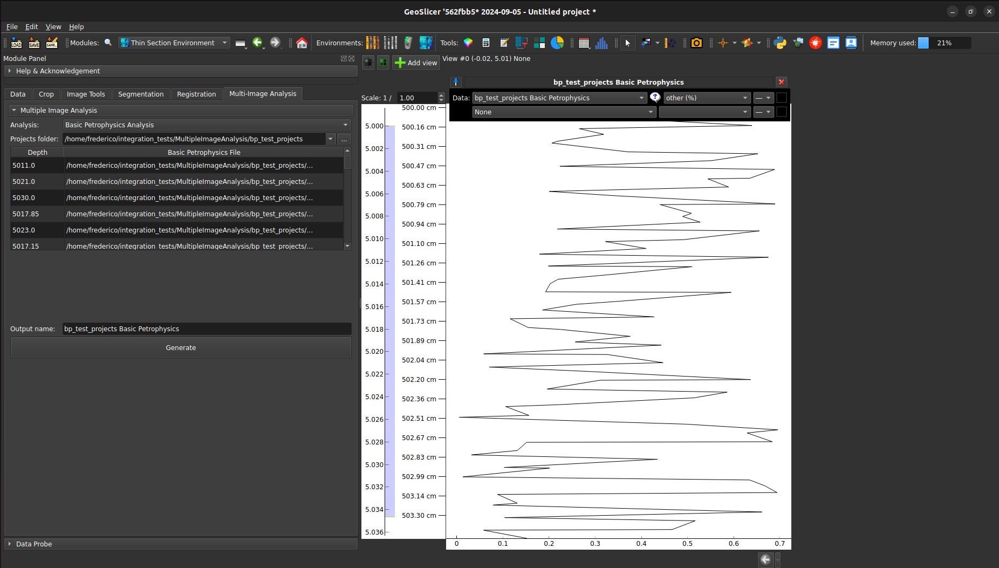

# Multiple Image Analysis

Crie diversos tipos de análise a partir dos conjuntos de dados incluídos em vários projetos do GeoSlicer. Para utilizá-la, forneça um caminho de diretório que contenha múltiplas pastas de projetos do GeoSlicer. As pastas de projeto inclusas devem ser adequadas para o seguinte padrão:

`<TAG>_<VALOR_PROFUNDIDADE>`

### Exemplo de Estrutura de Diretórios

- **Projetos**
  - `TAG_3000,00m`
    - `TAG_3000,00m.mrml`
    - **Data**
  - `TAG_3010,00m`
    - `TAG_3010,00m.mrml`
    - **Data**

## Análises

### 1. Histograma por Profundidade

Gera uma curva de histograma para cada valor de profundidade, com base em um parâmetro específico do relatório do plugin 'Segment Inspector'.

|  |
|:-----------------------------------------------:|
| Figura 1: Interface da análise de Histograma por Profundidade. |

#### Opções de Configuração

- **Histogram Input Parameter**: Define o parâmetro utilizado para criar o histograma.
- **Histogram Weight Parameters**: Define o parâmetro usado como peso no histograma.
- **Histogram Bins**: Especifica o número de bins no histograma.
- **Histogram Height**: Ajusta a altura visual da curva do histograma.
- **Normalize**: Aplica normalização aos valores do histograma. A normalização pode ser baseada pelo número de elementos ou por algum dos parâmetros disponíveis no relatório do Segment Inspector (e.g., Área de Voxel, Área de ROI).

### 2. Média por Profundidade

Calcula o valor médio para cada profundidade com base em um parâmetro específico do relatório do plugin 'Segment Inspector'.

#### Opções de Configuração

- **Mean Input Parameter**: Define o parâmetro a ser analisado.
- **Mean Weight Parameters**: Define o parâmetro utilizado como peso durante a análise.

|  |
|:-----------------------------------------------:|
| Figura 2: Interface da análise de Média por Profundidade. |

### 3. Petrofísica Básica

Gera uma tabela que inclui os parâmetros relacionados ao método de Petrofísica Básica do plugin 'Segment Inspector', organizados por valor de profundidade.

|  |
|:-----------------------------------------------:|
| Figura 3: Interface da análise de Petrofísica Básica. |