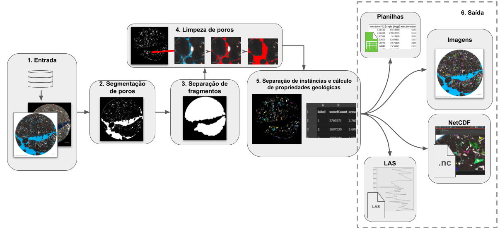
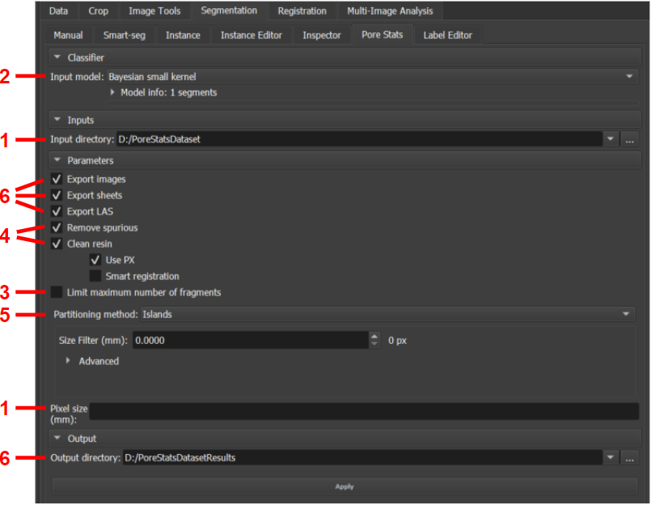
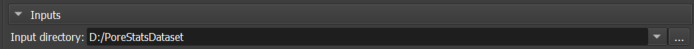
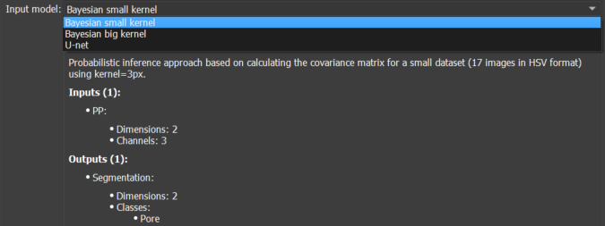
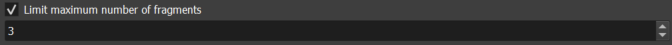
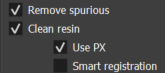
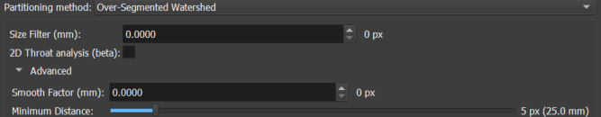
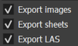

# Pore Stats: estatísticas e propriedades de poros e partículas em seção delgada

O módulo _Pore Stats_ oferece recursos para o cálculo de propriedades geológicas de poros em lotes de imagens de seção delgada de rocha, bem como estatísticas descritivas relacionadas. Dado um diretório de entrada contendo imagens relativas a um mesmo poço, o módulo é capaz de segmentar a região porosa, separar os diferentes poros, calcular diferentes propriedades de cada um e salvar relatórios e imagens sumarizando os resultados.

## Interface e funcionamento

O módulo está disponível no ambiente _Thin Section_, na aba _Segmentation_, sub-aba _Pore Stats_. A Figura 1 ilustra uma visualização geral do fluxo de funcionamento do módulo, enquanto a Figura 2 mostra a interface do módulo no GeoSlicer e aponta, para cada recurso, a subseção desta seção que o descreve.

|  |
|:-----------------------------------------------:|
| Figura 1: visualização geral do fluxo de funcionamento do módulo. |


|  |
|:-----------------------------------------------:|
| Figura 2: módulo *Pore Stats*. |

### 1. Entrada

O módulo é desenvolvido de modo a iterar sobre todas as imagens válidas que encontrar num dado diretório de entrada. Uma imagem é considerada válida caso o arquivo tenha formato PNG, JPEG ou TIFF e seu nome respeite o seguinte padrão: `<poço>_<profundidade-valor>(-índice-opcional)<profundidade-unidade>_<…>_c1.<extensão>`. O sufixo `c1` se refere à imagens em polarização direta (PP). Opcionalmente, contrapartes em polarização cruzada (PX) que constem no mesmo diretório também podem ser usadas para auxiliar em operações específicas, devendo ter o sufixo `c2`. Segue um exemplo de diretório de entrada: 

```
Diretório_entrada
    |__ ABC-123_3034.00m_2.5x_c1.jpg
    |__ ABC-123_3034.00m_2.5x_c2.jpg
    |__ ABC-123_3080.0-2m_c1.jpg
    |__ ABC-123_3080.0-2m_c2.jpg
    |__ ABC-123_3080.0m_c1.jpg
    |__ ABC-123_3080.0m_c2.jpg
    |__ ABC-123_3126.65m_2.5x_TG_c1.jpg
    |__ ABC-123_3126.65m_2.5x_TG_c2.jpg
```

O exemplo descreve um diretório de entrada com 4 imagens JPEG do poço "ABC-123", correspondentes às profundidades de 3034, 3080 e 3126,65 metros, em ambas as versões PP/c1 e PX/c2. Como existem duas variações correspondentes à mesma profundidade (3080m), um índice opcional ("-2") consta em uma delas. Entre as informações de profundidade e polarização, algumas informações adicionais podem existir entre *underlines* (como "\_2.5x\_" e "\_TG\_"). 

Além do diretório de entrada, também é necessário especificar a escala das imagens em mm, ou seja, quantos mm são representados pela distância entre um pixel e o pixel subsequente.

O diretório de entrada pode ser definido através do seletor _Input directory_ na interface do módulo, dentro da seção _Inputs_ da interface. Já a escala das imagens deve ser especificada no campo _Pixel size (mm)_, na seção _Parameters_.


|  |
|:-----------------------------------------------:|
| Figura 3: seletor de diretório de entrada. |


|  |
|:-----------------------------------------------:|
| Figura 4: campo de escala mm/pixel. |


### 2. Segmentação de poros

Uma vez que uma imagem é carregada, sua região porosa é segmentada através dos **[modelos pré-treinados](../../Segmenter/Automatic/automatic_thinSection.md)**
<a href="../../Segmenter/Automatic/automatic_thinSection.html">
    
</a>  disponíveis no GeoSlicer. Neste módulo, 3 modelos são disponibilizados:

* Modelo bayesiano de _kernel_ pequeno;
* Modelo bayesiano de _kernel_ grande;
* Modelo neural convolucional U-Net.

Escolha o modelo através do seletor _Input model_ na seção _Classifier_. A caixa de informações abaixo do seletor pode ser expandida para maiores detalhes sobre cada modelo.

|  |
|:-----------------------------------------------:|
| Figura 5: seletor de modelo de segmentação de poros. |

### 3. Separação de fragmentos

Muitas imagens possuem grandes regiões "vazias", preenchidas por resina de poro, que são detectadas pelo segmentador mas que não correspondem de fato à porosidade da rocha, mas apenas à região em volta de seu(s) fragmento(s) (vide exemplo da Figura 1). Em alguns casos, não todos mas apenas os _N_ maiores fragmentos da seção de rocha interessam. Para isolar os fragmentos úteis da rocha, a seguinte sequência de operações é aplicada:

* Primeiramente, o maior fragmento, correspondente à toda área da seção, é isolado das bordas da imagem;
* Então, toda porosidade detectada que toque a borda da imagem é também descartada, pois é interpretada como resina de poro visível ao redor da área útil da rocha;
* Por fim, caso seja interessante apenas os _N_ maiores fragmentos, o tamanho (em pixeis) de cada fragmento da área útil restante é medido e apenas os _N_ maiores são mantidos.

O módulo executa a separação de fragmentos automaticamente. Porém, é possível limitar a análise aos _N_ maiores marcando a caixa de seleção _Limit maximum number of fragments_, na seção _Parameters_, e definindo o valor de _N_ (entre 1 e 20).


|  |
|:-----------------------------------------------:|
| Figura 6: limitador de fragmentos a serem analisados, do maior para o menor. |


### 4. Limpeza de poros

Este algoritmo é responsável por aplicar duas operações de "limpeza" na segmentação de poros convencional, que se não realizadas podem impactar negativamente nos resultados finais.

**Remoção de poros espúrios**

Os segmentadores de poro atuais do GeoSlicer tendem a gerar detecções espúrias em pequenas regiões compreendidas por rocha mas que por efeitos de iluminação/resolução/afins têm coloração parecida com a da resina azul de poro. O módulo executa um modelo capaz de reconhecer essas detecções e diferencia-las das corretas, com base nos valores de pixel dentro de um intervalo em torno do centróide de cada segmento. Todos os poros espúrios detectados são descartados.

**Incorporação de bolhas e resíduos na resina de poro**

É comum que se formem na resina de poro algumas bolhas de ar e resíduos relacionados. Os segmentadores não detectam esses artefatos, não interpretando-os como área de poro, o que influencia no tamanho e quantidade dos poros detectados. Este módulo visa "limpar" a resina, incluindo essas bolhas e resíduos ao corpo do poro correspondente. Basicamente, alguns critérios devem ser atendidos para que uma região da imagem seja interpretada como bolha/resíduo:

1. <u>Ter cor branca ou ter cor azul com pouca intensidade e saturação</u>: em geral, as bolhas são brancas ou, quando cobertas de material, têm um tom de azul quase negro. Os resíduos que eventualmente circundam as bolhas também tem um nível de azul pouco intenso;
2. <u>Tocar na resina de poro</u>: a transição entre a resina e os artefatos é normalmente direta e suave. Como o modelo de segmentação de poro detecta bem a região de resina, o artefato precisa tocar nessa região. Consequentemente, o algoritmo atual não consegue detectar casos menos comuns em que o artefato tome 100% da área do poro;
3. <u>Ser pouco visível na imagem PX/c2 (se disponível)</u>: alguns elementos da rocha podem ser parecidos com os artefatos e também ter contato com a resina. Porém, no geral, os artefatos são pouco ou nada visíveis nas imagens PX/c2, enquanto os demais elementos são geralmente notáveis. Este critério se faz mais efetivo quanto melhor for o registro (alinhamento espacial) entre as imagens PP e PX. O algoritmo tenta corrigir o registro das imagens automaticamente alinhando os centros das imagens. Esta etapa pode ser precedida por uma operação de enquadramento da área útil da rocha, descartando bordas excedentes.

As operações de limpeza são recomendadas, porém podem levar um tempo. Por isso, é possível desabilitá-las desmarcando as caixas de seleção _Remove spurious_ para remoção de poros espúrios e _Clean resin_ para limpeza da resina, na seção _Parameters_. Caso esta última esteja habilitada, duas outras opções são disponibilizadas:

* _Use PX_ para usar a imagem PX para análise do critério 3;
* _Smart registration_ para decisão automática entre realizar ou não o enquadramento antes do registro automático. Não é recomendada caso a imagens já sejam naturalmente registradas.


|  |
|:-----------------------------------------------:|
| Figura 7: opções de limpeza de poros espúrios e artefatos na resina de poro |


### 5. Separação de instâncias e cálculo de propriedades geológicas

Uma vez que a região porosa esteja devidamente segmentada e "limpa", o recurso de **[inspeção](../../Inspector/Watershed/estudos_de_porosidade.md)**
<a href="../../Inspector/Watershed/estudos_de_porosidade.html">
    
</a> 
do GeoSlicer é utilizado para separação da segmentação em diferentes instâncias de poros e cálculo das propriedades geológicas de cada um. As seguintes propriedades são computadas:

* Área (mm²);
* Ângulo (°);
* Máximo diâmetro de Feret (mm);
* Mínimo diâmetro de Feret (mm);
* Razão de aspecto;
* Alongamento;
* Excentricidade;
* Perímetro da elipse (mm);
* Área da elipse (mm²);
* Elipse: perímetro sobre área (1/mm);
* Perímetro (mm);
* Perímetro sobre área;
* _Gamma_.

Dentro da seção _Parameters_, escolha o método de separação através do seletor _Partitioning method_, entre as opções _Islands_ para separação por conectividade simples de pixeis e _Over-Segmented Watershed_ para aplicação do algoritmo SNOW. Ambas as opções permitem filtragem extra de detecções espúrias através da escolha de valor mínimo aceitável (_Size Filter (mm)_) para o tamanho do maior eixo (diâmetro de Feret) da detecção. A seleção do _watershed_ disponibiliza as seguintes opções extras:

* _2D Throat analysis (beta)_: caixa de seleção que permite incluir a análise de garganta de poros nos relatórios de saída da inspeção;
* _Smooth Factor (mm)_: fator que regula a criação de mais ou menos partições. Valores pequenos são recomendados;
* _Minimum Distance_: distância padrão mínima entre os picos de segmentação (pontos mais distantes das bordas) para serem considerados como pertencentes a diferentes instâncias.

|  |
|:-----------------------------------------------:|
| Figura 8: opções de separação da região porosa em diferentes instâncias de poros e cálculo de suas propriedades geológicas. |

Depois de todos os parâmetros e opções de entrada definidos, pressione o botão _Apply_ para geração dos resultados.

### 6. Saída

Um diretório de saída também deve ser especificado. Nele, é criado um sub-diretório _pores_, dentro do qual é criada uma pasta para cada imagem processada, herdando o nome da imagem. Dentro dessa pasta, são criados três arquivos:

* `AllStats_<nome-da-imagem>_pores.xlsx`: planilha contendo os valores das propriedades geológicas de cada instância detectada;
* `GroupsStats_<nome-da-imagem>_pores.xlsx`: agrupa as instâncias detectadas por similaridade de área e disponibliza diversas estatísticas descritivas calculadas sobre as propriedades desses grupos;
* `<nome-da-imagem>.png`: imagem que destaca as instâncias detectadas na imagem original colorindo-as aleatoriamente.

Em cada sub-diretório também é criada uma pasta LAS, contendo arquivos .las que sumarizam estatísticas descritivas das instâncias do poço inteiro, separadas por profundidade.

Finalmente, também são geradas imagens netCDF dos resultados. Elas estarão contidas no sub-diretório _netCDFs_.

Exemplo:

```
Diretório_saída
    |__ pores
    |   |__ LAS
    |   |   |_ las_max.las
    |   |   |_ las_mean.las
    |   |   |_ las_median.las
    |   |   |_ las_min.las
    |   |   |_ las_std.las
    |   |__ ABC-123_3034.00m_2.5x_c1
    |   |   |__ AllStats_ABC-123_3034.00m_2.5x_c1_pores.xlsx
    |   |   |__ GroupsStats_ABC-123_3034.00m_2.5x_c1_pores.xlsx
    |   |   |__ ABC-123_3034.00m_2.5x_c1.png
    |   |__ ...
    |__ netCDFs
        |__ ABC-123_3034.00m_2.5x_c1.nc
        |__ ...
```

Defina o diretório de saída através no seletor _Output directory_ na seção _Output_. Caso inexistente, o diretório é criado automaticamente.

|  |
|:-----------------------------------------------:|
| Figura 9: seletor do diretório de saída. |

Escolha se deseja ou não gerar os relatórios de saída através das caixas de seleção _Export images_, _Export sheets_ e _Export LAS_ na seção _Parameters_. Caso marcadas, garantem respectivamente a geração da imagem ilustrando as instâncias, das planilhas de propriedades e estatísticas e dos arquivos LAS de descrição do poço.

|  |
|:-----------------------------------------------:|
| Figura 10: exportação opcional das ilustrações das instâncias detectadas, das planilhas de propriedades e estatísticas e dos arquivos LAS de estatísticas por profundidade. |
