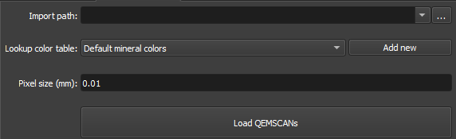

# Qemscan Loader

O módulo QEMSCAN Loader foi projetado especificamente para carregar e processar imagens QEMSCAN dentro do ambiente de Seção Delgada do GeoSlicer. Este módulo simplifica o processo de importação e visualização de dados complexos do QEMSCAN, oferecendo recursos como configurações personalizáveis de tamanho de pixel e tabelas de cores integradas para identificação eficiente de minerais.

## Painéis e sua utilização

|  |
|:-----------------------------------------------:|
| Figura 1: Apresentação do módulo Qemscan Loader. |

### Principais opções:
A interface do módulo QEMSCAN Loader é composta por vários painéis, cada um projetado para simplificar o carregamento e o processamento de imagens QEMSCAN:

 - _Input file_: Este input permite selecionar o diretório que contém seus arquivos de imagem QEMSCAN.

 - _Lookup color table_: Permite aos usuários criar e aplicar seus próprios mapeamentos de cores aos dados minerais ou a escolha entre um conjunto de tabelas de cores .csv predefinidas para atribuir cores a diferentes minerais com base em sua composição.

 - _Add new_: Opção de permitir que o carregador procure um arquivo CSV no mesmo diretório do arquivo QEMSCAN que está sendo carregado. Você também tem a opção de caixa de seleção para utilizar a tabela de "Cores minerais padrão". **[Cores minerais padrão](../../../../Resources/QEMSCAN/LookupColorTables/Default%20mineral%20colors.csv)**

 - _Pixel size(mm)_: Seção para definir a razão em px/milímetros. Se a imagem complementar em RGB ja foi importada, o valor deverá ser correspondente.

 - _Load Qemscam_: Carregar _QEMSCANs_ .