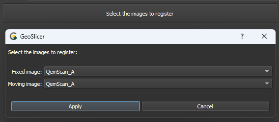
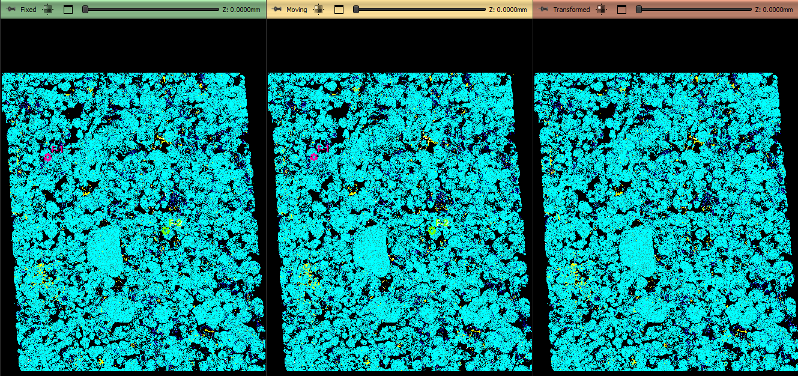
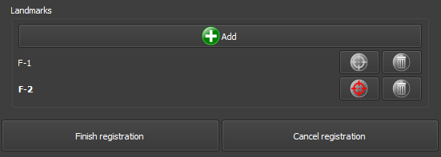

# Thin Section Manual Registration

O módulo Thin Section Registration é projetado para registrar imagens de cortes delgados e QEMSCAN, permitindo ao usuário alinhar as imagens através da adição de marcos (landmarks) em ambas. Após a seleção dos marcos correspondentes nas imagens fixas e móveis, o módulo aplica transformações para garantir um registro preciso.

## Inicialização

|  |
|:-----------------------------------------------:|
| Figura 1: Apresentação do módulo Manual Registration. |

### Principais opções:
A interface do módulo Manual Registration é composta por vários painéis, cada um projetado para simplificar o carregamento e o processamento de imagens QEMSCAN/RGB:

 - _Select images to register_: Este botão inicia a seleção de imagens para registro.

 - _Fixed image_: Escolha a imagem de referência ou fixa.

 - _Moving_: Escolha a imagem que será transformada para se alinhar à imagem fixa.

 - _Apply/Cancel_: Aceite ou cancele as escolhas de imagem.

## Painéis e sua utilização

|  |
|:-----------------------------------------------:|
| Figura 2: Apresentação do módulo Manual Registration. |

### Principais opções:
A interface do módulo Manual Registration é composta por vários painéis, cada um projetado para simplificar o carregamento e o processamento de imagens QEMSCAN/RGB:

#### Vizualization

|  |
|:-----------------------------------------------:|
| Figura 3: Apresentação das views do módulo Manual Registration. |

 - _Display_: Checkboxes para ferramentas de visualização. _Fixed image_: Apresentar a view com a imagem fixa, _Moving image_: Apresentar a view com a imagem que será transformada, _Transformed_: Apresentar a view interativa com a imagem transformada e _Reveal cursor_: Apresentar a regiao de transformação na view com a imagem transformada

 - _Fade_: Escolha a transparência da imagem transformada na view interativa com a imagem transformada.

 - _Rock/Flicker_: Efeitos de balanco ou de variação de transparência para a imagem transformada na view interativa com a imagem transformada.

 - _Views_: _ZoomIn/Out_: Escolha o nível de zoom das views.  _Fit_: Reseta o nível de zoom das views para apresentar toda a imagem.

#### Landmarks

|  |
|:-----------------------------------------------:|
| Figura 4: Apresentação da interface de landmarks. |

- _Add_ : Adicionar um ponto de referencia que será reproduzido nas views com a imagem fixa e na imagem que será transformada.

- : Remover um ponto de referencia que será reproduzido nas views com a imagem fixa e na imagem que será transformada.

- / : Ativa/Desativa a edição da posição um ponto de referencia que será reproduzido nas views com a imagem fixa e na imagem que será transformada. Somente uma pode ser editada por vez.

- _Finish/Cancel registration_: Termine ou cancele as edições de registro. Em caso de finalização, utilize a imagem transformada para os próximos processos.

