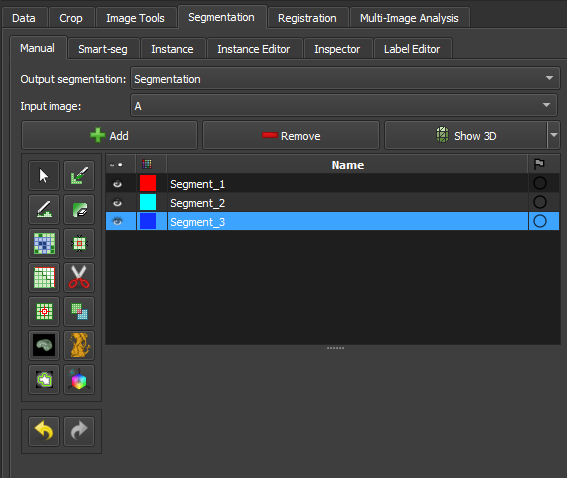
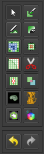
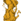

# Segment Editor

Este módulo é usado para especificar segmentos (estruturas de interesse) em imagens 2D/3D/4D. Algumas das ferramentas imitam uma interface de pintura, como o Photoshop ou o GIMP, mas operam em matrizes 3D de voxels em vez de pixels 2D. O módulo oferece edição de segmentos sobrepostos, exibição tanto em visualizações 2D quanto 3D, opções de visualização detalhadas, edição em visualizações 3D, criação de segmentações por interpolação ou extrapolação em algumas fatias, e edição em fatias em qualquer orientação.

O Segment Editor não edita volumes de mapas de rótulos, mas as segmentações podem ser facilmente convertidas para/partir de volumes de mapas de rótulos usando a seção Explorer e utilizando o menu do botão secundário do mouse.

## Segmentação e Segmento

O resultado de uma segmentação é armazenado no nó segmentation no GeoSlicer. Um nó de segmentação consiste em vários segmentos.

Um segmento especifica a região para uma estrutura única. Cada segmento possui um número de propriedades, como nome, cor de exibição preferencial, descrição do conteúdo (capaz de armazenar entradas codificadas padrão DICOM) e propriedades personalizadas. Os segmentos podem se sobrepor no espaço.

## Representação de rótulos em mapa binário

A representação em mapa binário de rótulos é provavelmente a representação mais comumente usada porque é a mais fácil de editar. A maioria dos softwares que utilizam essa representação armazena todos os segmentos em uma única matriz 3D, portanto, cada voxel pode pertencer a um único segmento: os segmentos não podem se sobrepor. No GeoSlicer, a sobreposição entre segmentos é permitida. Para armazenar segmentos sobrepostos em mapas binários, os segmentos são organizados em camadas. Cada camada é armazenada internamente como um volume 3D separado, e um volume pode ser compartilhado entre vários segmentos não sobrepostos para economizar memória.

Em uma segmentação com a representação de origem definida como mapa binário, cada camada pode ter geometria diferente (origem, espaçamento, direções dos eixos, extensões) temporariamente - para permitir mover segmentos entre segmentações sem perda de qualidade desnecessária (cada reamostragem de um mapa binário pode levar a pequenas mudanças). Todas as camadas são forçadas a ter a mesma geometria durante certas operações de edição e quando a segmentação é salva em arquivo.

## Painéis e sua utilização

|  |
|:-----------------------------------------------:|
| Figura 1: Apresentação do módulo segment editor. |

### Principais opções:

 - Segmentação: escolha a segmentação a ser editada.
 
 - Volume de origem: escolha o volume a ser segmentado. O volume de origem selecionado na primeira vez após a segmentação ser criada é usado para determinar a geometria de representação do labelmap da segmentação (extensão, resolução, direções dos eixos, origem). O volume de origem é usado por todos os efeitos do editor que utilizam a intensidade do volume segmentado (por exemplo, limite, rastreamento de nível). O volume de origem pode ser alterado a qualquer momento durante o processo de segmentação.

 - Adicionar: Adicione um novo segmento à segmentação e selecione-o.

 - Remover: selecione o segmento que deseja excluir e clique em Remover segmento para excluir da segmentação.

 - Mostrar 3D: exiba sua segmentação no visualizador 3D. Este é um botão de alternância. Quando ativado, a superfície é criada e atualizada automaticamente conforme o usuário segmenta. Quando desligado, a conversão não é contínua e o processo de segmentação é mais rápido. Para alterar os parâmetros de criação de superfície: clique na seta ao lado do botão siga para a opção "Smoothing factor" e na barra de valor para editar um valor de parâmetro de conversão. Definir o fator de suavização como 0 desativa a suavização, tornando as atualizações muito mais rápidas. Defina o fator de suavização como 0,1 para suavização fraca e 0,5 ou maior para suavização mais forte.

## Tabela de segmentos

Esta tabela exibe a lista de todos os segmentos.

### Colunas da tabela:

- Visibilidade (ícone de olho): Alterna a visibilidade do segmento. Para personalizar a visualização: abra os controles de visualização de fatia (clique nos ícones de botão e seta dupla na parte superior de um visualizador de fatia) ou vá para o módulo Segmentações.

- Amostra de cores: defina a cor e atribua o segmento à terminologia padronizada.

- Estado (ícone de bandeira): Esta coluna pode ser usada para definir o status de edição de cada segmento que pode ser usado para filtrar a tabela ou marcar segmentos para processamento posterior. 
Não iniciado: estado inicial padrão, indica que a edição ainda não ocorreu.
Em andamento: quando um segmento “não iniciado” é editado, seu estado é automaticamente alterado para este
Concluído: o usuário pode selecionar manualmente este estado para indicar que o segmentat está completo
Sinalizado: o usuário pode selecionar manualmente esse estado para qualquer finalidade personalizada, por exemplo, para chamar a atenção de um revisor especialista para o segmento

## Seção de efeitos

|  |
|:-----------------------------------------------:|
| Figura 2: Seção de efeitos do segment editor. |

- Barra de ferramentas de efeitos: Selecione o efeito desejado aqui. Veja abaixo mais informações sobre cada efeito.

- Opções: As opções para o efeito selecionado serão exibidas aqui.

- Desfazer/Refazer: O módulo salva o estado da segmentação antes de cada efeito ser aplicado. Isso é útil para experimentação e correção de erros. Por padrão, os últimos 10 estados são lembrados.
 
### Efeitos
-------------------------------------------

Os efeitos operam clicando no botão Aplicar na seção de opções do efeito ou clicando e/ou arrastando nas visualizações de fatias ou 3D.

###  Pintura

*   Escolha o raio (em milímetros) do pincel a ser aplicado.
    
*   Clique com o botão esquerdo para aplicar um círculo único.
    
*   Clique com o botão esquerdo e arraste para preencher uma região.
    
*   Uma trilha de círculos é deixada, que é aplicada quando o botão do mouse é liberado.
    
*   O modo Esfera aplica o raio às fatias acima e abaixo da fatia atual.
    

###  Desenho

*   Clique com o botão esquerdo para criar pontos individuais de um contorno.
    
*   Arraste com o botão esquerdo para criar uma linha contínua de pontos.
    
*   Clique duas vezes com o botão esquerdo para adicionar um ponto e preencher o contorno. Alternativamente, clique com o botão direito para preencher o contorno atual sem adicionar mais pontos.

Nota

O efeito Tesoura também pode ser usado para desenhar. O efeito Tesoura funciona tanto em visualizações de fatias quanto em 3D, pode ser configurado para desenhar em mais de uma fatia por vez, pode apagar também, pode ser restrito a desenhar linhas horizontais/verticais (usando o modo retângulo), etc.

###  Apagar

Semelhante ao efeito Pintura, mas as regiões destacadas são removidas do segmento selecionado em vez de adicionadas.

Se a Máscara / Área Editável estiver definida para um segmento específico, a região destacada é removida do segmento selecionado e adicionada ao segmento de máscara. Isso é útil quando uma parte de um segmento precisa ser separada em outro segmento.

###  Rastreamento de Nível

*   Mover o mouse define um contorno onde os pixels têm o mesmo valor de fundo que o pixel de fundo atual.
    
*   Clicar com o botão esquerdo aplica esse contorno ao mapa de rótulos.
    

###  Crescer a partir de sementes

Desenhe o segmento dentro de cada estrutura anatômica. Este método começará a partir dessas "sementes" e as expandirá para alcançar a segmentação completa.

*   Inicializar: Clique neste botão após a segmentação inicial ser concluída (usando outros efeitos de editor). O cálculo inicial pode levar mais tempo do que as atualizações subsequentes. O volume de origem e o método de preenchimento automático serão bloqueados após a inicialização, portanto, se algum desses precisar ser alterado, clique em Cancelar e inicialize novamente.
    
*   Atualizar: Atualize a segmentação concluída com base nas entradas alteradas.
    
*   Atualização automática: ative esta opção para atualizar automaticamente a visualização do resultado quando a segmentação for alterada.
    
*   Cancelar: Remover visualização do resultado. As sementes são mantidas inalteradas, portanto, os parâmetros podem ser alterados e a segmentação pode ser     reiniciada clicando em Inicializar.
    
*   Aplicar: Substitua os segmentos de sementes pelos resultados visualizados.
    

Notas:

*   Apenas segmentos visíveis são usados por este efeito.
    
*   Pelo menos dois segmentos são necessários.
    
* Se uma parte de um segmento for apagada ou a pintura for removida usando Desfazer (e não for substituída por outro segmento), recomenda-se cancelar e inicializar novamente. A razão é que o efeito de adicionar mais informações (pintar mais sementes) pode ser propagado para toda a segmentação, mas remover informações (remover algumas regiões de sementes) não mudará a segmentação completa.

* O método usa uma versão aprimorada do algoritmo grow-cut descrito em _Liangjia Zhu, Ivan Kolesov, Yi Gao, Ron Kikinis, Allen Tannenbaum. An Effective Interactive Medical Image Segmentation Method Using Fast GrowCut, International Conference on Medical Image Computing and Computer Assisted Intervention (MICCAI), Interactive Medical Image Computing Workshop, 2014_.

###  Margem

Aumenta ou diminui o segmento selecionado pela margem especificada.

Ao habilitar `Aplicar aos segmentos visíveis`, todos os segmentos visíveis da segmentação serão processados (na ordem da lista de segmentos).

###  Suavização

Suaviza segmentos preenchendo buracos e/ou removendo extrusões.

Por padrão, o segmento atual será Suavizado. Ao habilitar `Aplicar aos segmentos visíveis`, todos os segmentos visíveis da segmentação serão suavizado (na ordem da lista de segmentos). Esta operação pode ser demorada para segmentações complexas. O método `Suavização conjunta` sempre suaviza todos os segmentos visíveis.

Clicando no botão `Aplicar`, toda a segmentação é suavizada. Para suavizar uma região específica, clique e arraste com o botão esquerdo em qualquer visualização de fatia ou 3D. O mesmo método e força de suavização são usados tanto no modo de segmentação inteira quanto no modo de suavização por região (o tamanho do pincel não afeta a força da Suavização, apenas facilita a designação de uma região maior).

Métodos disponíveis:

*   Mediana: remove pequenas extrusões e preenche pequenos espaços enquanto mantém os contornos suaves praticamente inalterados. Aplicado apenas ao segmento selecionado.
    

*   Abertura: remove extrusões menores do que o tamanho do kernel especificado. Não adiciona nada ao segmento. Aplicado apenas ao segmento selecionado.
    

*   Fechamento: preenche cantos afiados e buracos menores do que o tamanho do kernel especificado. Não remove nada do segmento. Aplicado apenas ao segmento selecionado.
    

*   Gaussiano: suaviza todos os detalhes. A suavização mais forte possível, mas tende a diminuir o segmento. Aplicado apenas ao segmento selecionado.
    

*   Suavização conjunto: suaviza múltiplos segmentos de uma vez, preservando a interface estanque entre eles. Se os segmentos se sobrepuserem, o segmento mais alto na tabela de segmentos terá prioridade. Aplicado a todos os segmentos visíveis.
    

###  Tesoura

Recorta segmentos para a região especificada ou preenche regiões de um segmento (geralmente usado com mascaramento). As regiões podem ser desenhadas tanto na visualização de fatia quanto nas visualizações 3D.

*   Clique com o botão esquerdo para começar a desenhar (forma livre ou círculo/retângulo elástico)
    
*   Solte o botão para aplicar
    

Ao habilitar `Aplicar aos segmentos visíveis`, todos os segmentos visíveis da segmentação serão processados (na ordem da lista de segmentos).

###  Ilhas

Use esta ferramenta para processar “ilhas”, ou seja, regiões conectadas que são definidas como grupos de voxels não vazios que se tocam, mas são cercados por voxels vazios.

*   `Manter maior ilha`: mantém a maior região conectada.
    
*   `Remover pequenas ilhas`: mantém todas as regiões conectadas que são maiores que o `tamanho mínimo`.
    
*   `Dividir ilhas em segmentos`: cria um segmento único para cada região conectada do segmento selecionado.
    
*   `Manter ilha selecionada`: após selecionar este modo, clique em uma área não vazia na visualização de fatias para manter essa região e remover todas as outras regiões.
    
*   `Remover ilha selecionada`: após selecionar este modo, clique em uma área não vazia na visualização de fatias para remover essa região e preservar todas as outras regiões.
    
*   `Adicionar ilha selecionada`: após selecionar este modo, clique em uma área vazia na visualização de fatias para adicionar essa região vazia ao segmento (preencher buraco).

###  Operadores lógicos

Aplicar operações básicas de copiar, limpar, preencher e Booleanas ao(s) segmento(s) selecionado(s). Veja mais detalhes sobre os métodos clicando em “Mostrar detalhes” na descrição do efeito no Editor de Segmentos.

###  Volume de máscara

Apague dentro/fora de um segmento em um volume ou crie uma máscara binária. O resultado pode ser salvo em um novo volume ou sobrescrever o volume de entrada. Isso é útil para remover detalhes irrelevantes de uma imagem ou criar máscaras para operações de processamento de imagem (como registro ou correção de intensidade).

*   `Operação`:
    
    *   `Preencher dentro`: define todos os voxels do volume selecionado para o `Valor de preenchimento` especificado dentro do segmento selecionado.
        
    *   `Preencher fora`: define todos os voxels do volume selecionado para o `Valor de preenchimento` especificado fora do segmento selecionado.
        
    *   `Preencher dentro e fora`: cria um volume de mapa de etiquetas binário como saída, preenchido com o `Valor de preenchimento fora` e o `Valor de preenchimento dentro`. A maioria das operações de processamento de imagem exige que a região de fundo (fora, ignorada) seja preenchida com o valor 0.
        
*   `Borda suave`: se definido como >0, a transição entre dentro/fora da máscara é gradual. O valor especifica o desvio padrão da função de desfoque gaussiano. Valores maiores resultam em uma transição mais suave.
    
*   `Volume de entrada`: voxels deste volume serão usados como entrada para a máscara. A geometria e o tipo de voxel do volume de saída serão os mesmos que os deste volume.
    
*   `Volume de saída`: este volume armazenará o resultado da máscara. Embora possa ser o mesmo que o volume de entrada, geralmente é melhor usar um volume de saída diferente, porque assim as opções podem ser ajustadas e a máscara pode ser recalculada várias vezes.

###  Limiar de cores 

Esse efeito de edição de segmentação chamado "Color threshold", permite a segmentação de imagens com base em intervalos de cores definidos pelo usuário. O efeito pode operar em modos de cor HSV ou RGB, permitindo ajustes nos componentes de matiz, saturação e valor. Ainda possui ajuste nos níveis de vermelho, verde e azul. O efeito oferece uma visualização em tempo real da segmentação, utilizando um pulso de pré-visualização para ajudar o usuário a refinar os parâmetros antes de aplicar as alterações permanentemente. Além disso, o efeito inclui funcionalidades avançadas, como a conversão de espaços de cor e a manipulação de intervalos circulares, possibilitando uma segmentação precisa e customizada.

###  Conectividade

Esse efeito de "Conectividade" permite a seleção de segmentos no Geoslicer, permitindo aos usuários calcular regiões conectadas dentro de um segmento em uma direção específica. O efeito inclui parâmetros configuráveis como saltos de conectividade, direção e nome de saída, tornando-o uma ferramenta versátil para tarefas detalhadas de segmentação. Ele lida de forma eficiente com a análise de componentes conectados e gera um novo segmento baseado nas configurações definidas pelo usuário.
