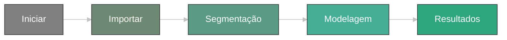
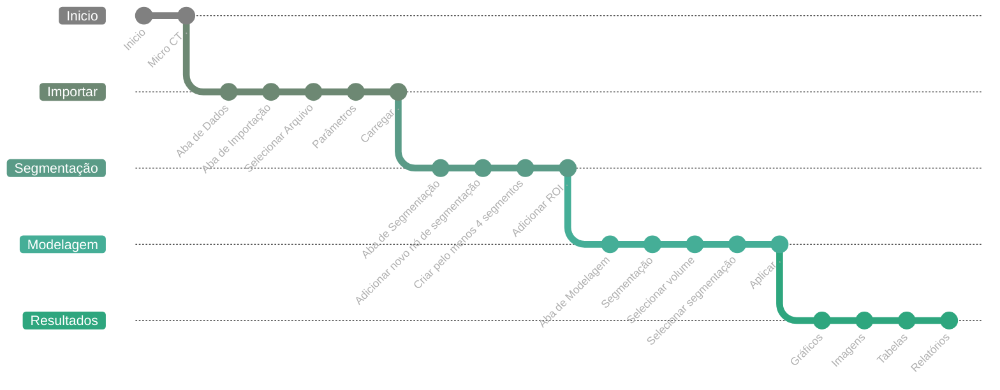

## Explore

Fluxo para o obtenção de um mapa de porosidade a partir de um volume escalar.

1. Inicie o Geoslicer no ambiente MicroCT a partir da interface do aplicativo.

2. Selecione o volume de entrada clicando em "Escolher pasta" ou "Escolher arquivo" e escolha os dados de importação desejados entre as opções disponíveis. Sugerimos testar primeiro os parâmetros padrão.

3. Selecione o volume de entrada clicando em "Input:" Ajuste os parâmetros para diferentes efeitos de segmentação, como "Múltiplos Limiares," "Remoção de Fronteira," e "Expandir Segmentos." Ajuste as configurações para obter os resultados de segmentação desejados, usando o feedback da interface e as ferramentas de visualização.

4. Revise e refine os dados segmentados. Ajuste os limites da segmentação, mescle ou divida segmentos, e aplique outras modificações para aprimorar o modelo de porosidade usando as ferramentas fornecidas.

5. Salve o mapa de porosidade ou exporte o volume com as tabelas de parametros.

## Saiba Mais...

#### [Inicio](../../Bem Vindo/welcome) 
Inicie o Geoslicer no ambiente MicroCT a partir da interface do aplicativo.

#### [Importar(TODO)](../../Bem Vindo/welcome)
Selecione o volume de entrada clicando em "Escolher pasta" ou "Escolher arquivo" e escolha os dados de importação desejados entre as opções disponíveis. Sugerimos testar primeiro os parâmetros padrão.

#### [Segmentação](../../Segmentation/segmentation.md)
Selecione o volume de entrada clicando em "Entrada:" Ajuste os parâmetros para diferentes efeitos de segmentação, como:
 
 1. Múltiplos Limiares(TODO)
 2. Remoção de Fronteira(TODO)
 3. Expandir Segmentos(TODO)
  
Ajuste as configurações para obter os resultados de segmentação desejados, usando o feedback da interface e as ferramentas de visualização.

#### [Modelagem(TODO)](../../Bem Vindo/welcome)
 Revise e refine os dados segmentados. Ajuste os limites da segmentação, mescle ou divida segmentos, e aplique outras modificações para aprimorar o modelo de segmentação usando as ferramentas fornecidas.(TODO)

#### [Resultados(TODO)](../../Bem Vindo/welcome)
Salve o projeto ou exporte o volume segmentado. Os resultados podem ser exibidos como:

 1. Imagem(Screenshot)(TODO)
 2. Graficos(Charts)(TODO)
 3. Servidos atraves de Relatórios (Streamlit)(TODO)

## Ainda tem perguntas?

#### [Entre em contato](https://www.ltrace.com.br/contact/)
