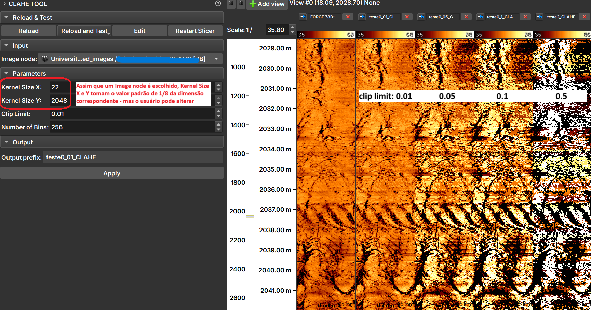

## CLAHE Tool

O Módulo _CLAHE Tool_ aplica o Contrast Limit Adaptive Histogram Equalization (CLAHE), "um algoritmo para melhoramento de contraste local, que utiliza histogramas computados sobre diferentes regiões de uma imagem. Assim, detalhes locais podem ser realçados mesmo em regiões mais claras ou escuras que a maior parte da imagem" - documentação da função equalize_adapthist do scikit-image em 25/06/2025.

### Painéis e sua utilização

|  |
|:-----------------------------------------------:|
| Figura 1: Apresentação do módulo CLAHE Tool. |

A imagem mostra o resultado da aplicação do CLAHE com diferentes valores de _clip limit_.

### Inputs
1. __Image Node__: Image Log volume a ser processado.

### Parameters
1. __Kernel Size__: Define a forma das regiões contextuais usada no algoritmo. Por padrão, kernel_size é 1/8 da altura da imagem por 1/8 da largura.
2. __Clip Limit__: Normalizado entre zero 0 e 1. Valores altos resultam em maior contraste.
3. __Number of Bins__: Número de bins para os histogramas ('data range').

### Outputs
1. __Output prefix__: Imagem processada, com tipo float64.