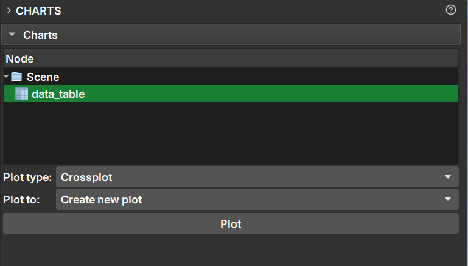
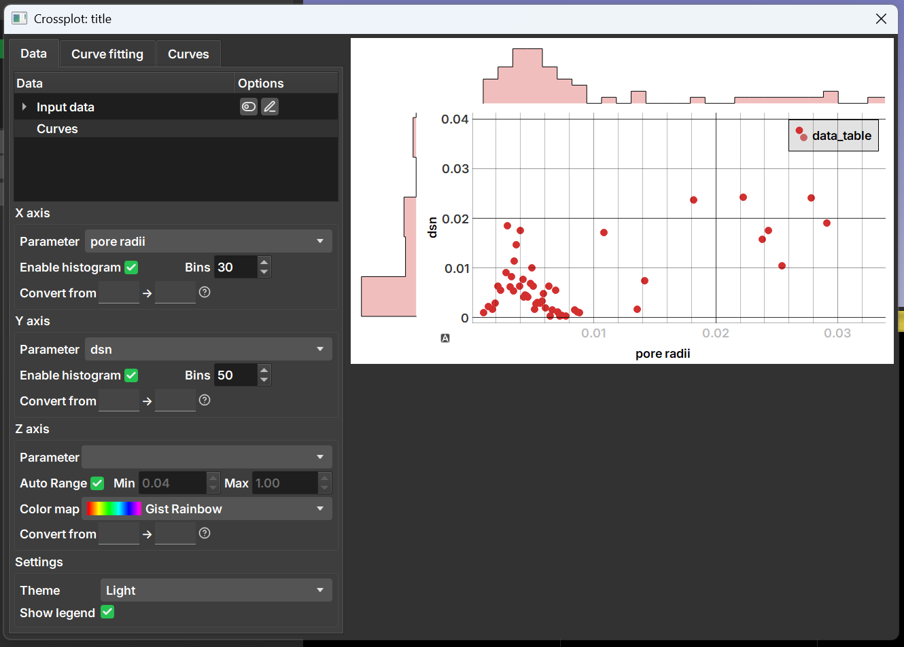
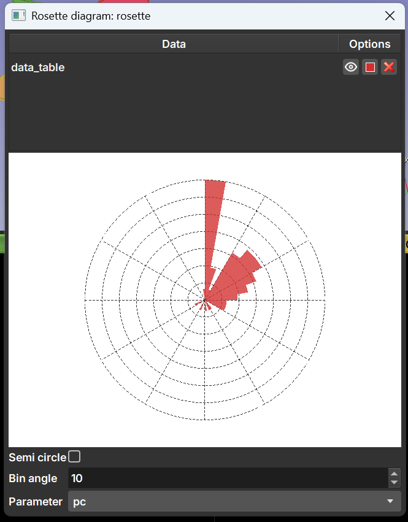
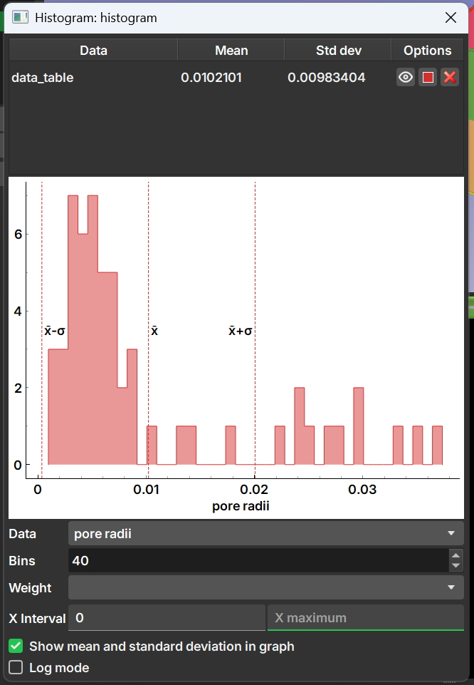

## Charts

Esse módulo serve para gerar gráficos com base em um nó de tabela gerado no GeoSlicer. Na interface do módulo o usuário pode selecionar uma ou mais tabelas para gerar um gráfico com base nos dados

Após selecionar as tabelas com os dados que serão graficados, pode-se selecionar o tipo de gráfico no campo **Plot type**, as opções de gráficos são:

- **Crossplot**: Uma combinação de gráfico de dispersão de pontos, com histogramas para cada um dos eixos e seleção de cores de acordo com uma terceira coluna.

Permite o ajuste de curvas ou adição de curvas ao gráfico para comparação nas abas "Curve fitting" e "Curves".

- **Rosette Diagram**: Diagrama tipicamente usados para mostrar a frequência e distribuição de dados direcionais.

- **Transition**

- **Histograms in depth**

- **Histogram**: Histograma simples dos dados em alguma das colunas. Permite a seleção da quantidade de bins (caixas) e repesagem de acordo com outra coluna.

