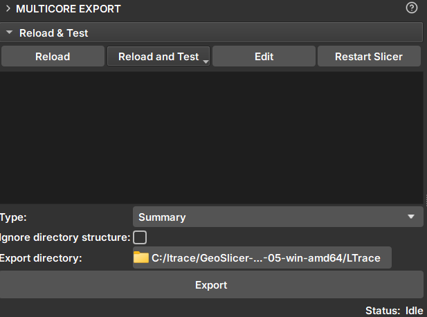

## Multicore Export

Módulo _GeoSlicer_ para exportar o sumário, fatias do _core_ e imagens desdobradas de _cores_.

### Painéis e sua utilização

|  |
|:-----------------------------------------------:|
| Figura 1: Módulo Multicore Export. |

#### Export

- Seletor: Escolhe um ou mais volumes para realizar a exportação.

- _Type_: Tipo de dado a ser exportado. Opções disponíveis:
    - _Summary_: Cria um arquivo html para a visualização de informações do _core_.
    - _CSV_: Em dois formatos com colunas de profundidade e intensidades de CT da imagem. Um deles é compatível com o software Techlog.
    - _PNG_: Opção de exportação do _unwrap_.
    - _TIF_: Arquivo .tiff do volume do _core_.

- _Ignore directory structure_: Caso selecionado, todos os arquivos serão salvos no diretório selecionado, sem criar novos sub-diretórios.

- _Export directory_: Diretório em que os arquivos serão salvos

- _Export_: Realiza a exportação para o diretório escolhido.