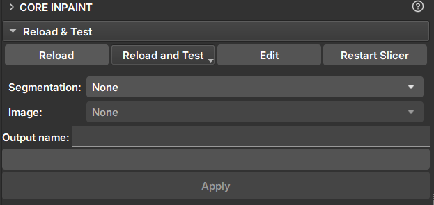

## Core Inpaint

Módulo _GeoSlicer_ para o preenchimento de falhas de rochas utilizando segmentos.

### Painéis e sua utilização

|  |
|:-----------------------------------------------:|
| Figura 1: Módulo Core Inpaint. |

### Inpaint

- _Segmentation_: Segmentação do _core_ que será preenchido.

- _Image_: Volume do _core_ com valores escalares.

- _Segments_: Seletor de segmentos que serão preenchidos. Pelo menos um segmento deve ser preenchido.

- _Output name_: Nome do volume preenchido que será gerado pelo módulo.

- _Apply_: Aplica o preenchimento no segmento escolhido.
