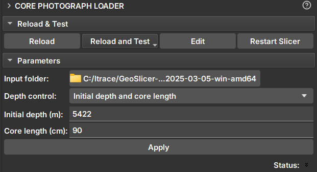

# Core Photograph Loader

Módulo _GeoSlicer_ para extrair imagem de _core_ de fotos de caixas de testemunho e construir um volume completo com a imagem do _core_. 

## Painéis e sua utilização

|  |
|:-----------------------------------------------:|
| Figura 1: Módulo Core Photograph Loader. |

### Parâmetros

- _Input folder_: Diretório que contem as imagens da caixa do core.
Adiciona diretórios que contenham dados de _core_. Esses diretórios irão aparecer na lista _Data to be processed_. Durante a execução, a pesquisa pelos dados ocorrerá em apenas um nível abaixo.

- _Depth control_: Escolha do método de configurar os limites do _core_:
    - _Initial depth and core length_
        - _Initial depth (m)_: Profundidade do topo do _core_.
        - _Core length (cm)_: Comprimento do _core_.
    - _Core boundaries CSV file_
        - _Core depth file_: Seletor de um arquivo CSV que contem os limites do _core_ em metros. No mesmo formato de arquivo CSV do Módulo Multicore.
    - _From photos (OCR)_        
