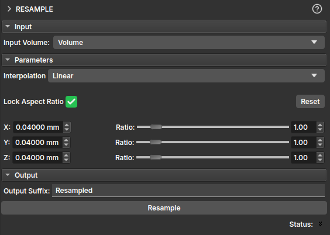

## Resample

O módulo **Resample** permite alterar a resolução espacial de um volume a partir de uma interpolação, modificando o tamanho do voxel nos eixos **X**, **Y** e **Z**. Esse processo é útil para padronizar volumes, aumentando ou reduzindo o seu tamanho, ou para reduzir o tamanho dos arquivos para análises específicas que não demandem uma resolução tão alta.

Os parâmetros disponíveis no módulo são:

- **Interpolation**: define o método de interpolação usado para reamostrar que pode ser:
	+ *Linear*: interpolação linear entre voxels;
	+ *Nearest Neighbor*: atribui ao novo voxel o valor do vizinho mais próximo;
	+ *Lanczos*: interpolação baseada em janelas da função sinc. Leia mais em ;
	+ *Bspline*: interpolação suave usando curvas polinomiais;
	+ *Mean*: calcula a média dos voxels originais que correspondem ao novo voxel. Útil para reduzir resolução mantendo tendência geral dos dados.
- **Lock Aspect Ratio**: quando ativado, mantém a proporção entre os eixos X, Y e Z.
- **Reset**: restaura os valores originais do espaçamento dos voxels.
- **X / Y / Z**: define o novo tamanho do voxel em milímetros (mm) para cada eixo.
- **Ratio**: mostra a razão de alteração em relação ao tamanho original do voxel. Pode ser ajustado manualmente através dos controles deslizantes.
- **Resample**: Executa o processo de reamostragem.
