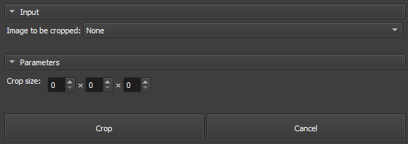

## Volumes Crop

O módulo _Crop_ é uma ferramenta integrada ao GeoSlicer, projetada para permitir o recorte personalizado de volumes de imagem em coordenadas IJK, utilizando uma Região de Interesse (ROI) específica. O módulo é especialmente útil para focar em áreas específicas de volumes maiores, ajustando a dimensão do corte de acordo com as necessidades do usuário.

### Painéis e sua utilização

|  |
|:-----------------------------------------------:|
| Figura 1: Apresentação do módulo Crop. |

### Principais opções

 - _Volume to be cropped_: Escolha a Imagem a ser Recortada. 

 - _Crop Size_: Definir o tamanho do recorte nas três dimensões (X, Y, Z), ajustando os limites da ROI de forma interativa. No caso de imagens 2D o valor Z sempre será 1.

 - _Crop/cancel_: Botões dedicados para iniciar o processo de recorte e cancelar as operações em andamento.

_GeoSlicer_ module to crop a volume, as described in the steps bellow:

1. Select the _Volume to be cropped_.
   
2. Adjust the ROI in the slice views to the desired location and size.
   
3. Click _Crop_ and wait for completion. The cropped volume will appear in the same directory as the original volume.

