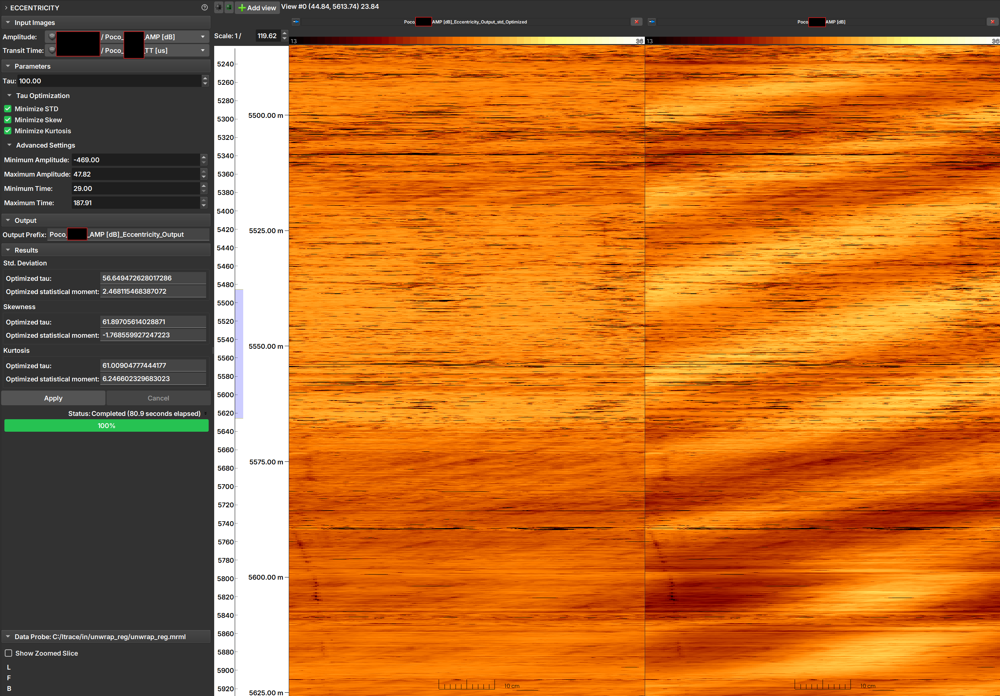

## Eccentricity

Perfis de imagem ultrassônica podem sofrer de excentricidade, que ocorre quando a ferramenta não está centralizada no poço. Isso pode causar artefatos na imagem de amplitude, onde um lado do poço parece ter uma amplitude sistematicamente menor do que o outro. O módulo de Excentricidade corrige esses artefatos usando o tempo de trânsito para compensar as variações de amplitude.

### Teoria

O método de correção é baseado na patente US2017/0082767, que modela a atenuação da amplitude com a distância (relacionada ao tempo de trânsito) usando um decaimento exponencial. O parâmetro chave neste modelo é o "Tau".

A correção é aplicada ponto a ponto na imagem. O valor ideal de "Tau" é aquele que produz uma imagem corrigida com certas características estatísticas desejadas. O módulo pode otimizar "Tau" minimizando um ou mais dos seguintes momentos estatísticos da distribuição de amplitudes da imagem corrigida:

-   **Desvio Padrão (Standard Deviation):** Busca a menor variação de amplitude na imagem.
-   **Assimetria (Skewness):** Busca uma distribuição de amplitude o mais simétrica possível.
-   **Curtose (Kurtosis):** Busca uma distribuição de amplitude com "caudas" semelhantes a uma distribuição normal.

### Como Usar

|  |
|:-----------------------------------------------:|
| Figura 1: Interface do módulo Eccentricity, resultado, e imagem original. |

#### Imagens de Entrada (Input Images)

1.  **Amplitude:** Selecione a imagem de amplitude a ser corrigida.
2.  **Tempo de Trânsito (Transit Time):** Selecione a imagem de tempo de trânsito correspondente.

#### Parâmetros (Parameters)

1.  **Tau:** Insira um valor de "Tau" para ser usado na correção. Este valor só é utilizado se nenhuma das opções de otimização abaixo for selecionada.
2.  **Otimização de Tau (Tau Optimization):**
    -   **Minimizar Desvio Padrão (Minimize STD):** Marque esta opção para que o módulo encontre o "Tau" que minimiza o desvio padrão da imagem corrigida.
    -   **Minimizar Assimetria (Minimize Skew):** Marque para encontrar o "Tau" que minimiza a assimetria (absoluta) da imagem corrigida.
    -   **Minimizar Curtose (Minimize Kurtosis):** Marque para encontrar o "Tau" que minimiza a curtose da imagem corrigida.

    !!! note "Nota"
        É possível selecionar múltiplas opções de otimização. Neste caso, uma imagem de saída será gerada para cada opção selecionada. Se nenhuma opção for marcada, a correção será feita usando o valor de "Tau" inserido manualmente no campo **Tau**.

#### Configurações Avançadas (Advanced Settings)

Esta seção permite refinar o processo de otimização, ignorando valores de pixel que possam ser ruído ou anomalias.

-   **Amplitude Mínima / Máxima (Minimum / Maximum Amplitude):** Define o intervalo de valores de amplitude a serem considerados no cálculo da otimização. Pixels com valores fora deste intervalo serão ignorados.
-   **Tempo de Trânsito Mínimo / Máximo (Minimum / Maximum Time):** Define o intervalo de valores de tempo de trânsito a serem considerados no cálculo da otimização. Pixels com valores fora deste intervalo serão ignorados.

#### Saída (Output)

-   **Prefixo de Saída (Output Prefix):** Digite o prefixo a ser usado no nome das imagens de saída. O nome final incluirá o tipo de otimização (ex: `_std_Optimized`).

#### Resultados (Results)

Esta seção exibe os resultados para cada otimização realizada.

-   **Tau otimizado (Optimized tau):** O valor de "Tau" ótimo encontrado pelo processo de otimização.
-   **Momento estatístico otimizado (Optimized statistical moment):** O valor do momento estatístico (desvio padrão, assimetria ou curtose) correspondente ao "Tau" otimizado.

#### Execução

-   **Apply:** Inicia o processo de correção.
-   **Cancel:** Cancela a execução do processo.

### Referências

- MENEZES, C.; COMPAN, A. L. M.; SURMAS, R. **Method to correct eccentricity in ultrasonic image profiles**. US Patent No. US2017/0082767. 23 mar. 2017.
