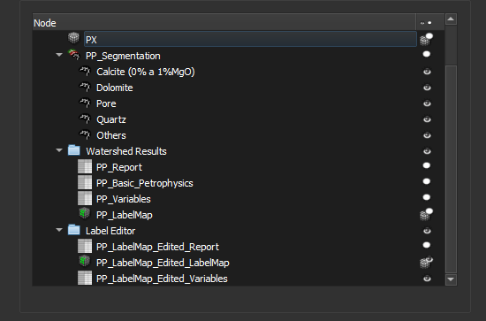

### Finalizar

Este passo apresenta os resultados do fluxo de trabalho. Todas imagens do projeto são listadas, incluindo entradas, saídas e imagens intermediárias.

Ao finalizar o fluxo, você pode:

- Visualizar os resultados (Clique no ícone de olho na lista de resultados)
- Salvar o projeto (Ctrl+S)
- Exportar os resultados usando o módulo *Thin Section Export*
- Clicar em `Next` para executar o fluxo com outra imagem.

**Módulo correspondente**: *Explorer*

#### Elementos da Interface

Todos os dados do projeto atual são listados, isso inclui tanto dados gerados neste fluxo ou em outros processos.

O relatório é gerado no passo *Auto-label* e é recalculado opcionalmente no passo *Edit labels*. Ambas tabelas são listadas. O mesmo vale para o mapa de objetos (*labelmap*).