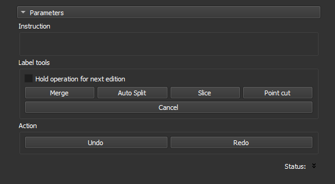

### Editar Objetos

Separe ou una objetos detectados no passo anterior.

Após a edição, pressione `Next` para recalcular as métricas de poro e gerar uma nova tabela de relatório. Pressione `Skip` para pular o cálculo, se não houver alterações.

**Módulo correspondente**: *Label Editor*

#### Elementos da Interface

Este passo mostra o mapa de objetos gerado no passo anterior (*auto-label*). Clique em uma operação e, em seguida, clique em um objeto na imagem para executá-la.

- **Hold operation for next edition**: Selecione esta opção para realizar uma operação (ex.: `Merge`) várias vezes consecutivas sem precisar selecionar a operação novamente.
- **Merge**: Clique em dois objetos para uni-los. Atalho: `m`.
- **Auto Split**: Clique para dividir automaticamente um objeto usando a técnica de *watershed*. Atalho: `a`.
- **Slice**: Clique para cortar o objeto com uma linha reta. Defina a linha com dois cliques na imagem. Atalho: `s`.
- **Point cut**: Clique para cortar o objeto em um ponto específico. Atalho: `c`.
- **Cancel**: Clique para cancelar a operação atual.
- **Undo**: Clique para desfazer a última ação. Atalho: `z`.
- **Redo**: Clique para refazer a última ação desfeita. Atalho: `x`.
