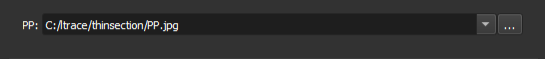

### Carregar PP/PX

Escolha os arquivos de imagem PP (polarizado plano) para carregar.

**Módulo correspondente**: *[Thin Section Loader](./ThinSectionLoader.md)*

#### Elementos da Interface

Especifique o caminho para a imagem no campo **PP**.

Ao lado do campo, há um botão  que abre o explorador de arquivos do sistema, a fim de selecionar o arquivo.

#### Formatos aceitos

- JPEG
- TIFF
- PNG
