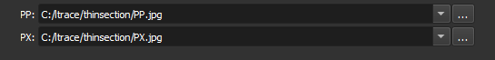
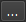

### Carregar PP/PX

Escolha os arquivos de imagem PP (polarizado plano) e PX (polarizado cruzado) para carregar.

**Módulo correspondente**: *[Thin Section Loader](./ThinSectionLoader.md)*

#### Elementos da Interface

Especifique o caminho para as imagens nos campos **PP** e **PX**.

Ao lado de cada campo, há um botão  que abre o explorador de arquivos do sistema, a fim de selecionar o arquivo.

#### Formatos aceitos

- JPEG
- TIFF
- PNG
