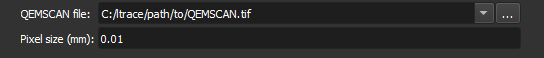

### Carregar QEMSCAN

Escolha o arquivo de imagem QEMSCAN a ser carregado.

**Módulo correspondente**: *[QEMSCAN Loader](./ThinSectionQemscanLoader.md)*

#### Elementos da Interface

- QEMSCAN file
Especifique o caminho para a imagem QEMSCAN.

Ao lado deste campo, há um botão  que abre o explorador de arquivos do sistema, a fim de selecionar o arquivo.

Se houver um único arquivo CSV na mesma pasta da imagem, este será usado para definir o nome e a cor de cada segmento da imagem. Se não houver, é usada uma tabela padrão QEMSCAN.

-  Pixel size (mm)

Especifique o tamanho de cada pixel da imagem em milímetros.

#### Formatos aceitos

- TIFF (imagem)
- CSV (tabela de cores)
