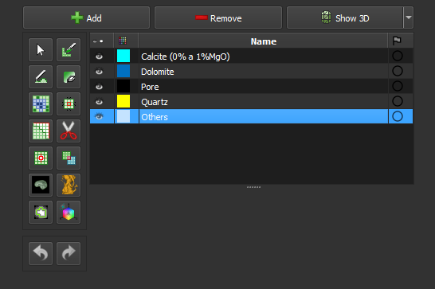

### Segmentação Manual

Edite a segmentação com ferramentas manuais. Esse passo pode ser usado para editar a segmentação criada no passo anterior (*Smart-seg*), ou para editar uma segmentação nova.

**Módulo correspondente**: *[Segment Editor](./SegmentEditor.md)*

#### Elementos de Interface

Página principal: *[Segment Editor](./SegmentEditor.md)*
