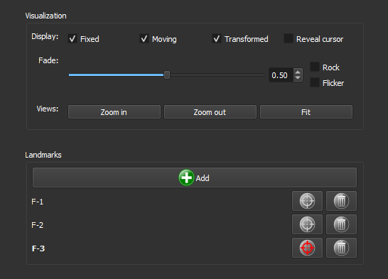
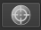
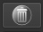

### Registrar

Registre a imagem PP com a imagem PX, garantindo que elas estejam espacialmente alinhadas.

Confira se as imagens precisam de alinhamento, por exemplo, usando a função `Rock` Se elas já estiverem alinhadas, pule esse passo com a opção `Skip`

Se o registro for necessário, clique no botão `Add` e, em seguida, clique na imagem para adicionar um marcador. Arraste o mesmo marcador na outra imagem de forma que ele esteja na mesma posição em ambas as imagens.

Adicione mais marcadores até que as imagens estejam alinhadas.

**Módulo correspondente**: *[Thin Section Registration](./ThinSectionRegistration.md)*

#### Elementos da Interface

##### Visualização

- **Display**:
  - **Fixed**: Seleciona a visualização da imagem PP.
  - **Moving**: Seleciona a visualização da imagem PX.
  - **Transformed**: Seleciona a visualização da imagem *Transformed* Essa imagem mostra ambas imagens sobrepostas.

- **Fade**: Ajusta a opacidade entre as imagens sobrepostas. Use a barra deslizante para alterar a opacidade e o campo numérico para definir um valor específico. 

- **Rock**: Ativa a visualização alternativa das imagens em um movimento de vai-e-vem.

- **Flicker**: Alterna rapidamente entre as imagens.

- **Views**:
  - **Zoom in**: Aumenta o zoom na visualização de todas imagens.
  - **Zoom out**: Reduz o zoom na visualização de todas imagens.
  - **Fit**: Ajusta as imagens para caber na janela de visualização.

##### Marcadores (Landmarks)

- **Add**: Clique neste botão para adicionar um novo marcador na imagem. 
- **Lista de marcadores**: Exibe os marcadores adicionados. Cada marcador listado inclui:
  - **Botão de seleção** : Seleciona o marcador.
  - **Botão de exclusão** : Exclui o marcador.
