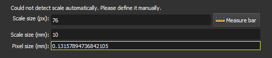

### Definir a Escala

Defina o tamanho do pixel em milímetros para a imagem.

Neste passo, a imagem PP deve estar visível. Se a imagem tiver uma barra de escala, ela pode ser detectada automaticamente, e os campos serão preenchidos automaticamente. Nesse caso, confira os valores e siga para o próximo passo.

Se a detecção falhar, a seguinte mensagem aparecerá: `Could not detect scale automatically. Please define it manually.` Nesse caso, é necessário definir a escala manualmente. Se o tamanho do pixel for conhecido, preencha-o diretamente no campo `Pixel size (mm)`. Se não for, o tamanho do pixel pode ser calculado medindo a barra de escala na imagem.

Definir a escala é importante para garantir que as métricas de poro calculadas posteriormente estejam fisicamente corretas.

**Módulo correspondente**: *[Thin Section Loader](./ThinSectionLoader.md)*

#### Elementos da Interface

- **Scale size (px)**: Insira o tamanho da barra de escala em pixels (px). Use o botão `Measure bar` para medir diretamente na imagem.

- **Measure bar**: Clique neste botão para usar a ferramenta de medida, que permitirá que você desenhe uma linha na imagem para medir a barra de escala em pixels. Com a ferramenta ativa, clique em uma das extremidades da barra, em seguida clique na outra extremidade. O campo `Scale size (px)` será preenchido com o tamanho medido.

- **Scale size (mm)**: Insira o tamanho real da barra de escala em milímetros (mm). Esse valor deve estar visível na imagem, próximo a barra. Por exemplo, se estiver escrito "0,1 cm", insira "1" no campo.

- **Pixel size (mm)**: Este campo exibe o valor calculado do tamanho do pixel em milímetros, com base nos valores inseridos nos campos `Scale size (px)` e `Scale size (mm)`. Esse valor é atualizado automaticamente quando os campos anteriores são preenchidos.
