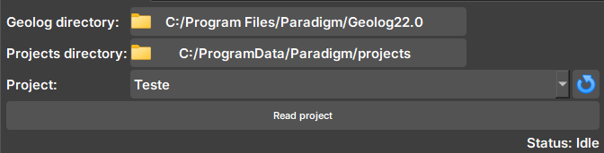
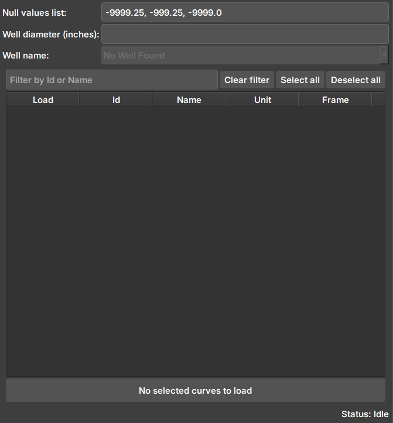
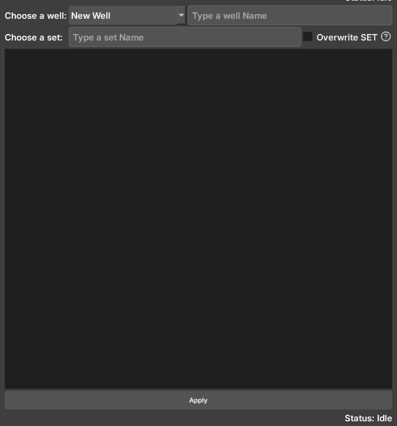

## Geolog Integration

O Módulo *Geolog Integration* foi desenvolvido para estabelecer uma conexão eficiente com o software *Geolog*, facilitando a importação e exportação de dados de image log entre os softwares. Para seu pleno funcionamento, é necessário o uso do Python 3.8 no *Geolog*, uma vez que esta versão inclui bibliotecas essenciais para a integração.

### Painéis e sua utilização

#### Lendo um projeto do Geolog

Widget responsável por verificar se o Geolog está disponível e ler um projeto do Geolog, verificando WELLS, SETS e LOGS disponíveis.

|  |
|:-----------------------------------------------:|
| Figura 1: Widget de conexão ao Geolog. |

 - _Geolog directory_: Diretório do local de instalação do Geolog.

 - _Projects directory_: Diretório da pasta com o projeto que é desejado ler.

 - _Project_: Seletor de projetos disponíveis dentro do diretório. Caso necessário, o botão ao lado atualiza o seletor para mostrar novos projetos.

#### Importando dados do Geolog
Widget responsável por mostrar dados disponíveis para importação do Geolog para o Geoslicer.

|  |
|:-----------------------------------------------:|
| Figura 2: Widget de importação de dados do Geolog. |

 - _Null values list_: Lista de valores considerados como nulos. Durante a importação das imagens, é realizada uma verificação para identificar se esses valores estão presentes. Caso estejam, as imagens passam por um processo de tratamento apropriado.

 - _Well diameter_: Diâmetro do poço (polegadas). Usado no cálculo do tamanho dos pixels e atributos do volume criado.

 - _Well name_: Nome do poço no Geolog. Contém os SETS e LOGS a serem importados.

 - _Seletor_: Após conectar e selecionar um poço, os dados disponíveis (LOGS) para serem importados serão exibidos aqui.

#### Exportando dados para o Geolog
Widget responsável por selecionar e exportar dados de imagelog do Geoslicer para o Geolog.

|  |
|:-----------------------------------------------:|
| Figura 3: Widget de exportação de dados para Geolog. |

 - _Choose a well_: Seletor de Poços disponíveis no projeto do Geolog. Selecionar a opção "New Well" irá criar um novo poço durante a exportação, com o nome digitado no campo ao lado.

 - _Choose a set_: Campo para digitar nome do SET em que será salvo os dados. SETs não podem ser modificados e escolher um SET que já existe pode sobrescrever os dados se a opção ao lado estiver selecionada.

 - _Seletor_:  Seletor de dados do Geoslicer para serem exportados. Devido a forma que ocorre a escrita no Geolog, os volumes devem ter o mesmo tamanho vertical de pixels para evitar falhas no dado.