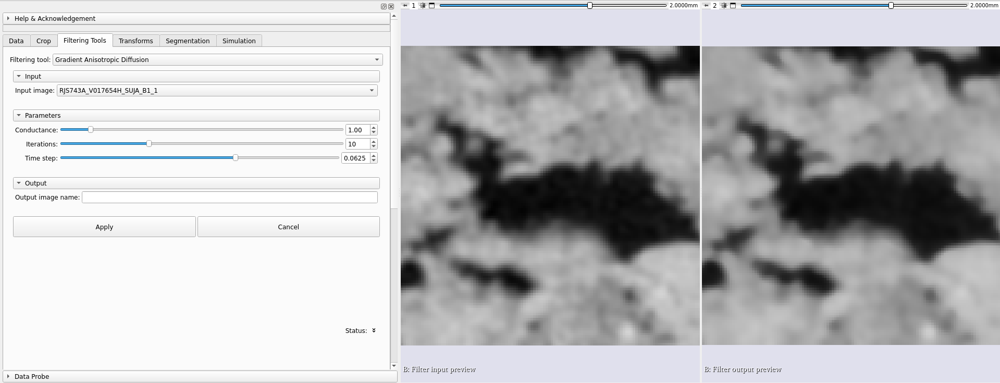
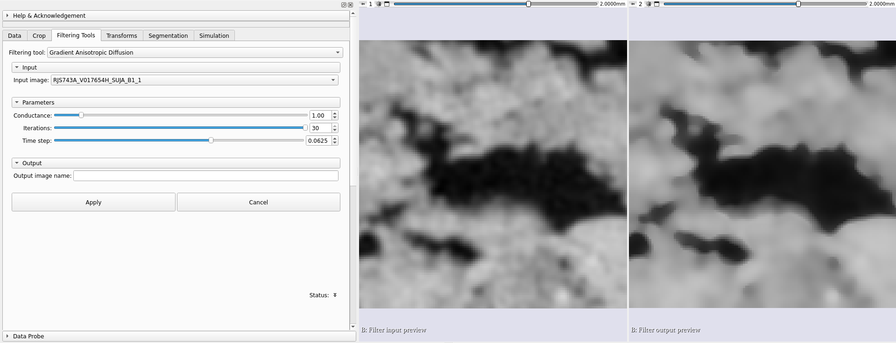
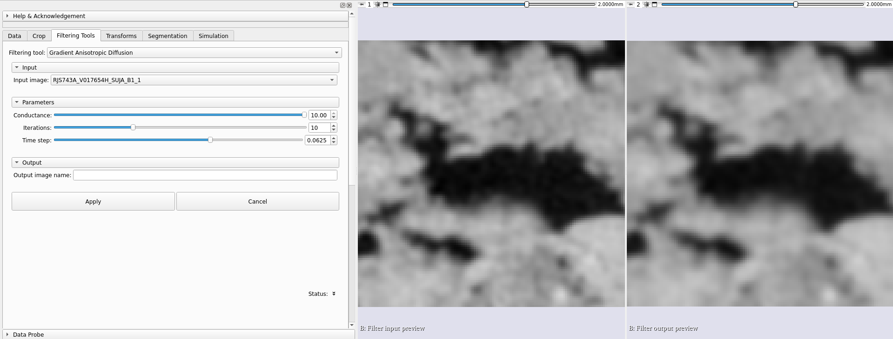
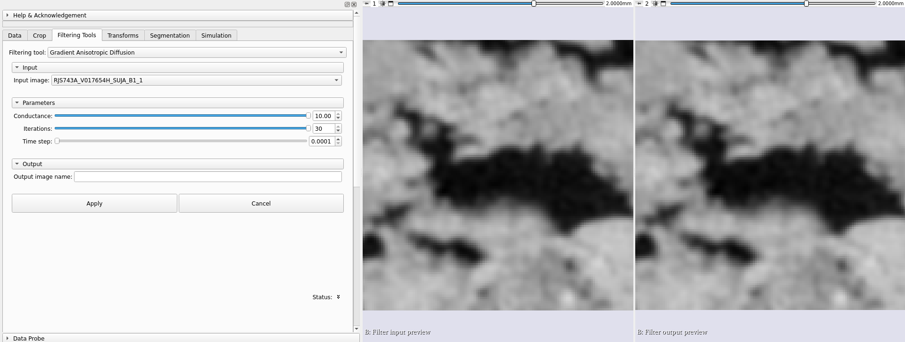

## Gradient Anisotropic Diffusion

Aplica difusão anisotrópica de gradiente a um volume. Métodos de difusão anisotrópica reduzem ruído em imagens enquanto preservam características da imagem, como bordas. Em muitas aplicações, assume-se que transições entre claro e escuro (bordas) sejam de interesse. Métodos de difusão isotrópica padrão frequentemente borram fronteiras entre claro e escuro. Metódos de difusão anisotrópica são formulados especificamente para preservar as bordas. O termo de condutância neste caso é uma função da magnitude do gradiente da imagem em cada ponto, reduzindo a força da difusão nas bordas. A implementação numérica dessa equação é similar à descrita no artigo de Perona-Malik, porém usa uma técnica mais robusta para estimativa da magnitude do gradiente e é generalizado para N-dimensões.

### Parâmetros para o algoritmo de difusão anisotrópica

Condutância (conductance): Controla a sensibilidade do termo de condutância. Como regra geral, quanto menor o valor, mais fortemente o filtro preservará as bordas. Um alto valor causará difusão (suavização) das bordas. Note que o número de iterações controla o quanto haverá de suavização dentro de regiões delimitadas pelas bordas.

Iterações (numberOfIterations): Quanto mais iterações, maior suavização. Cada iteração leva a mesma quantidade de tempo. Se uma iteração leva 10 segundos, 10 iterações levam 100 segundos.

Passo temporal (timeStep): O passo temporal depende da dimensionalidade da imagem. Para imagens tridimensionais, o valor padrão de de 0.0625 fornece uma solução estável. Na prática, a alteração deste parâmetro causa poucas alterações na imagem.

### Exemplos

|                                                |
|:--------------------------------------------------------------------------------------------:|
| Figura 1: Exemplo de aplicação do algoritmo a um volume com os valores padrão dos parâmetros |

|                                                                                      |
|:----------------------------------------------------------------------------------------------------------------------------------:|
| Figura 2: Exemplo de como o parâmetro de iterações afeta o resultado. Nesse caso, um alto valor levou a bordas mais bem definidas. |

|                                                                                      |
|:----------------------------------------------------------------------------------------------------------------------------------:|
| Figura 3: Exemplo de como o parâmetro de condutância afeta o resultado. Nesse caso, um alto valor levou a uma imagem mais borrada. |

|                                                                                              |
|:------------------------------------------------------------------------------------------------------------------------------------------:|
| Figura 4: Exemplo de como o parâmetro de condutância afeta o resultado. Nesse caso, um baixo valor levou a um resultado similar à entrada. |
