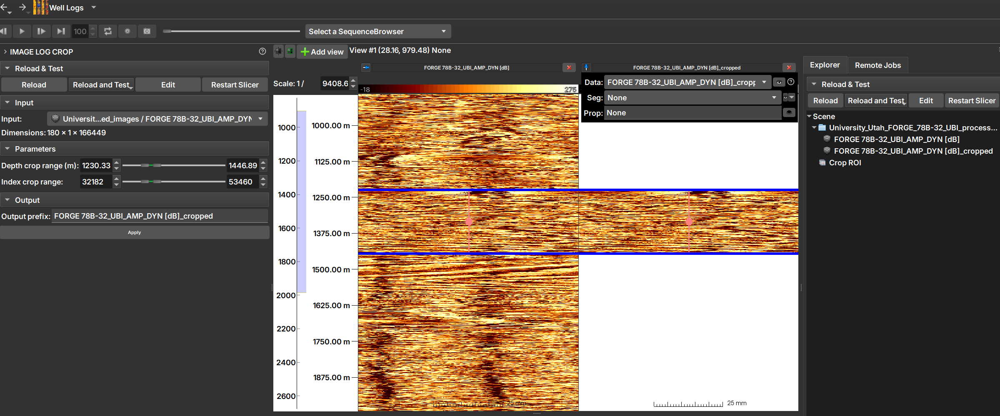

## Image Log Crop

O Módulo _Image Log Crop_ permite o recorte personalizado de imagens de poço, ajustado com base nas profundidades do topo e fundo da imagem.

### Painéis e sua utilização

|  |
|:-----------------------------------------------:|
| Figura 1: A manipulação pode ser feita utilizando _sliders_ e valores numéricos (à esquerda), ou arrastando com o mouse a região de corte sobre a imagem de poço (ao centro). Após clicar "Apply", pode-se abrir a imagem cortada e visualizá-la, como aparece na imagem à direita. |

Manipulações dos _sliders_  (à esquerda na Imagem 1) refletem-se automaticamente na região de corte (no centro da imagem) e vice-versa.

### Principais opções

 - _Input_: Escolha a imagem a ser recortada. 

 - _Depth crop range (m)_: Limites inferior e superior da região de profundidades que constituirá o recorte, em metros.

 - _Index crop range_: Os mesmos limites acima, mas expressos em índices.

 - Arrastando com o mouse a região de corte sobre a imagem de poço (ao centro)