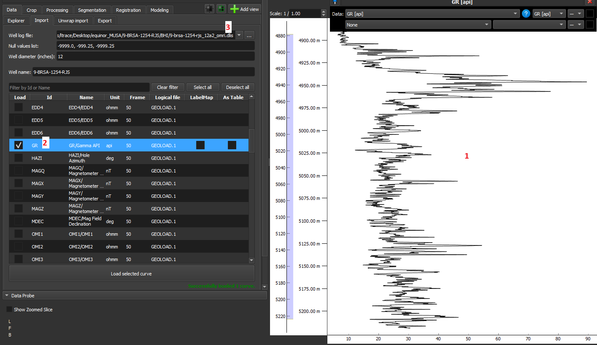
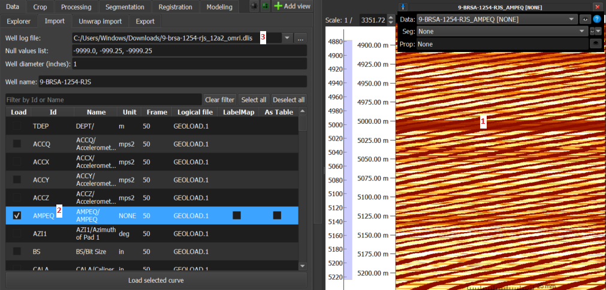
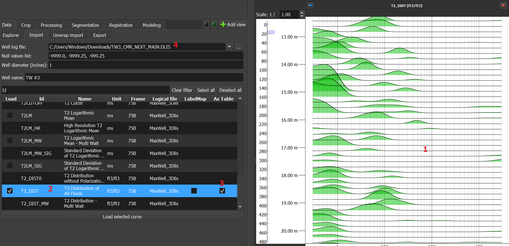
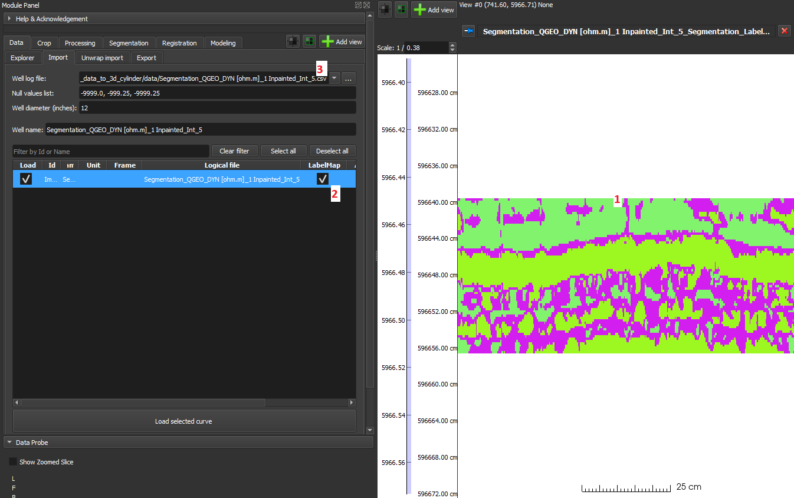

Módulo _GeoSlicer_ para carregar dados de perfis em DLIS, LAS e CSV, conforme descrito nos passos abaixo:

1. Selecione o arquivo de log de poço em _Well Log File_.

2. Edite _Null values list_ e adicione ou remova valores da lista de possíveis valores nulos.

3. Escolha os perfis desejados para serem carregados no GeoSlicer, de acordo com cada opção descrita abaixo:

    - Dados 1-D devem ser carregados sem selecionar as opções “As Table“ e “LabelMap” e são exibidos como gráficos de
      linha na Image Log View.
      
    - Dados 2-D podem ser carregadas como volumes, tabelas ou LabelMap no GeoSlicer, sendo cada uma das opções
      detalhadas a seguir:

        - Volume: Esta é a opção padrão do GeoSlicer, sem marcar 'As Table' e 'LabelMap', sendo o dado carregado como
          volume e exibido como imagem na Image Log View.
          
        - Tabelas: Nesta opção, marcando a checkbox 'As Table', o dado é carregado como tabela e é exibido como vários
          histogramas, como no caso do dado t2_dist da Figura 3 abaixo:
          
        - LabelMap: Nesta opção, marcando a checkbox 'LabelMap', assumindo um dado segmentado, ele é carregado como um
          LabelMap e exibido como imagem segmentada.
          

## Formatação dos arquivos a serem carregados

### LAS

Curvas em sequência com mnemônicos no formato `mnemonic[number]` serão agrupadas em dados 2-D. Por exemplo, os
mnemônicos de uma imagem com 200 colunas:

```
AMP[0]
…
AMP[199]
```

Um mesmo arquivo pode conter dados 1-D e 2-D. No exemplo a seguir, AMP é uma imagem, enquanto LMF1 e LMF2 são dados 1-D:

```
AMP[0]
…
AMP[199]
LMF1
LMF2
```

### CSV

Para o GeoSlicer interpretar dados CVS como 2-D, basta os mnemônicos serem de mesmo nome seguidos de um índice entre
colchetes, como no 1º exemplo da seção LAS acima (AMP[0], …, AMP[199]).
Diferentemente do caso LAS, o arquivo deve ter somente os dados 2-D.

