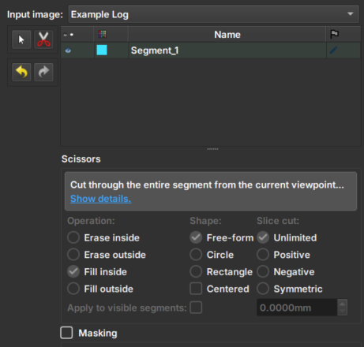

## Image Log Inpaint

O Módulo _Image Log Inpaint_ integrado ao GeoSlicer é uma ferramenta que permite realizar o preenchimento interativo de áreas ausentes ou danificadas em imagens de poço, com ajustes dinâmicos durante o processo.

### Painéis e sua utilização

|  |
|:-----------------------------------------------:|
| Figura 1: Apresentação do módulo Image Log Crop. |

#### Principais opções

 - _Input image_: Escolha a Imagem a ser alterada. Ao escolher uma imagem, duas views serão adicionadas automaticamente para facilitar usabilidade. 

 - _Clone Volume_: Cria uma nova imagem para ser utilizada no módulo, mantendo a imagem original  selecionada no input sem mudanças.

 - _Rename Volume_: Renomeia o nome da imagem escolhida.

 - _Tesoura/Scissors_: Ferramenta que realiza o preenchimento: primeiro, selecione a ferramenta e, em seguida, desenhe na imagem a área onde o preenchimento deverá ser realizado. As opções da ferramenta no menu inferior são desabilitadas nesse módulo.

 - _Setas_: Permitem desfazer ou refazer uma modificação de preenchimento.
