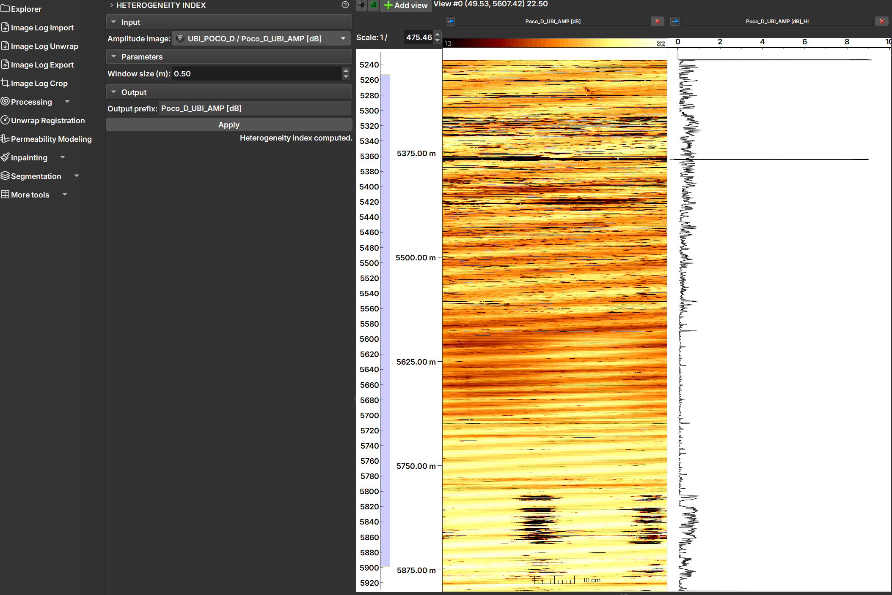

# Ambiente Well Logs

O ambiente de Perfil de Poço (Well Logs) é projetado para a visualização e análise de dados de perfis de poços, como perfis de imagem e curvas.

## Visualização de Dados

A principal característica deste ambiente é a capacidade de exibir múltiplos perfis lado a lado, todos sincronizados pela profundidade.

*Ambiente de Perfil de Poço, mostrando uma imagem (esquerda) e uma curva (direita) alinhadas pela profundidade.*

### Tipos de Visualização

- **Imagens:** Perfis 2D, como imagens de poço, são exibidos como imagens em uma trilha vertical.
- **Tabelas:** Tabelas de valores por profundidade são exibidas como uma curva.
- **Histogramas:** É possível visualizar vários histogramas em diferentes profundidades em uma única trilha, por exemplo, resultados do módulo [Charts](../ImageLog/MoreTools/MoreTools.md#charts).

### Navegação e Interação

- **Eixo de Profundidade:** Um eixo de profundidade vertical é exibido à esquerda, servindo como referência para todos os perfis.
- **Sincronização:** A rolagem (scroll) e o zoom são sincronizados em todas as trilhas, permitindo uma análise comparativa em diferentes profundidades.
- **Adicionar/Remover Trilhas:** Para adicionar uma nova trilha de visualização, selecione o dado desejado no painel "Explorer" e clique no botão "Add view" na barra de ferramentas. Para remover, utilize o botão de fechar no cabeçalho da trilha.

## Seções

O ambiente Well Logs do GeoSlicer é organizado em vários módulos, cada um dedicado a um conjunto específico de tarefas. Clique em um módulo para saber mais sobre suas funcionalidades:

*   **[Importação](../ImageLog/Import/Import.md):** Para carregar dados de perfis de poço nos formatos DLIS, LAS e CSV.
*   **[Unwrap](../ImageLog/Unwrap/Unwrap.md):** Para retificar imagens de poço.
*   **[Exportação](../ImageLog/Export/Export.md):** Para exportar os dados processados.
*   **[Crop](../ImageLog/Crop.md):** Para cortar dados de imagem.
*   **[Processamento](../ImageLog/Processing/Processing.md):** Ferramentas para aplicar filtros e correções, como:
    *   [Eccentricity](../ImageLog/Processing/Processing.md#eccentricity): Para correção de excentricidade.
    *   [Filtro Espiral](../ImageLog/Processing/Processing.md#spiral-filter)
    *   [Indicador de Qualidade](../ImageLog/Processing/Processing.md#quality-indicator)
    *   [Índice de Heterogeneidade](../ImageLog/Processing/Processing.md#heterogeneity-index)
    *   [Correção de Azimute](../ImageLog/Processing/Processing.md#azimuth-shift)
    *   [CLAHE (Contrast Limit Adaptive Histogram Equalization)](../ImageLog/Processing/Processing.md#clahe-tool): Para realce de contraste.
*   **[Unwrap Registration](../ImageLog/UnwrapRegistration/UnwrapRegistration.md):** Para registrar imagens retificadas.
*   **[Modelagem de Permeabilidade](../ImageLog/PermeabilityModeling/PermeabilityModeling.md):** Para calcular a permeabilidade a partir de atributos da imagem.
*   **[Inpainting](../ImageLog/Inpainting/Inpainting.md):** Para preenchimento de falhas na imagem.
    *   [ImageLog Inpaint](../ImageLog/Inpainting/Inpainting.md#image-log-inpaint)
    *   [Core Inpaint](../ImageLog/Inpainting/Inpainting.md#core-inpaint)
*   **[Segmentação](../ImageLog/Segmentation/Segmentation.md):** Módulos para segmentar imagens de poço:
    *   **[Editor de Segmentos](../ImageLog/Segmentation/Segmentation.md#manual-segmentation):** Ferramentas manuais e semi-automáticas para edição de segmentos.
    *   **[Segmentador por Instância](../ImageLog/Segmentation/Segmentation.md#instance-segmenter):** Segmentação automática baseada em aprendizado de máquina.
    *   **[Editor de Instâncias](../ImageLog/Segmentation/Segmentation.md#instance-segmenter-editor):** Ferramentas para refinar os resultados da segmentação por instância.
*   **[Ferramentas Adicionais](../ImageLog/MoreTools/MoreTools.md):**
    *   [Calculadora de Volume](../ImageLog/MoreTools/MoreTools.md#volume-calculator)
    *   [Filtro de Tabela](../ImageLog/MoreTools/MoreTools.md#table-filter)
    *   [Editor de Tabelas](../ImageLog/MoreTools/MoreTools.md#tables)
    *   [Gráficos](../ImageLog/MoreTools/MoreTools.md#charts)

## O que você pode fazer?

Com o ambiente Well Logs do GeoSlicer, você pode:

*   **Visualizar e analisar dados de perfis de poços, como perfis de imagem e curvas.**
*   **Aplicar filtros e correções nos dados.**
*   **Segmentar imagens de poço para identificar diferentes características.**
*   **Calcular a permeabilidade a partir de atributos da imagem.**
*   **Exportar os dados processados.**