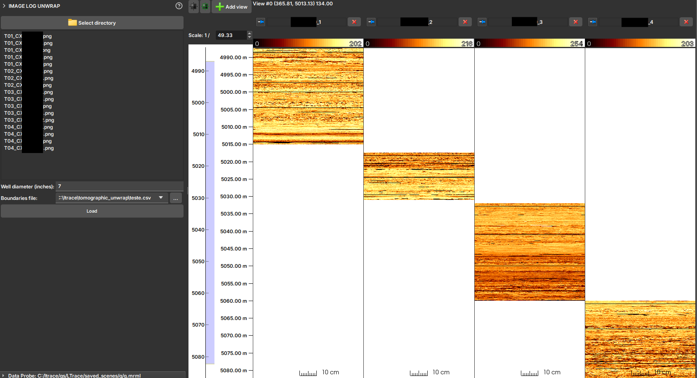

# Importador de Imagens Tomográficas Planificadas (Unwrap)

O módulo **Importador de Imagens Tomográficas Planificadas** é uma ferramenta especializada para carregar e reconstruir perfis de imagem a partir de imagens 2D de testemunhos de sondagem que foram escaneados e "planificados".

Em alguns fluxos de trabalho, a imagem da parede do poço é obtida escaneando testemunhos de sondagem e, em seguida, planificando essa imagem cilíndrica em uma representação 2D. Este módulo serve para importar essas imagens 2D (em formatos como JPG, PNG ou TIF) e reconstruí-las em uma imagem de perfil com a profundidade correta no GeoSlicer. Ele utiliza um arquivo CSV para obter as informações de profundidade e um diâmetro de poço para dimensionar corretamente a circunferência da imagem.

## Requisitos de Entrada

Para usar este importador, seus arquivos devem seguir convenções estritas de nomenclatura e estrutura.

### Convenção de Nomenclatura dos Arquivos de Imagem

Os arquivos de imagem devem ser nomeados seguindo o padrão:
`T<ID_testemunho>_CX<primeira_caixa>CX<ultima_caixa>.<extensao>`

-   `T<ID_testemunho>`: O identificador numérico do testemunho.
-   `_CX<primeira_caixa>CX<ultima_caixa>`: O intervalo de caixas de testemunho contidas no arquivo de imagem.
-   `<extensao>`: A extensão do arquivo (ex: `jpg`, `png`, `tif`).

**Exemplo:** `T42_CX1CX5.jpg` se refere ao testemunho 42 e contém as imagens das caixas 1 a 5.

### Arquivo de Limites (CSV)

É necessário um arquivo CSV que mapeia cada caixa de testemunho às suas profundidades de topo e base. O arquivo deve conter as seguintes colunas:

-   `poco`: O nome do poço.
-   `testemunho`: O ID do testemunho (deve corresponder ao usado no nome do arquivo).
-   `caixa`: O número da caixa.
-   `topo_caixa_m`: A profundidade do topo da caixa em metros.
-   `base_caixa_m`: A profundidade da base da caixa em metros.

## Como Usar

1.  **Select directory:** Clique no botão para escolher a pasta que contém os arquivos de imagem planificados e o arquivo CSV de limites.
2.  **Verificar Arquivos:** A lista de arquivos de imagem detectados será exibida. O módulo tentará encontrar e selecionar automaticamente um arquivo `.csv` no mesmo diretório.
3.  **Well diameter (inches):** Insira o diâmetro do poço em polegadas. Este valor é crucial para dimensionar corretamente a largura da imagem para a circunferência do poço.
4.  **Boundaries file:** Se o arquivo CSV não for selecionado automaticamente, aponte para o local correto neste campo.
5.  **Load:** Clique no botão para iniciar a importação.

## Saída

O módulo irá processar as imagens e criar uma ou mais imagens de perfil na cena. Cada imagem representa um testemunho completo, montado a partir de seus respectivos arquivos de imagem e posicionado nas profundidades corretas. As imagens geradas serão organizados em uma pasta com o mesmo nome do diretório de entrada na hierarquia do projeto.
