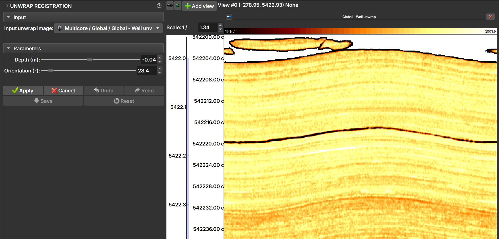

# Registro de Planificação (Unwrap Registration)

Após a criação de uma imagem de testemunho planificada (unwrap) pelo ambiente Core, pode ser necessário ajustar sua posição vertical (profundidade) ou sua rotação (orientação) para alinhá-la corretamente com outros perfis de poço, como perfis de imagem acústica (ambiente Well Logs). O módulo de Registro de Planificação oferece uma interface interativa para realizar esses ajustes manualmente.

## Como Usar

O processo de registro envolve selecionar a imagem planificada, ajustá-la usando os controles deslizantes e, em seguida, salvar as alterações.

### 1. Selecionar a Imagem de Entrada

-   **Imagem de planificação de entrada (Input unwrap image):** Selecione na hierarquia do projeto a imagem de testemunho planificada que você deseja registrar. A lista mostrará apenas as imagens que foram devidamente marcadas como "Well unwrap" (planificação de poço).

### 2. Ajustar os Parâmetros

Uma vez que uma imagem é selecionada, os controles deslizantes de parâmetros são ativados. As alterações feitas com os controles são exibidas em tempo real nas vistas 2D e 3D.

-   **Profundidade (m) (Depth):** Mova o controle deslizante para ajustar a profundidade da imagem. Valores positivos movem a imagem para cima, e valores negativos a movem para baixo.
-   **Orientação (°) (Orientation):** Mova o controle deslizante para rotacionar a imagem horizontalmente.

### 3. Fluxo de Trabalho e Ações

O módulo utiliza um sistema de "aplicar" e "salvar" para gerenciar as alterações. Isso permite experimentar vários ajustes antes de torná-los permanentes.

-   **Apply:** Confirma os ajustes de profundidade e orientação atuais. Uma vez que uma alteração é "aplicada", ela pode ser desfeita usando o botão `Undo`. Você pode aplicar várias alterações em sequência.
-   **Cancel:** Descarta os ajustes feitos nos controles deslizantes desde a última vez que `Apply` foi pressionado.
-   **Undo / Redo:** Navega pelo histórico de alterações que foram confirmadas com `Apply`.
-   **Reset:** Reverte **todas** as alterações aplicadas, retornando a imagem ao seu último estado salvo. Use esta opção para descartar todo o trabalho feito desde o último `Save`.
-   **Save:** Aplica permanentemente todas as alterações ao projeto. Esta ação:
    -   Modifica a imagem de planificação atual.
    -   Aplica as mesmas transformações de profundidade e orientação a todos os volumes de testemunho (tanto a imagem 3D quanto planificações) associados, garantindo a consistência em todo o conjunto de dados do *Multicore*.
    -   Limpa o histórico de `Undo`/`Redo`.

    !!! warning "Atenção"
        A ação de **Salvar (Save)** não pode ser desfeita.

### Resumo do Fluxo de Trabalho Recomendado

1.  No ambiente Core, importe e faça o unwrap de um testemunho.
1.  No ambiente Well Logs, importe outras imagens de interesse.
1.  Visualize as imagens, tanto de unwrap como outros perfis de imagem. [Como visualizar imagens no ambiente Well Logs](./ImageLogIntroduction.md)
1.  Entre no módulo em Processing > **Unwrap Registration**.
1.  Selecione a imagem carregada no ambiente Core em **Input unwrap image**.
1.  Use os controles **Depth** e **Orientation** para alinhar a imagem visualmente.
1.  Quando estiver satisfeito com um ajuste, clique em **Apply**.
1.  Repita os passos 2 e 3 conforme necessário, aplicando múltiplos ajustes.
1.  Se cometer um erro, use **Undo** para reverter a última alteração aplicada ou **Reset** para começar de novo desde o último ponto salvo.
1.  Quando o alinhamento final estiver correto, clique em **Save** para tornar as alterações permanentes e atualizar todos os dados de testemunho relacionados.
