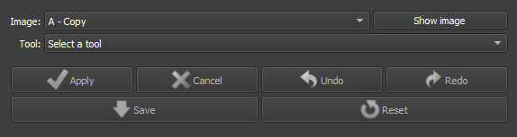
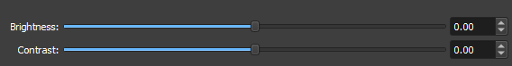

# Image Tools

O módulo Thin Section Image Tools no GeoSlicer oferece um conjunto de funcionalidades voltadas para a manipulação e análise de imagens digitais de rochas. Este módulo serve como uma caixa de ferramentas versátil para usuários que precisam realizar operações como recorte, redimensionamento, ajustes de cor e filtragem de imagens, tudo dentro do ambiente GeoSlicer.

## Painéis e sua utilização

|  |
|:-----------------------------------------------:|
| Figura 1: Apresentação do módulo Thin Section Image Tools. |

### Principais opções

 - _Image_: Escolha a Imagem a ser modificada. 

 - _Tool_: Escolha a Ferramenta a ser utilizada. 

 - _Apply/Cancel_: Aplicar a ferramenta atual na imagem. Cancela o Processo Iniciado.

 - _Undo/Redo_: Desfaz ou refaz os efeitos aplicados
 
 - _Save/Reset_: Finaliza o processo impossibilitando o Undu/Redo ou desfaz todos os processos aplicados.

### Brightness/Contrast:
|  |
|:-----------------------------------------------:|
| Figura 2: Apresentação da interface para a opção Brightness/Contrast. |

 - _Brightness_: Escolha o novo nivel de brilho da imagem. 

 - _Contrast_: Escolha o novo nivel de contraste da imagem.

### Saturation:
|  |
|:-----------------------------------------------:|
| Figura 3: Apresentação da interface para a opção Saturation. |

 - _Saturation_: Escolha o novo nivel de Saturação de cores da imagem. 

### Histogram Equalization:

A Equalização de Histograma é uma técnica de processamento de imagem que ajusta o contraste, redistribuindo os níveis de intensidade de forma mais uniforme. Isso melhora a visibilidade dos detalhes em áreas com baixo contraste, tornando a imagem mais clara e informativa. 

### Shading Correction:

A Correção de Sombras (Shading Correction) é uma técnica de processamento de imagem que remove variações de iluminação e sombras indesejadas causadas por condições de iluminação desiguais durante a captura da imagem. Esse processo normaliza a intensidade da imagem, melhorando a uniformidade e a precisão dos dados
