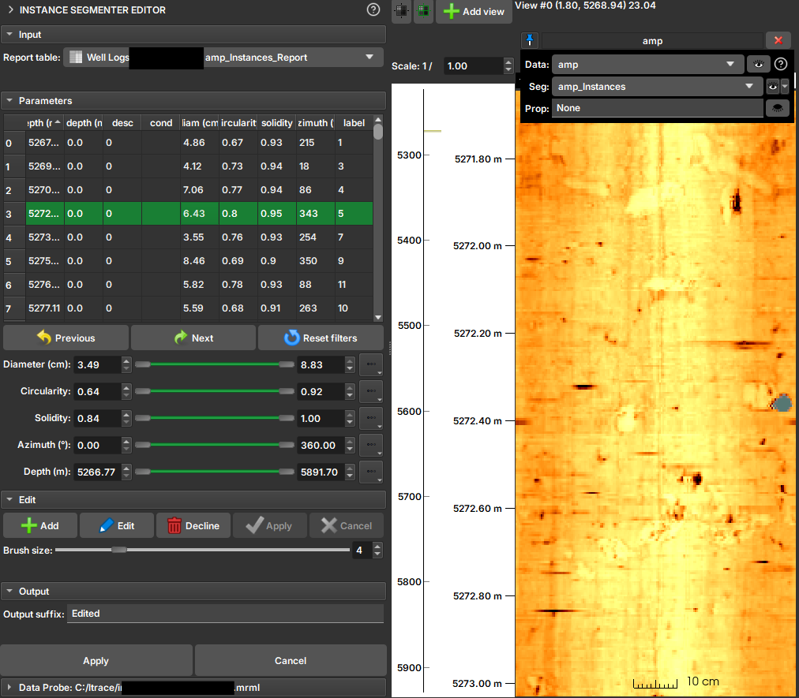

# Instance Segmenter Editor

## Visão Geral

O módulo **Editor de Segmentos por Instância** é uma ferramenta interativa para visualizar, filtrar e editar os resultados de uma segmentação por instância. Ele foi projetado para trabalhar em conjunto com os resultados de módulos como o [Segmentador de Instâncias para Perfilagem de Poço](./ImageLogInstanceSegmenter.md), que identifica objetos individuais em uma imagem e extrai suas propriedades.

Com este editor, você pode:

*   Inspecionar visualmente cada instância segmentada.
*   Filtrar instâncias com base em suas propriedades (por exemplo, tamanho, forma, orientação).
*   Criar, editar e remover instâncias de forma interativa, pintando diretamente na imagem.

Esta ferramenta é essencial para o controle de qualidade e refino dos resultados de segmentações automáticas, permitindo correções manuais de forma eficiente.

## Como Usar

### Seleção de Dados

1.  **Tabela de Relatório (`Report table`):** Selecione a tabela de propriedades gerada pelo módulo de segmentação por instância. Esta tabela contém os dados de cada objeto identificado. O editor depende de um atributo específico (`InstanceSegmenter`) na tabela para identificar a imagem de rótulos associada e o tipo de instância.
1. É recomendado visualizar a imagem (AMP, TT, ou ambas) e as instâncias nas [trilhas de visualização](./ImageLogIntroduction.md).

### Filtrando Instâncias

A principal funcionalidade do editor é a capacidade de filtrar as instâncias com base em suas propriedades. Para cada propriedade numérica na tabela (como área, circularidade, etc.), um controle deslizante de intervalo (`range slider`) é exibido na seção **Parâmetros (`Parameters`)**.

Para filtrar:

1.  Localize o controle deslizante correspondente à propriedade que deseja filtrar (ex: `Area`).
2.  Use os marcadores do controle para definir o intervalo de valores desejado (mínimo e máximo).
3.  As marcações que ficam fora do intervalo do filtro aparecem realçadas em vermelho.

Você pode ajustar os intervalos para múltiplas propriedades simultaneamente para criar filtros complexos. Para redefinir todos os filtros para seus valores originais, clique no botão **Reset filters**.

### Editando Instâncias e Segmentos

As operações de edição permitem refinar a segmentação, seja criando novos segmentos, editando existentes ou removendo-os.

*   **Visualização:** Clique em uma linha na tabela para selecionar a instância correspondente. As trilhas de visualização irão deslocar automaticamente para a profundidade da instância, evidenciando-a.

*   **Adicionar (`Add`):** Inicia o modo de criação de um novo segmento. O cursor do mouse se transforma em um pincel nas visualizações. Você pode "pintar" a nova instância diretamente na imagem. Após a pintura, clique em **Apply** para calcular as propriedades do novo segmento e adicioná-lo à tabela, ou **Cancel** para descartar.

*   **Editar (`Edit`):** Similar ao modo "Adicionar", mas para um segmento existente. Selecione um item na tabela e clique em **Edit** para modificar sua forma na imagem usando o pincel. Clique em **Apply** para salvar as alterações ou **Cancel** para reverter.

*   **Recusar (`Decline`):** Para excluir uma instância, selecione-a na tabela e clique em **Recusar (`Decline`)**. A instância selecionada será removida da tabela e da imagem.

*   **Tamanho do Pincel (`Brush size`):** Um controle deslizante permite ajustar o tamanho do pincel para as operações de adicionar e editar.

## Interface do Módulo

A interface é dividida em quatro seções principais:

1.  **Entrada (`Input`):** Menu para selecionar a tabela de relatório (`Report table`).
2.  **Parâmetros (`Parameters`):** Contém os controles deslizantes para filtrar as instâncias e a tabela que exibe os resultados.
3.  **Edição (`Edit`):** Contém os botões para as operações de edição (`Add`, `Edit`, `Decline`, `Apply`, `Cancel`) e o controle do tamanho do pincel.
4.  **Saída (`Output`):** Permite definir um sufixo para os arquivos de saída e aplicar as mudanças em definitivo, gerando um novo conjunto de tabela e imagem de rótulos.