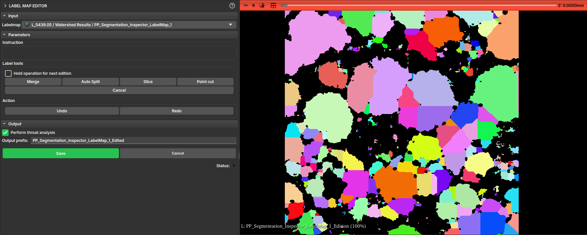

## LabelMap Editor

Esse módulo permite a edição de labelmaps, tipicamente gerados pelo algoritmo de Watershed no módulo Segment Inspector.

Nem sempre os resultados gerados pelo watershed estão de acordo com as expectativas, esse módulo permite ao usuário fazer uma edição desses resultados rótulo-a-rótulo, mesclando ou dividindo as divisões feitas pelo algoritmo.

O módulo apresenta uma interface com as operações de:

- *Merge*: Mescla duas labels;
- *Auto Split*: Tenta dividir uma label em mais de uma parte;
- *Slice*: Corta a label em uma linha definida pelo usuário;
- *Point cut*: Corta a label a partir de uma reta que passa por um ponto definido pelo usuário;

A interface também conta com botões de Undo e Redo para voltar atrás ou avançar nas mudanças.
