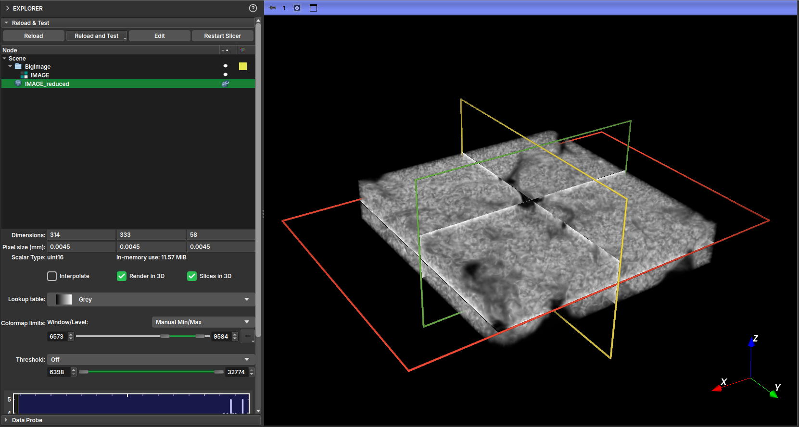

O módulo **_Big Image_** é um kit de ferramentas para trabalhar com imagens grandes usando memória limitada. Visualize fatias, corte, reduza a
resolução e converta o tipo sem carregar a imagem inteira na RAM. Atualmente, suporta o carregamento de imagens NetCDF
de vários arquivos do sistema de arquivos local ou de imagens NetCDF MicroCT do módulo BIAEP Browser.

## Carregamento

Siga os passos abaixo para carregar, pré-visualizar e reduzir uma imagem de grande porte.

#### Passo 1: Carregar o Conjunto de Dados NetCDF

1.  Na seção **Load Multi-file NetCDF Image**, clique no botão ao lado de **Input directory** para selecionar a pasta que contém o(s) arquivo(s) NetCDF (`.nc`).
2.  Uma vez que um diretório válido é selecionado, o botão **Load dataset** será habilitado.
3.  Clique em **Load dataset**. Isso irá analisar os metadados dos arquivos e criar imagens virtuais na hierarquia de dados do _GeoSlicer_. Esta operação é rápida e não consome muita memória, pois os dados da imagem ainda não são carregados.

!!! note "Observação"
    Uma **imagem virtual** é uma imagem no projeto _GeoSlicer_ que aponta para o local onde uma imagem grande está armazenada.
    Ao salvar o projeto, apenas o endereço da imagem é armazenado na pasta do projeto.

 

|  |
|:-----------------------------------------------:|
| Figura 1: Seção "Load Multi-file NetCDF Image" com o diretório selecionado e o botão "Load dataset" habilitado. |

#### Passo 2: Selecionar e Inspecionar a Imagem

1.  Na seção **Data**, clique no seletor **Image** para ver a lista de imagens disponíveis no conjunto de dados carregado. Selecione a imagem que deseja inspecionar.
2.  Após a seleção, os campos **Shape (XYZ)** e **Data type** serão preenchidos com as informações da imagem selecionada.

 

|  |
|:-----------------------------------------------:|
| Figura 2: Seção "Data" mostrando a seleção de uma imagem e os campos de informação preenchidos. |

#### Passo 3: Pré-visualizar Fatias da Imagem

1.  Com uma imagem selecionada, clique no botão **Preview image** para entrar no modo de pré-visualização.
2.  A seção **Slice Preview** aparecerá. Use os sliders **Z**, **Y** e **X** para navegar pelas fatias da imagem nos visualizadores 2D. Apenas a fatia selecionada é carregada do disco, permitindo a exploração de imagens muito grandes.
3.  Para sair do modo de pré-visualização, clique em **Stop preview**.

 

|  |
|:-----------------------------------------------:|
| Figura 3: Seção "Slice Preview" e os visualizadores 2D mostrando uma fatia da imagem de grande porte. |

!!! note "Observação"
    Para imagens NetCDF salvas sem *chunking*, a visualização pelo slider **Z** (plano YX) costuma ser a mais rápida, enquanto os outros eixos demoram mais. Para imagens salvas com *chunking*, é possível visualizar rapidamente por qualquer eixo.

!!! tip "Dica"
    No módulo **Explorer**, você pode iniciar a pré-visualização de uma imagem virtual já carregada ativando o ícone de olho dela.
    

#### Passo 4: Configurar a Redução da Imagem

Para carregar uma versão menor da imagem na memória, configure as opções na seção **Reduce Image**.

*   **Crop**: Defina uma região de interesse (ROI) para cortar a imagem. Especifique a coordenada inicial em **Crop origin** e o tamanho do corte em **Crop size** para cada eixo (X, Y, Z). Você pode definir o corte interagindo com o ROI no visualizador 3D, ou definindo os valores diretamente. Use o botão **Reset crop region** para redefinir a área para a imagem inteira.
*   **Downsample**: Reduza a resolução da imagem definindo um **Downsample factor**. Um fator de 2, por exemplo, reduzirá o tamanho da imagem em 8 vezes (2³).
*   **Numeric type conversion**: Converta o tipo numérico da imagem para um que consuma menos memória (por exemplo, `uint8`).
    *   Se a caixa **Map min and max values...** estiver marcada, os valores da imagem serão remapeados para o novo intervalo de tipo, preservando a faixa dinâmica.
    *   Se desmarcada, os valores fora do novo intervalo serão limitados.

 

|  |
|:-----------------------------------------------:|
| Figura 4: Seção "Reduce Image" com as opções de Crop, Downsample e Type Conversion destacadas. |

#### Passo 5: Carregar a Imagem Reduzida

1.  Na seção **Output**, verifique o tamanho estimado da imagem final em **Output size**.
2.  Defina um nome para o novo volume em **Output name**.
3.  Clique em **Load reduced image**. As operações de redução (corte, reamostragem e conversão de tipo) serão executadas e o volume resultante será carregado no _GeoSlicer_.

 

|  |
|:-----------------------------------------------:|
| Figura 5: Seção "Output" com o nome de saída e o botão "Load reduced image" destacados. |

Com a imagem reduzida gerada, você pode visualizá-la habilitando a visualização na aba **Explorer**.

|  |
|:-----------------------------------------------:|
| Figura 6: Visualização da imagem 3D da versão reduzida. |