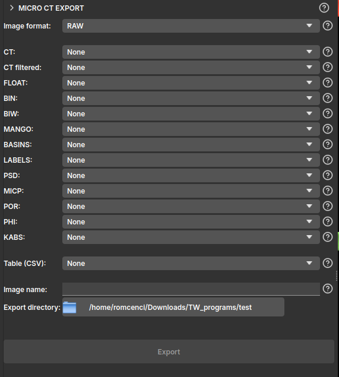

## MicroCT Export

Esse módulo disponibiliza uma série de formatos de exportação dos volumes carregados ou gerados pelo GeoSlicer, facilitando a integração com outros softwares ou o salvamento dos resultados. 

A interface do módulo é apresentada de forma simples, onde o usuário pode selecionar um entre os formatos de exportação:

- *RAW*: Arquivos binários brutos. Suporta volume /scalar/, /labelmap/ e segmentações. Exporta um arquivo separado para cada volume com a nomenclatura padrão;
- *TIF*: Arquivos TIFF. Suporta apenas volume /scalar/. Exporta um arquivo separado para cada volume com a nomenclatura padrão;
- *NetCDF*: Arquivos NetCDF. Suporta volume /scalar/, /labelmap/ e segmentação. Exporta um único arquivo `.nc` contendo todos os volumes;

A interface também é pensada para funcionar seguindo uma nomenclatura padrão, definida pela Petrobras, ela segue a seguinte lógica:

- *CT*: imagem com valores inteiros sem sinal de 16-bit, normalmente a própria CT da amostra;
- *CT filtered*: imagem cortada ou filtrada baseada na original, também com valores inteiros sem sinal de 16-bit;
- *FLOAT*: imagem com valores reais de 32-bit, normalmente representando uma componente do campo de velocidades ou a pressão;
- *BIN*: imagem binária de 8-bit, normalmente 1 representando poro e 0 o sólido;
- *BIW*: imagem binária de 8-bit, invertendo a classificação do BIN, 1 representa o sólido e 0 o poro;
- *MANGO*: imagem binária de 8-bit, 0 e 1 representam o poro, enquanto 102 e 103 são sólido, valores intermediários entre 1 e 102 são distribuídos na imagem linear e inversamente proporcional a porosidade da amostra;
- *BASINS*: imagem segmentada, normalmente com valores inteiros, onde os segmentos são definidos como: 1 = Poro, 2 = Quartzo, 3 = Microporosidade, 4 = Calcita, 5 = Alto coeficiente de atenuação;
- *LABELS*: imagem de 8-bit que representa um mapa de rótulos ou segmentação, atribuindo um identificador único para cada componente conectado ou região segmentada;
- *PSD*: imagem de 16-bit com valores inteiros que representam o diâmetro máximo da esfera que contém o ponto e permanece completamente dentro do meio poroso segmentado;
- *MICP*: imagem de 16-bit com valores inteiros que representam o diâmetro máximo da esfera que alcançou o ponto a partir de uma das bordas do meio poroso segmentado;
- *POR*: imagem de 32-bit com valores reais que representam a porosidade local da amostra, ponto a ponto, variando entre 0 e 1;
- *PHI*: imagem de 32-bit com valores reais que podem representar a porosidade da amostra;
- *KABS*: imagem de 64-bit com valores reais que representam o campo de permeabilidade absoluta da amostra;
- *Table (CSV)*: Exporta uma tabela do GeoSlicer para um arquivo `.csv` com o mesmo nome do nó;

Após selecionar a pasta onde deseja criar os arquivos, clique em `Export`.