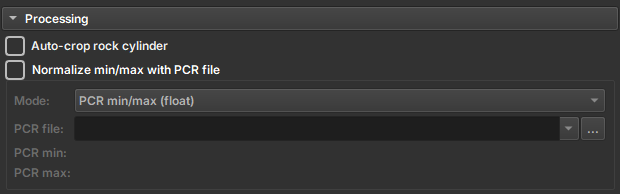
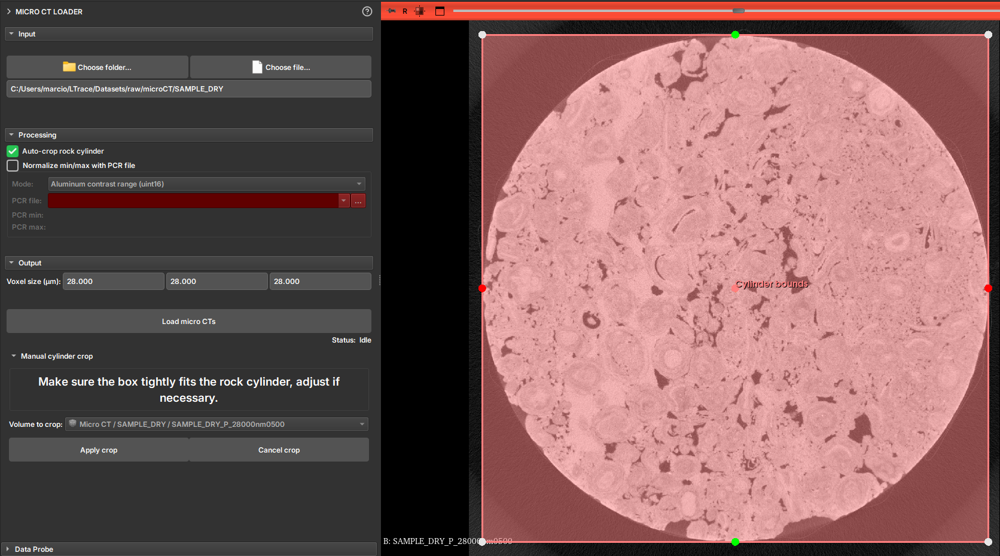

O ambiente de micro CT possui apenas um **_Loader_** para carregar volumes 3D. Ele é capaz de reconhecer diversos tipos
de dados, como:

- **_RAW_**: Arquivos de imagem em formato RAW.
- **_TIFF_**: Arquivos de imagem em formato TIFF.
- **_PNG_**: Arquivos de imagem em formato PNG.
- **_JPG_**: Arquivos de imagem em formato JPG.

Com exceção do formato RAW, o **_Loader_** requer um diretório contendo as imagens 2D que compõem o
volume. O **_Loader_** irá reconhecer as imagens e montar o volume automaticamente. Abaixo vamos detalhar esses dois
modos
de funcionamento.

## Visualização de formatos TIFF, PNG e JPG

1. Clique no botão **_Choose folder_** para selecionar o diretório contendo imagens de micro CT. Nessa opção o diretório
   precisa conter imagens 2D para compor o volume 3D.
2. Ao selecionar o diretório, o módulo informa quantas imagens ele encontrou, para que o usuário confirme que todas as
   imagens foram detectadas corretamente. Em caso de faltar imagens, o usuário pode verificar se o nome de alguma delas
   não está fora do
   padrão, causando a falha na detecção.
3. Automáticamente o módulo tenta detectar o tamanho do pixel das imagens através do nome do arquivo(ex. prefixo "_
   28000nm). Caso o valor detectado não esteja correto, o usuário pode alterar o valor manualmente.
4. Clique no botão **_Load micro CTs_** para carregar as imagens. O volume 3D será montado e disponibilizado na **_View_
   ** principal e acessível via **_Explorer_**.

## Visualização de formato RAW

1. Clique no botão **_Choose file_** para selecionar o arquivo RAW.
2. Como o arquivo .RAW não possui informações sobre a imagem diretamente no formato, o módulo tenta inferir as
   configurações do dado pelo nome do arquivo. Por exemplo, **AFLORAMENTO_III_LIMPA_B1_BIN_1000_1000_1000_02214nm.raw**
    - Tamanho do pixel: 2214nm
    - Tamanho do volume: 1000x1000x1000
    - Tipo de pixel: BIN (8 bit unsigned)
3. O usuário pode alterar manualmente as configurações do volume, como tamanho do pixel, tamanho do volume e tipo do
   dado, caso alguma informação não tenha sido detectada corretamente ou simplesmente não exista.
4. Clique no botão **_Load_** para carregar o volume. O volume 3D será montado e disponibilizado na **_View_** principal
   e acessível via **_Explorer_**.

### Explorando os Parâmetros de Importação

Existe a opção **Real-time update** que permite que o volume seja atualizado automaticamente conforme as configurações
são alteradas. No entanto, recomendamos que o usuário não utilize essa opção para volumes muito grandes.

1. Mude o campo _X dimension_ até colunas retas aparecerem na image (se as colunas estiverem ligeiramente inclinadas
   então o valor está próximo de estar correto). Tente com diferentes valores de endianness e tipo de pixel se nenhum
   valor em _X dimension_ parece fazer sentido.
2. Mova _Header size_ até a primeira linha da imagem aparecer no topo.
3. Altere o valor do campo _Z dimension_ para algumas dezenas de fatias para tornar
   mais fácil ver quando o valor de _Y dimension_ está correto.
4. Altere o valor de _Y dimension_ até a última linha da imagem aparecer na parte mais baixa.
5. Altere o slider _Z dimension_ até todas as fatias da imagem estarem inclusas.

## Recursos Avançados de Importação

### Auto-crop

O usuário pode ativar a opção **_Auto-crop Rock Cylinder_** para cortar a imagem automaticamente. Essa solução é
aplicada para casos onde o volume de estudo é um cilindro, normalmente envolto por outras camadas de outros materiais.
Essa opção, tenta detectar o cilindro relevante e gerar uma região para recortar (crop). Antes de aplicar o recorte, o
módulo apresenta a região detectada para que o usuário possa confirmar se a região está correta ou fazer ajustes para
enquadrar a região de interesse.

### Normalização de Imagens

Algumas imagens podem ser importadas usando um arquivo de normalização dos valores, o PCR. Para isso, o usuário deve
selecionar a opção **_Normalize min/max with PCR file_** e selecionar o arquivo PCR correspondente. As opções de uso do
arquivo são:

- **_Normalize min/max (float)_**: Normaliza os valores da imagem com base no arquivo PCR.
- **_Divide by alumminum median (float)_**: Divide os valores da imagem pela mediana do alumínio.
- **_Alumminum contrast range (uint8)_**: Define o intervalo de contraste do alumínio.