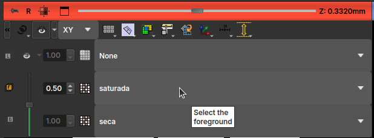

# Registro

O Registro serve para alinhar duas imagens de uma mesma amostra, muito utilizado em caso de lâminas (porém com outra interface) para quando se existe PP/PX. Em Micro CT geralmente utilizamos quando temos imagens da mesma amostra seca e saturada, ou quando a amostra passa por processos de limpeza.

O alinhamento pode ser feito manualmente ou a partir de um algoritmo automático. Em casos simples, o automático deve ser capaz de resolver, mas em outros casos é interessante ajustar manualmente primeiro, deixando as amostras ao menos próxima da de referência e depois rodar o processo automático para fazer o ajuste fino.

## Registro Manual

A interface do registro manual conta com uma matrix de transformação que permite uma transformação afim geral no volume dada pela mudança de coordenadas:

$$\mathbf{r'}=\mathbf{A}\cdot\mathbf{r}+\mathbf{B},$$

onde $\mathbf{r}$ é um vetor com as coordenadas da imagem original e $\mathbf{r'}$ são as coordenadas da imagem transformada. Dessa forma, a matriz $\mathbf{A}$ será responsável por aplicar transformações de escala (elementos da diagonal principal), rotações, reflexões e cisalhamento, e o vetor $\mathbf{B}$ será responsável pelas translações. A matrix de transformação presente na interface do registro manual é geralmente chamada de matriz aumentada, permitindo que a transformação seja representada como uma única multiplicação de matriz:

$$
\begin{pmatrix}
x'\\
y'\\
z'\\
1\\
\end{pmatrix}=
\begin{pmatrix}
A_{xx}     & A_{xy} & A_{xz}& B_x  \\
A_{yx}     & A_{yy} & A_{yz}& B_y  \\
A_{zx}     & A_{zy} & A_{zz}& B_z  \\
0          & 0      & 0     & 1  \\
\end{pmatrix}
\cdot
\begin{pmatrix}
x\\
y\\
z\\
1\\
\end{pmatrix}
$$

No entanto, a maneira mais intuitiva para se registrar a imagem é a partir dos elementos gráficos presentes na interface. As translações podem ser escolhidas tanto pelos controles deslizantes como pelo seletor ao lado direito, os valores Min e Max representam os limites dessas translações. Abaixo dos controles de translação, a interface apresenta botões giratórios que estão associados a rotações em cada um dos eixos, é importante avaliar o eixo que aponta para a tela do computador na hora de escolher a rotação desejada. Além disso a interface também apresenta alguns botões para refletir a imagem em algum dos eixos e também opções para fazer a transposição dos eixos (trocando x por y ou assim por diante).

!!! tip
	Costuma-se encontrar na imagem de referência algum poro ou elemento com um formato bem característico em alguma das fatias (janelas verde, vermelha ou amarela) (algumas vezes pode ser necessário mexer também na escala de cores, filtrando por exemplo elementos de alta atenuação). Depois de encontrar tal formato característico, faz-se translações ao longo dessa direção até que o mesmo formato seja reconhecido na imagem em movimento (dependendo do caso o elemento pode estar bastante deformado ou pode aparecer distante da coordenada original). Após isso, pode-se fazer transformações de translações transversais em relação ao eixo da tela, rotações e reflexões afim de que o volume em movimento fique em concordância com o de referência. Após casar as imagens dentro da fatia deve-se ainda ver como ficaram as demais fatias, uma vez que outras rotações em outros eixos podem afetá-las.

!!! tip
	Para comparar os volumes durante o registro, pode-se escolher um dos volumes como *foreground* e o outro como *background*, a partir da caixa de seleção no canto superior esquerdo de cada view. Ao selecionar esses dois volumes, a interface permite mudar a opacidade entre os dois pelo controle deslizante na esquerda da seleção, ou então segurando o botão Ctrl + clicando e arrastando o mouse de baixo para a cima dentro da janela de visualização. 
	

## Registro Automático

Na interface do Registro Automático, deve-se selecionar um volume de referência e um volume que irá se mover até encontrar automaticamente a transformação necessária. As transformações serão aplicadas ao "*Moving volume*" para coincidir com o "*Fixed volume*", e o resultado será salvo em um novo volume transformado, preservando os volumes original e de referência.

Os parâmetros utilizados no registro automático são:

- *Sample Radius*: raio da amostra em milímetros. Esse raio será usado para criar uma máscara que identifica os dados relevantes para o registro.
- *Sampling Fraction*: a fração dos voxels do Fixed volume que será usada para o registro. O valor deve ser maior que zero e menor ou igual a um. Valores mais altos aumentam o tempo de computação, mas podem resultar em maior precisão.
- *Minimum step length*: um valor maior ou igual a 10-8. Cada passo na otimização será no mínimo desse tamanho. Quando não for possível dar mais passos, o registro é considerado completo. Valores menores permitem que o otimizador faça ajustes mais sutis, mas podem aumentar o tempo de registro.
- *Number of iterations*: Esse parâmetro determina o número máximo de iterações antes de interromper a otimização. Valores mais baixos (500–1000) forçam o encerramento antecipado, mas aumentam o risco de parar antes de alcançar uma solução ideal.
- *Downsampling factor*: Esse parâmetro afeta diretamente a eficiência do algoritmo. Valores altos (~1) podem exigir muito tempo de execução. Valores intermediários, como 0.3, têm se mostrado ideais para obter bons resultados com custo computacional razoável.
- *Registration phases*: Escolhe os tipos de transformações que o algoritmo pode fase na imagem original.
  - *Rigid (6 DOF)*: é uma transformação que faz apenas translações e rotações da imagem, são 6 graus de liberdade: 3 translações (xyz) + 3 rotações.
  - *Rigid + Scale (7 DOF)*: pode fazer um outro tipo de transformação além das rígidas, ele pode aumentar ou diminuir a escala da imagem.
  - *Rigid + Scale + Skew (10 DOF)*: vai poder fazer além das transformações anteriores, um cisalhamento em diferentes direções.
  Essas fases estão em uma escala em que o primeiro tipo de transformações, com menos graus de liberdade, vai poder deformar menos a imagem original, e o último pode deformar com mais liberdade.