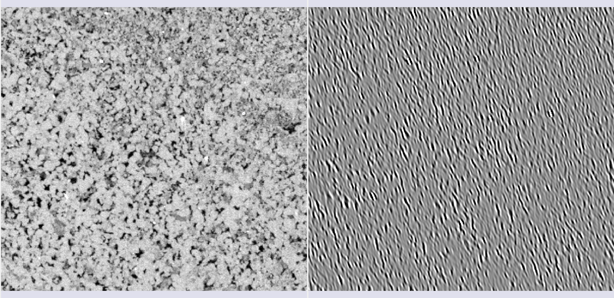

## AI Segmenter

O módulo **MicroCT Segmenter** oferece a opção de *Model Training*, que realiza a segmentação de uma amostra inteira a partir de uma anotação inicial simples. Com base nessa anotação, diferentes métodos treinam um modelo e inferem o resultado em toda a imagem ou em uma região de interesse (SOI). O modelo treinado pode ser salvo e reutilizado em outras imagens.

### Método Random-Forest

O Random-Forest é um método que constrói múltiplas árvores de decisão durante o treinamento para criar um modelo robusto. A classificação final é determinada pela maioria dos votos das árvores. Para este método, é possível selecionar diferentes *features* (características) extraídas da imagem para o treinamento.

#### Seleção de características (*features*)

*   **Raw input image**: Adiciona a própria imagem como uma das entradas.
*   **Gaussian filter**: Aplica um kernel gaussiano de raio escolhido como um filtro na imagem.

|  |
|:-----------------------------------------------:|
| Figura 1: Filtro gaussiano. |

*   **Winvar filter**: Filtro baseado na variância, calcula $\left\lt x^2\right\gt-\left\lt x\right\gt^2$ dentro de um kernel de raio escolhido.

|  |
|:-----------------------------------------------:|
| Figura 2: Filtro winvar. |

*   **Gabor filters**: Calculados em direções $\theta$ igualmente espaçadas, esses filtros são compostos de uma parte gaussiana e uma parte senoidal. Em 2D, a fórmula é:

$$ f(x,y,\omega,\theta,\sigma)=\frac{1}{2\pi\sigma^2}\exp\left[-\frac{1}{2}\frac{x^2+y^2}{\sigma^2}+I\omega(x\cos\theta+y\sin\theta)\right] $$

|  |
|:-----------------------------------------------:|
| Figura 3: Filtro Gabor em uma das direções $\theta$. |

*   **Minkowsky functionals**: Parâmetros morfológicos que descrevem a geometria dos dados, associados a volume, superfície, curvatura média e característica de Euler.

|   |
|:-----------------------------------------------:|
| Figura 4: Filtros Minkowsky. |

*   **Variogram range**: Mede a variação média dos valores em função da distância. O *range* é a distância onde a variação é máxima. É útil para diferenciar texturas e granulometrias.

|  |
|:-----------------------------------------------:|
| Figura 5: Variogram range. |

### Método Inferência Bayesiana

Este método utiliza a **regra de Bayes** para classificar os pixels da imagem, atualizando as probabilidades de um pixel pertencer a uma classe com base nas anotações.

A abordagem no GeoSlicer assume uma **Distribuição Normal Multivariada** para a função de verossimilhança, onde a média $\mu_s$ e a matriz de covariância $\Sigma_s$ de cada segmento são calculadas a partir das anotações:

$$ f(x_p|s)=\frac{1}{\sqrt{(2\pi)^k \det \Sigma_s}}\exp\left(-\frac{1}{2}(x_p-\mu_s)^T \Sigma_s^{-1} (x_p-\mu_s)\right) $$ 

Onde $x_p$ é o vetor de pixels em uma janela, e $\mu_s$ e $\Sigma_s$ são a média e a covariância do segmento $s$.

A inferência da probabilidade de cada segmento para um pixel é obtida pela regra de Bayes, e o segmento que maximiza essa probabilidade é escolhido.

Para otimizar o desempenho, são aplicados alguns tratamentos, como a transformação de percentil em imagens de MicroCT e a conversão para o formato HSV em imagens de lâminas delgadas. Além disso, para acelerar o processo, é possível calcular a covariância de forma esparsa, utilizando apenas os eixos ou planos principais, o que é especialmente útil em 3D.

Abaixo, alguns resultados da aplicação do método em imagens de tomografia e lâminas:

|  |
|:-----------------------------------------------:|
| Figura 6: Segmentação semi-automática usando inferência Bayesiana em dados de MicroCT. |

|  |
|:-----------------------------------------------:|
| Figura 7: Segmentação semi-automática usando inferência Bayesiana em dados de lâminas. |

### Modelos Pré-treinados

O GeoSlicer oferece modelos pré-treinados baseados na arquitetura **U-Net** para resolver dois problemas comuns na microtomografia de rochas: a segmentação binária (poro/não-poro) e a segmentação *basins* (múltiplos minerais).

#### Treinamento

O treinamento dos modelos foi realizado com um vasto conjunto de dados (68 volumes para o modelo binário e 106 para o *basins*), aplicando uma transformação linear de histograma para facilitar a generalização. Os volumes foram recortados em subvolumes de 128³ voxels, e uma porção de 75% deles sofreu transformações aleatórias (aumento de dados) para melhorar a robustez do modelo. Para lidar com o desbalanceamento de classes (poros são menos comuns), foi utilizada a **função de custo de Tversky**, que ajusta a sensibilidade do modelo para classes minoritárias, melhorando a precisão na detecção de poros.

#### Resultados

Os modelos pré-treinados apresentam resultados de alta qualidade. O modelo de segmentação binária é especialmente preciso na identificação de poros, enquanto o modelo *basins* oferece uma segmentação completa dos diferentes minerais.

##### Segmentação Binária

|  |
|:---------------------------------------------------------------:|
| Figura 8: Comparação entre a imagem original, a anotação e o resultado da segmentação binária. |

##### Segmentação *Basins*

|  |
|:---------------------------------------------------------------:|
| Figura 9: Comparação entre a imagem original, a anotação e o resultado da segmentação basins. |

#### Referências

*   SCHMIDT, U. et al. (2018). *Cell detection with star-convex polygons*. In: Medical Image Computing and Computer Assisted Intervention–MICCAI 2018. Springer.

*   SALEHI, S. S. M. et al. (2017). *Tversky loss function for image segmentation using 3D fully convolutional deep networks*. In: Machine Learning in Medical Imaging. Springer.

*   WEIGERT, M. et al. (2020). *Star-convex polyhedra for 3D object detection and segmentation in microscopy*. In: Proceedings of the IEEE/CVF winter conference on applications of computer vision.

*   BAI, M. & URTASUN, R. (2017). *Deep watershed transform for instance segmentation*. In: Proceedings of the IEEE conference on computer vision and pattern recognition.

*   HE, K. et al. (2017). *Mask r-cnn*. In: Proceedings of the IEEE international conference on computer vision.

*   RONNEBERGER, O. et al. (2015). *U-net: Convolutional networks for biomedical image segmentation*. In: Medical Image Computing and Computer-Assisted Intervention–MICCAI 2015. Springer.
